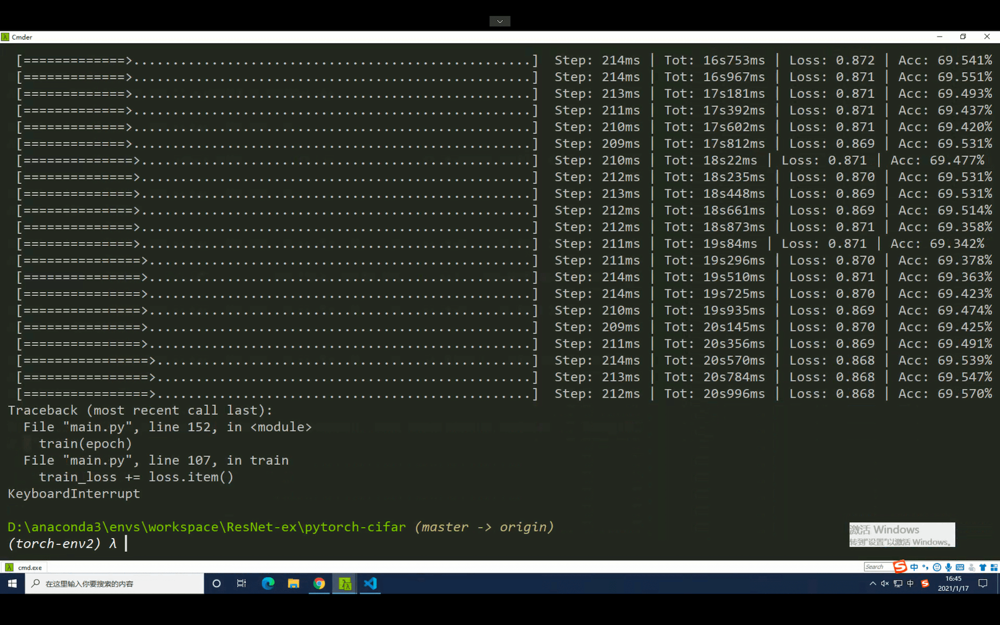
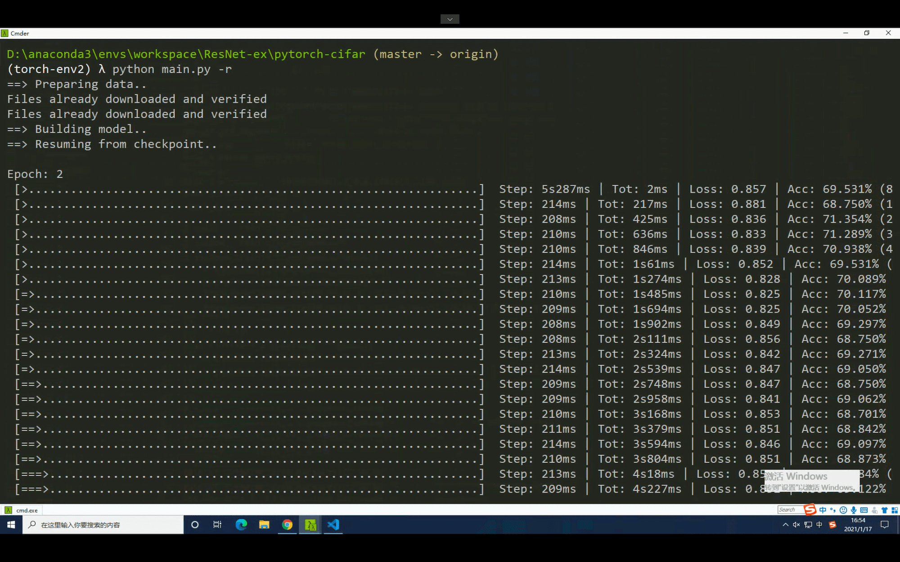

# 训练神经网络的技巧：Saving and Loading checkpoint

学到了一个训练神经网络的技巧：保存和加载 checkpoint。

## PyTorch 

[SAVING AND LOADING A GENERAL CHECKPOINT IN PYTORCH](https://pytorch.org/tutorials/recipes/recipes/saving_and_loading_a_general_checkpoint.html)

`model_state_dict` 和 `optimizer_state_dict`  是最重要的参数。

保存：

```python
# Additional information
EPOCH = 5
PATH = "model.pt"
LOSS = 0.4

torch.save({
            'epoch': EPOCH,
            'model_state_dict': net.state_dict(),
            'optimizer_state_dict': optimizer.state_dict(),
            'loss': LOSS,
            }, PATH)
```

加载：

```python
model = Net()
optimizer = optim.SGD(net.parameters(), lr=0.001, momentum=0.9)

checkpoint = torch.load(PATH)
model.load_state_dict(checkpoint['model_state_dict'])
optimizer.load_state_dict(checkpoint['optimizer_state_dict'])
epoch = checkpoint['epoch']
loss = checkpoint['loss']

model.eval()
# - or -
model.train()
```

## 实践

> 发现一个写得很好的代码，怕弄丢我已经把这个仓库 fork 了。
>
> [https://github.com/landodo/pytorch-cifar](https://github.com/landodo/pytorch-cifar)

可以不需要指定训练多少个 epoch，每次训练完成一个 epoch 后，如果 Acc 相比于上一次得到改善，那么就保存当前训练的模型，再开始下一个 epoch。

```python
 # Save checkpoint.
    acc = 100.*correct/total
    if acc > best_acc:
        print('Saving..')
        state = {
            'net': net.state_dict(),
            'acc': acc,
            'epoch': epoch,
        }
        if not os.path.isdir('checkpoint'):
            os.mkdir('checkpoint')
        torch.save(state, './checkpoint/ckpt.pth')
        best_acc = acc
```



如果程序终止，再继续开始训练时，可以加载上一次保存的模型。

```python
if args.resume:
    # Load checkpoint.
    print('==> Resuming from checkpoint..')
    assert os.path.isdir('checkpoint'), 'Error: no checkpoint directory found!'
    checkpoint = torch.load('./checkpoint/ckpt.pth')
    net.load_state_dict(checkpoint['net'])
    best_acc = checkpoint['acc']
    start_epoch = checkpoint['epoch']
```

如下：

> Resuming from checkpoint...




