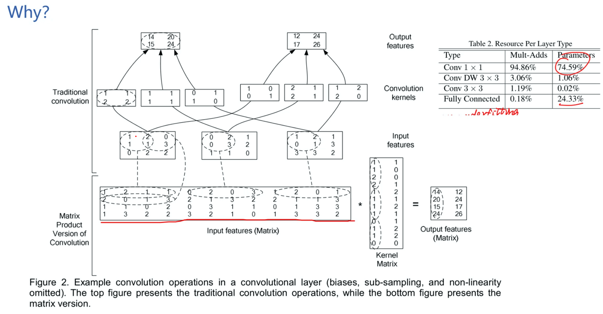

# 2021.01.17 组会

## 论文名称：“Born-Again Nerual Network”

> yxy

- 新的角度研究知识蒸馏（KD）：不压缩模型，而是将学生模型与老师模型参数相同，建立的 Born-Again Nerual Network (BANs) 在计算机视觉和语言建模任务上比它们的 Teacher 表现出色。
- BAN
  - Backbone：残差网络、DenseNet
- 暗知识
- CIFAR-10（3.5%）/ CIFAR-100（15.5%）
- 长期自我感知是通过集成的多代的内部学习过程建造的，论证了知识迁移在人工神经网络中也是成功的。

- Softmax-T
  - $q_i = \frac{exp(e_i / T)}{\sum_j exp(z_j / T)}$

## 论文名称：“Model-Agnostic Meta-Learning for Fast Adaptation of Deep Networks”

> flj

- 训练一组初始化参数，通过在初始参数的基础上**进行一步或多步的梯度调整**，来达到仅用**少量数据**就能**快速适应**新 task 的目的。
- 元学习 Meta Learning
- 通过梯度迭代找到对于 task 敏感的参数 $\theta$
- 回归：微调一个训练过的 MAML 模型。
- 分类：Omniglot 和 MiniImagenet 两个少样本分类数据集。（目前图像分类任务最常用的少样本学习的数据集）
- MAML 的缺陷：进行两次梯度更新，因此在大网络上训练会很慢。

## “MobileNetV2”

> cxd

## V1

28 层。

用于移动设备的网络

- （1）稀疏性
- （2）去除冗余：精度和时间的权衡
- （3）

相关工作：

- SqueezeNet
- Xception
- MobileNet-V1
- ShuffleNet-V1
- MobileNet-V2
- ShuffleNet-V2
- MnasNet
- MobileNet-V3：19 年 5 月

MobileNet：提出了深度可分离卷积（DSC）。

为什么那么高效？

- FLOPs，降低了 1/8 ~ 1/9。
- 参数量也降低了 1/8。
- 精度只影响了 1%。

## V2

先升维，再做深度可分离卷积。因为低维损失太多。

升维升到 6 倍。

Relu6？

- 为什么是 6？答：实验得到的，6 表现的最好。

## DenseNet

> ww

思路：密集连接

结构细节：

- DenseBlock+Transition

结构变体：

- DenseNet-B

特征重用

