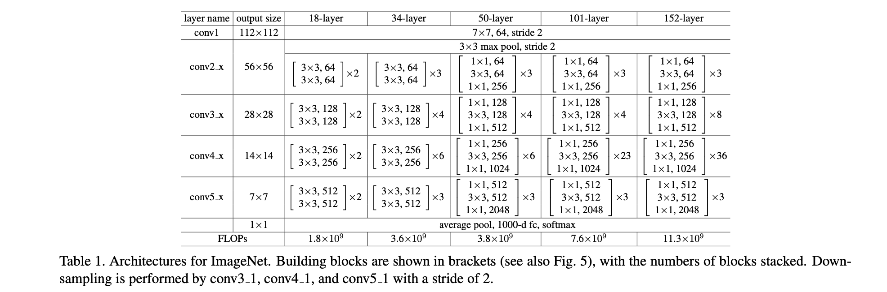
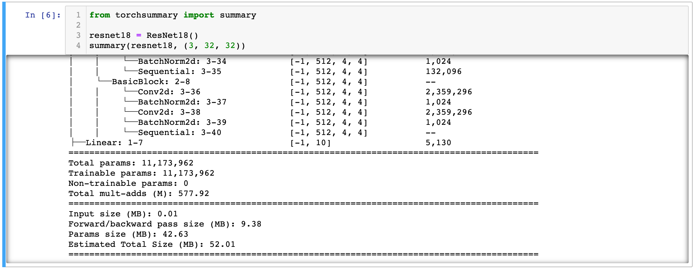
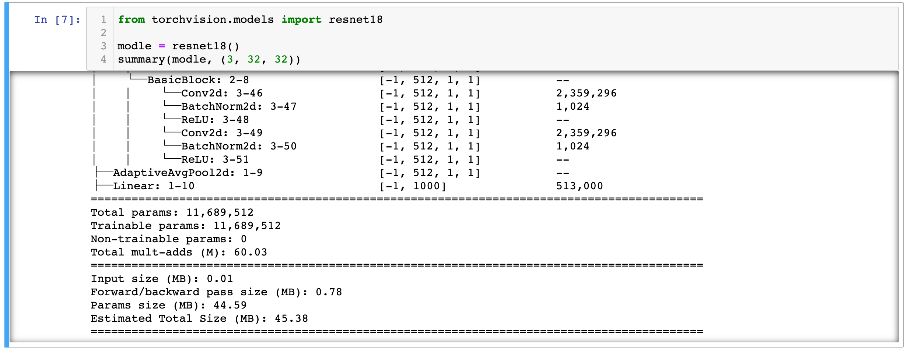

# 复现 ResNet18 笔记

复现 ResNet-18。



## ResNet18

```python
'''ResNet in PyTorch.
For Pre-activation ResNet, see 'preact_resnet.py'.
Reference:
[1] Kaiming He, Xiangyu Zhang, Shaoqing Ren, Jian Sun
    Deep Residual Learning for Image Recognition. arXiv:1512.03385
'''
import torch
import torch.nn as nn
import torch.nn.functional as F


class BasicBlock(nn.Module):
    expansion = 1 # class Bottleneck(nn.Module) 中的 expansion = 4，
    							# 即一个 Block 中通道数会改变，如上图 50-layer，通道数增大 4 倍

    def __init__(self, in_planes, planes, stride=1):
        super(BasicBlock, self).__init__()
        self.conv1 = nn.Conv2d(
            in_planes, planes, kernel_size=3, stride=stride, padding=1, bias=False)
        self.bn1 = nn.BatchNorm2d(planes)
        self.conv2 = nn.Conv2d(planes, planes, kernel_size=3,
                               stride=1, padding=1, bias=False)
        self.bn2 = nn.BatchNorm2d(planes)

        self.shortcut = nn.Sequential()
        # 前后维度不一致，需要调整
        if stride != 1 or in_planes != self.expansion*planes:
            self.shortcut = nn.Sequential(
                nn.Conv2d(in_planes, self.expansion*planes,
                          kernel_size=1, stride=stride, bias=False),
                nn.BatchNorm2d(self.expansion*planes)
            )

    def forward(self, x):
        out = F.relu(self.bn1(self.conv1(x)))
        out = self.bn2(self.conv2(out))
        out += self.shortcut(x)
        out = F.relu(out)
        return out


class ResNet(nn.Module):
    def __init__(self, block, num_blocks, num_classes=10):
        super(ResNet, self).__init__()
        self.in_planes = 64

        self.conv1 = nn.Conv2d(3, 64, kernel_size=3,
                               stride=1, padding=1, bias=False)
        self.bn1 = nn.BatchNorm2d(64)
        self.layer1 = self._make_layer(block, 64, num_blocks[0], stride=1)
        self.layer2 = self._make_layer(block, 128, num_blocks[1], stride=2)
        self.layer3 = self._make_layer(block, 256, num_blocks[2], stride=2)
        self.layer4 = self._make_layer(block, 512, num_blocks[3], stride=2)
        self.linear = nn.Linear(512*block.expansion, num_classes)

    def _make_layer(self, block, planes, num_blocks, stride):
        strides = [stride] + [1]*(num_blocks-1)
        layers = []
        for stride in strides:
            layers.append(block(self.in_planes, planes, stride))
            self.in_planes = planes * block.expansion
        return nn.Sequential(*layers)

    def forward(self, x):
        out = F.relu(self.bn1(self.conv1(x)))
        out = self.layer1(out)
        out = self.layer2(out)
        out = self.layer3(out)
        out = self.layer4(out)
        out = F.avg_pool2d(out, 4)
        out = out.view(out.size(0), -1)
        out = self.linear(out)
        return out


def ResNet18():
    return ResNet(BasicBlock, [2, 2, 2, 2])

def test():
    net = ResNet18()
    y = net(torch.randn(1, 3, 32, 32)) # CIFAR-10: input size 32*32
    print(y.size())
```

复现的 ResNet18：

```
from torchsummary import summary

resnet18 = ResNet18()
summary(resnet18, (3, 32, 32))
```

结果：



torchvision.models 里面的 resnet18：



可以看到，torch 内置的 resnet18 Muli-add 为 60.03M，而自己复现的是 577.92M；Forward/backward 也有非常大的差距。

## install tensorwatch

```shell
pip install -i https://pypi.tuna.tsinghua.edu.cn/simple tensorwatch
```


应该是 Torch 版本过高的问题，那就不可视化模型图了。

```
AttributeError: module 'torch.onnx' has no attribute 'set_training'
```

## summary 输出细节

```python
from torchsummary import summary

resnet18 = ResNet18()
summary(resnet18, (3, 32, 32))

```

```
  
==========================================================================================
  Layer (type:depth-idx)                   Output Shape              Param #
  ==========================================================================================
  ├─Conv2d: 1-1                            [-1, 64, 32, 32]          1,728
  ├─BatchNorm2d: 1-2                       [-1, 64, 32, 32]          128
  ├─Sequential: 1-3                        [-1, 64, 32, 32]          --
  |    └─BasicBlock: 2-1                   [-1, 64, 32, 32]          --
  |    |    └─Conv2d: 3-1                  [-1, 64, 32, 32]          36,864
  |    |    └─BatchNorm2d: 3-2             [-1, 64, 32, 32]          128
  |    |    └─Conv2d: 3-3                  [-1, 64, 32, 32]          36,864
  |    |    └─BatchNorm2d: 3-4             [-1, 64, 32, 32]          128
  |    |    └─Sequential: 3-5              [-1, 64, 32, 32]          --
  |    └─BasicBlock: 2-2                   [-1, 64, 32, 32]          --
  |    |    └─Conv2d: 3-6                  [-1, 64, 32, 32]          36,864
  |    |    └─BatchNorm2d: 3-7             [-1, 64, 32, 32]          128
  |    |    └─Conv2d: 3-8                  [-1, 64, 32, 32]          36,864
  |    |    └─BatchNorm2d: 3-9             [-1, 64, 32, 32]          128
  |    |    └─Sequential: 3-10             [-1, 64, 32, 32]          --
  ├─Sequential: 1-4                        [-1, 128, 16, 16]         --
  |    └─BasicBlock: 2-3                   [-1, 128, 16, 16]         --
  |    |    └─Conv2d: 3-11                 [-1, 128, 16, 16]         73,728
  |    |    └─BatchNorm2d: 3-12            [-1, 128, 16, 16]         256
  |    |    └─Conv2d: 3-13                 [-1, 128, 16, 16]         147,456
  |    |    └─BatchNorm2d: 3-14            [-1, 128, 16, 16]         256
  |    |    └─Sequential: 3-15             [-1, 128, 16, 16]         8,448
  |    └─BasicBlock: 2-4                   [-1, 128, 16, 16]         --
  |    |    └─Conv2d: 3-16                 [-1, 128, 16, 16]         147,456
  |    |    └─BatchNorm2d: 3-17            [-1, 128, 16, 16]         256
  |    |    └─Conv2d: 3-18                 [-1, 128, 16, 16]         147,456
  |    |    └─BatchNorm2d: 3-19            [-1, 128, 16, 16]         256
  |    |    └─Sequential: 3-20             [-1, 128, 16, 16]         --
  ├─Sequential: 1-5                        [-1, 256, 8, 8]           --
  |    └─BasicBlock: 2-5                   [-1, 256, 8, 8]           --
  |    |    └─Conv2d: 3-21                 [-1, 256, 8, 8]           294,912
  |    |    └─BatchNorm2d: 3-22            [-1, 256, 8, 8]           512
  |    |    └─Conv2d: 3-23                 [-1, 256, 8, 8]           589,824
  |    |    └─BatchNorm2d: 3-24            [-1, 256, 8, 8]           512
  |    |    └─Sequential: 3-25             [-1, 256, 8, 8]           33,280
  |    └─BasicBlock: 2-6                   [-1, 256, 8, 8]           --
  |    |    └─Conv2d: 3-26                 [-1, 256, 8, 8]           589,824
  |    |    └─BatchNorm2d: 3-27            [-1, 256, 8, 8]           512
  |    |    └─Conv2d: 3-28                 [-1, 256, 8, 8]           589,824
  |    |    └─BatchNorm2d: 3-29            [-1, 256, 8, 8]           512
  |    |    └─Sequential: 3-30             [-1, 256, 8, 8]           --
  ├─Sequential: 1-6                        [-1, 512, 4, 4]           --
  |    └─BasicBlock: 2-7                   [-1, 512, 4, 4]           --
  |    |    └─Conv2d: 3-31                 [-1, 512, 4, 4]           1,179,648
  |    |    └─BatchNorm2d: 3-32            [-1, 512, 4, 4]           1,024
  |    |    └─Conv2d: 3-33                 [-1, 512, 4, 4]           2,359,296
  |    |    └─BatchNorm2d: 3-34            [-1, 512, 4, 4]           1,024
  |    |    └─Sequential: 3-35             [-1, 512, 4, 4]           132,096
  |    └─BasicBlock: 2-8                   [-1, 512, 4, 4]           --
  |    |    └─Conv2d: 3-36                 [-1, 512, 4, 4]           2,359,296
  |    |    └─BatchNorm2d: 3-37            [-1, 512, 4, 4]           1,024
  |    |    └─Conv2d: 3-38                 [-1, 512, 4, 4]           2,359,296
  |    |    └─BatchNorm2d: 3-39            [-1, 512, 4, 4]           1,024
  |    |    └─Sequential: 3-40             [-1, 512, 4, 4]           --
  ├─Linear: 1-7                            [-1, 10]                  5,130
  ==========================================================================================
  Total params: 11,173,962
  Trainable params: 11,173,962
  Non-trainable params: 0
  Total mult-adds (M): 577.92
  ==========================================================================================
  Input size (MB): 0.01
  Forward/backward pass size (MB): 9.38
  Params size (MB): 42.63
  Estimated Total Size (MB): 52.01
  ==========================================================================================
```


```python
from torchvision.models import resnet18

modle = resnet18()
summary(modle, (3, 32, 32))
```

```
==========================================================================================
  Layer (type:depth-idx)                   Output Shape              Param #
  ==========================================================================================
  ├─Conv2d: 1-1                            [-1, 64, 16, 16]          9,408
  ├─BatchNorm2d: 1-2                       [-1, 64, 16, 16]          128
  ├─ReLU: 1-3                              [-1, 64, 16, 16]          --
  ├─MaxPool2d: 1-4                         [-1, 64, 8, 8]            --
  ├─Sequential: 1-5                        [-1, 64, 8, 8]            --
  |    └─BasicBlock: 2-1                   [-1, 64, 8, 8]            --
  |    |    └─Conv2d: 3-1                  [-1, 64, 8, 8]            36,864
  |    |    └─BatchNorm2d: 3-2             [-1, 64, 8, 8]            128
  |    |    └─ReLU: 3-3                    [-1, 64, 8, 8]            --
  |    |    └─Conv2d: 3-4                  [-1, 64, 8, 8]            36,864
  |    |    └─BatchNorm2d: 3-5             [-1, 64, 8, 8]            128
  |    |    └─ReLU: 3-6                    [-1, 64, 8, 8]            --
  |    └─BasicBlock: 2-2                   [-1, 64, 8, 8]            --
  |    |    └─Conv2d: 3-7                  [-1, 64, 8, 8]            36,864
  |    |    └─BatchNorm2d: 3-8             [-1, 64, 8, 8]            128
  |    |    └─ReLU: 3-9                    [-1, 64, 8, 8]            --
  |    |    └─Conv2d: 3-10                 [-1, 64, 8, 8]            36,864
  |    |    └─BatchNorm2d: 3-11            [-1, 64, 8, 8]            128
  |    |    └─ReLU: 3-12                   [-1, 64, 8, 8]            --
  ├─Sequential: 1-6                        [-1, 128, 4, 4]           --
  |    └─BasicBlock: 2-3                   [-1, 128, 4, 4]           --
  |    |    └─Conv2d: 3-13                 [-1, 128, 4, 4]           73,728
  |    |    └─BatchNorm2d: 3-14            [-1, 128, 4, 4]           256
  |    |    └─ReLU: 3-15                   [-1, 128, 4, 4]           --
  |    |    └─Conv2d: 3-16                 [-1, 128, 4, 4]           147,456
  |    |    └─BatchNorm2d: 3-17            [-1, 128, 4, 4]           256
  |    |    └─Sequential: 3-18             [-1, 128, 4, 4]           8,448
  |    |    └─ReLU: 3-19                   [-1, 128, 4, 4]           --
  |    └─BasicBlock: 2-4                   [-1, 128, 4, 4]           --
  |    |    └─Conv2d: 3-20                 [-1, 128, 4, 4]           147,456
  |    |    └─BatchNorm2d: 3-21            [-1, 128, 4, 4]           256
  |    |    └─ReLU: 3-22                   [-1, 128, 4, 4]           --
  |    |    └─Conv2d: 3-23                 [-1, 128, 4, 4]           147,456
  |    |    └─BatchNorm2d: 3-24            [-1, 128, 4, 4]           256
  |    |    └─ReLU: 3-25                   [-1, 128, 4, 4]           --
  ├─Sequential: 1-7                        [-1, 256, 2, 2]           --
  |    └─BasicBlock: 2-5                   [-1, 256, 2, 2]           --
  |    |    └─Conv2d: 3-26                 [-1, 256, 2, 2]           294,912
  |    |    └─BatchNorm2d: 3-27            [-1, 256, 2, 2]           512
  |    |    └─ReLU: 3-28                   [-1, 256, 2, 2]           --
  |    |    └─Conv2d: 3-29                 [-1, 256, 2, 2]           589,824
  |    |    └─BatchNorm2d: 3-30            [-1, 256, 2, 2]           512
  |    |    └─Sequential: 3-31             [-1, 256, 2, 2]           33,280
  |    |    └─ReLU: 3-32                   [-1, 256, 2, 2]           --
  |    └─BasicBlock: 2-6                   [-1, 256, 2, 2]           --
  |    |    └─Conv2d: 3-33                 [-1, 256, 2, 2]           589,824
  |    |    └─BatchNorm2d: 3-34            [-1, 256, 2, 2]           512
  |    |    └─ReLU: 3-35                   [-1, 256, 2, 2]           --
  |    |    └─Conv2d: 3-36                 [-1, 256, 2, 2]           589,824
  |    |    └─BatchNorm2d: 3-37            [-1, 256, 2, 2]           512
  |    |    └─ReLU: 3-38                   [-1, 256, 2, 2]           --
  ├─Sequential: 1-8                        [-1, 512, 1, 1]           --
  |    └─BasicBlock: 2-7                   [-1, 512, 1, 1]           --
  |    |    └─Conv2d: 3-39                 [-1, 512, 1, 1]           1,179,648
  |    |    └─BatchNorm2d: 3-40            [-1, 512, 1, 1]           1,024
  |    |    └─ReLU: 3-41                   [-1, 512, 1, 1]           --
  |    |    └─Conv2d: 3-42                 [-1, 512, 1, 1]           2,359,296
  |    |    └─BatchNorm2d: 3-43            [-1, 512, 1, 1]           1,024
  |    |    └─Sequential: 3-44             [-1, 512, 1, 1]           132,096
  |    |    └─ReLU: 3-45                   [-1, 512, 1, 1]           --
  |    └─BasicBlock: 2-8                   [-1, 512, 1, 1]           --
  |    |    └─Conv2d: 3-46                 [-1, 512, 1, 1]           2,359,296
  |    |    └─BatchNorm2d: 3-47            [-1, 512, 1, 1]           1,024
  |    |    └─ReLU: 3-48                   [-1, 512, 1, 1]           --
  |    |    └─Conv2d: 3-49                 [-1, 512, 1, 1]           2,359,296
  |    |    └─BatchNorm2d: 3-50            [-1, 512, 1, 1]           1,024
  |    |    └─ReLU: 3-51                   [-1, 512, 1, 1]           --
  ├─AdaptiveAvgPool2d: 1-9                 [-1, 512, 1, 1]           --
  ├─Linear: 1-10                           [-1, 1000]                513,000
  ==========================================================================================
  Total params: 11,689,512
  Trainable params: 11,689,512
  Non-trainable params: 0
  Total mult-adds (M): 60.03
  ==========================================================================================
  Input size (MB): 0.01
  Forward/backward pass size (MB): 0.78
  Params size (MB): 44.59
  Estimated Total Size (MB): 45.38
  ==========================================================================================
```

## tensorwatch.model_states

```
  import tensorwatch as tw
  resnet18 = ResNet18()
  tw.model_stats(resnet18, [1, 3, 32, 32])
```

|      | module name         | input shape      | output_shape     | parameters | infer memory(MB)   | MAdd          | Flops       | MemRead(B) | MemWrite(B) | duration |
| ---- | ------------------- | ---------------- | ---------------- | ---------- | ------------------ | ------------- | ----------- | ---------- | ----------- | -------- |
| 0    | conv1               | (1, 3, 32, 32)   | (1, 64, 32, 32)  | 1,728      | 0.25               | 3,473,408     | 1,769,472   | 19,200     | 262,144     | 0.000183 |
| 1    | bn1                 | (1, 64, 32, 32)  | (1, 64, 32, 32)  | 128        | 0.25               | 262,144       | 131,072     | 262,656    | 262,144     | 0.000174 |
| 2    | layer1.0.conv1      | (1, 64, 32, 32)  | (1, 64, 32, 32)  | 36,864     | 0.25               | 75,431,936    | 37,748,736  | 409,600    | 262,144     | 0.001210 |
| 3    | layer1.0.bn1        | (1, 64, 32, 32)  | (1, 64, 32, 32)  | 128        | 0.25               | 262,144       | 131,072     | 262,656    | 262,144     | 0.000058 |
| 4    | layer1.0.conv2      | (1, 64, 32, 32)  | (1, 64, 32, 32)  | 36,864     | 0.25               | 75,431,936    | 37,748,736  | 409,600    | 262,144     | 0.001183 |
| 5    | layer1.0.bn2        | (1, 64, 32, 32)  | (1, 64, 32, 32)  | 128        | 0.25               | 262,144       | 131,072     | 262,656    | 262,144     | 0.000060 |
| 6    | layer1.0.shortcut   | (1, 64, 32, 32)  | (1, 64, 32, 32)  | 0          | 0.25               | 0             | 0           | 0          | 0           | 0.000009 |
| 7    | layer1.1.conv1      | (1, 64, 32, 32)  | (1, 64, 32, 32)  | 36,864     | 0.25               | 75,431,936    | 37,748,736  | 409,600    | 262,144     | 0.001137 |
| 8    | layer1.1.bn1        | (1, 64, 32, 32)  | (1, 64, 32, 32)  | 128        | 0.25               | 262,144       | 131,072     | 262,656    | 262,144     | 0.000058 |
| 9    | layer1.1.conv2      | (1, 64, 32, 32)  | (1, 64, 32, 32)  | 36,864     | 0.25               | 75,431,936    | 37,748,736  | 409,600    | 262,144     | 0.001179 |
| 10   | layer1.1.bn2        | (1, 64, 32, 32)  | (1, 64, 32, 32)  | 128        | 0.25               | 262,144       | 131,072     | 262,656    | 262,144     | 0.000059 |
| 11   | layer1.1.shortcut   | (1, 64, 32, 32)  | (1, 64, 32, 32)  | 0          | 0.25               | 0             | 0           | 0          | 0           | 0.000006 |
| 12   | layer2.0.conv1      | (1, 64, 32, 32)  | (1, 128, 16, 16) | 73,728     | 0.125              | 37,715,968    | 18,874,368  | 557,056    | 131,072     | 0.000885 |
| 13   | layer2.0.bn1        | (1, 128, 16, 16) | (1, 128, 16, 16) | 256        | 0.125              | 131,072       | 65,536      | 132,096    | 131,072     | 0.000058 |
| 14   | layer2.0.conv2      | (1, 128, 16, 16) | (1, 128, 16, 16) | 147,456    | 0.125              | 75,464,704    | 37,748,736  | 720,896    | 131,072     | 0.001248 |
| 15   | layer2.0.bn2        | (1, 128, 16, 16) | (1, 128, 16, 16) | 256        | 0.125              | 131,072       | 65,536      | 132,096    | 131,072     | 0.000054 |
| 16   | layer2.0.shortcut.0 | (1, 64, 32, 32)  | (1, 128, 16, 16) | 8,192      | 0.125              | 4,161,536     | 2,097,152   | 294,912    | 131,072     | 0.000403 |
| 17   | layer2.0.shortcut.1 | (1, 128, 16, 16) | (1, 128, 16, 16) | 256        | 0.125              | 131,072       | 65,536      | 132,096    | 131,072     | 0.000048 |
| 18   | layer2.1.conv1      | (1, 128, 16, 16) | (1, 128, 16, 16) | 147,456    | 0.125              | 75,464,704    | 37,748,736  | 720,896    | 131,072     | 0.001117 |
| 19   | layer2.1.bn1        | (1, 128, 16, 16) | (1, 128, 16, 16) | 256        | 0.125              | 131,072       | 65,536      | 132,096    | 131,072     | 0.000046 |
| 20   | layer2.1.conv2      | (1, 128, 16, 16) | (1, 128, 16, 16) | 147,456    | 0.125              | 75,464,704    | 37,748,736  | 720,896    | 131,072     | 0.001140 |
| 21   | layer2.1.bn2        | (1, 128, 16, 16) | (1, 128, 16, 16) | 256        | 0.125              | 131,072       | 65,536      | 132,096    | 131,072     | 0.000046 |
| 22   | layer2.1.shortcut   | (1, 128, 16, 16) | (1, 128, 16, 16) | 0          | 0.125              | 0             | 0           | 0          | 0           | 0.000006 |
| 23   | layer3.0.conv1      | (1, 128, 16, 16) | (1, 256, 8, 8)   | 294,912    | 0.0625             | 37,732,352    | 18,874,368  | 1,310,720  | 65,536      | 0.000938 |
| 24   | layer3.0.bn1        | (1, 256, 8, 8)   | (1, 256, 8, 8)   | 512        | 0.0625             | 65,536        | 32,768      | 67,584     | 65,536      | 0.000047 |
| 25   | layer3.0.conv2      | (1, 256, 8, 8)   | (1, 256, 8, 8)   | 589,824    | 0.0625             | 75,481,088    | 37,748,736  | 2,424,832  | 65,536      | 0.001181 |
| 26   | layer3.0.bn2        | (1, 256, 8, 8)   | (1, 256, 8, 8)   | 512        | 0.0625             | 65,536        | 32,768      | 67,584     | 65,536      | 0.000087 |
| 27   | layer3.0.shortcut.0 | (1, 128, 16, 16) | (1, 256, 8, 8)   | 32,768     | 0.0625             | 4,177,920     | 2,097,152   | 262,144    | 65,536      | 0.000479 |
| 28   | layer3.0.shortcut.1 | (1, 256, 8, 8)   | (1, 256, 8, 8)   | 512        | 0.0625             | 65,536        | 32,768      | 67,584     | 65,536      | 0.000046 |
| 29   | layer3.1.conv1      | (1, 256, 8, 8)   | (1, 256, 8, 8)   | 589,824    | 0.0625             | 75,481,088    | 37,748,736  | 2,424,832  | 65,536      | 0.001178 |
| 30   | layer3.1.bn1        | (1, 256, 8, 8)   | (1, 256, 8, 8)   | 512        | 0.0625             | 65,536        | 32,768      | 67,584     | 65,536      | 0.000085 |
| 31   | layer3.1.conv2      | (1, 256, 8, 8)   | (1, 256, 8, 8)   | 589,824    | 0.0625             | 75,481,088    | 37,748,736  | 2,424,832  | 65,536      | 0.001225 |
| 32   | layer3.1.bn2        | (1, 256, 8, 8)   | (1, 256, 8, 8)   | 512        | 0.0625             | 65,536        | 32,768      | 67,584     | 65,536      | 0.000085 |
| 33   | layer3.1.shortcut   | (1, 256, 8, 8)   | (1, 256, 8, 8)   | 0          | 0.0625             | 0             | 0           | 0          | 0           | 0.000005 |
| 34   | layer4.0.conv1      | (1, 256, 8, 8)   | (1, 512, 4, 4)   | 1,179,648  | 0.03125            | 37,740,544    | 18,874,368  | 4,784,128  | 32,768      | 0.000844 |
| 35   | layer4.0.bn1        | (1, 512, 4, 4)   | (1, 512, 4, 4)   | 1,024      | 0.03125            | 32,768        | 16,384      | 36,864     | 32,768      | 0.000065 |
| 36   | layer4.0.conv2      | (1, 512, 4, 4)   | (1, 512, 4, 4)   | 2,359,296  | 0.03125            | 75,489,280    | 37,748,736  | 9,469,952  | 32,768      | 0.001733 |
| 37   | layer4.0.bn2        | (1, 512, 4, 4)   | (1, 512, 4, 4)   | 1,024      | 0.03125            | 32,768        | 16,384      | 36,864     | 32,768      | 0.000073 |
| 38   | layer4.0.shortcut.0 | (1, 256, 8, 8)   | (1, 512, 4, 4)   | 131,072    | 0.03125            | 4,186,112     | 2,097,152   | 589,824    | 32,768      | 0.000278 |
| 39   | layer4.0.shortcut.1 | (1, 512, 4, 4)   | (1, 512, 4, 4)   | 1,024      | 0.03125            | 32,768        | 16,384      | 36,864     | 32,768      | 0.000067 |
| 40   | layer4.1.conv1      | (1, 512, 4, 4)   | (1, 512, 4, 4)   | 2,359,296  | 0.03125            | 75,489,280    | 37,748,736  | 9,469,952  | 32,768      | 0.002056 |
| 41   | layer4.1.bn1        | (1, 512, 4, 4)   | (1, 512, 4, 4)   | 1,024      | 0.03125            | 32,768        | 16,384      | 36,864     | 32,768      | 0.000095 |
| 42   | layer4.1.conv2      | (1, 512, 4, 4)   | (1, 512, 4, 4)   | 2,359,296  | 0.03125            | 75,489,280    | 37,748,736  | 9,469,952  | 32,768      | 0.002787 |
| 43   | layer4.1.bn2        | (1, 512, 4, 4)   | (1, 512, 4, 4)   | 1,024      | 0.03125            | 32,768        | 16,384      | 36,864     | 32,768      | 0.000092 |
| 44   | layer4.1.shortcut   | (1, 512, 4, 4)   | (1, 512, 4, 4)   | 0          | 0.03125            | 0             | 0           | 0          | 0           | 0.000006 |
| 45   | linear              | (1, 512)         | (1, 10)          | 5,130      | 3.814697265625e-05 | 10,230        | 5,120       | 22,568     | 40          | 0.000087 |
| 46   | Model               | [1, 3, 32, 32]   | (1, 10)          | 11,173,962 | 5.406288146972656  | 1,112,688,630 | 556,651,520 | 49,821,992 | 4,915,240   | 0.023906 |