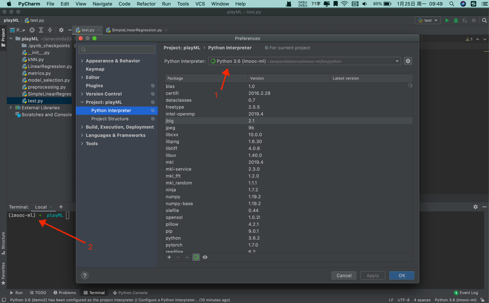
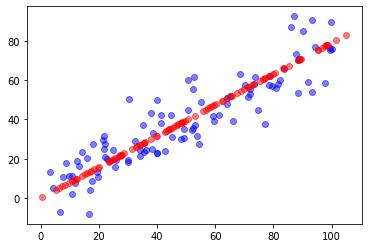

# 7-5 高维数据映射为低维数据

- $X \in \mathbb{R}^{m \times n}$：m 个样本，n 个特征。

- $W_k \in \mathbb{R}^{k \times n}$ ：k 个主成分

将数据 X 从 n 为降为 k 维：$X \cdot W_k^T = X_k$ ，$X_k \in \mathbb{R}^{m \times k}$

恢复后会有一定的信息损失：$X_k \cdot W_k = X_m$

## PyCharm

开始尝试使用 PyCharm。

配置好虚拟环境中的 Python 解释器：



测试：


## 从高维数据向低维数据的映射


```python
import numpy as np
import matplotlib.pyplot as plt
```


```python
X = np.empty((100, 2))
X[:, 0] = np.random.uniform(0., 100, size=100)
X[:, 1] = 0.75 * X[:, 0] + 3. + np.random.normal(0., 10., size=100)
```


```python
from playML.PCA import PCA

pca = PCA(n_components=2)
pca.fit(X)
```


    PCA(n_components=2)


```python
pca.components_
```


    array([[ 0.78412541,  0.62060241],
           [-0.62059806,  0.78412884]])


```python
pca = PCA(n_components=1)
pca.fit(X)
```


    PCA(n_components=1)


```python
pca.components_
```


    array([[0.78412541, 0.6206024 ]])


```python
# 降维
X_reduction = pca.transform(X)
```


```python
X_reduction.shape
```


    (100, 1)


```python
# 恢复
X_restore = pca.inverse_transform(X_reduction)
```


```python
X_restore.shape
```


    (100, 2)


```python
plt.scatter(X[:, 0], X[:,1], color='b', alpha=0.5)
# 在高维空间中表示降维后的数据信息
plt.scatter(X_restore[:,0], X_restore[0:,1], color='r', alpha=0.5)
plt.show()
```

​    

​    


