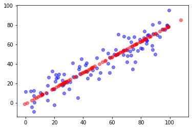
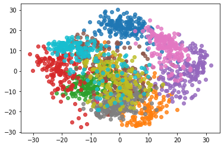

# 7-6 scikit-learn 中的 PCA


```python
from sklearn.decomposition import PCA
```


```python
pca = PCA(n_components=1)
```


```python
import numpy as np
import matplotlib.pyplot as plt

X = np.empty((100, 2))
X[:, 0] = np.random.uniform(0., 100, size=100)
X[:, 1] = 0.75 * X[:, 0] + 3. + np.random.normal(0., 10., size=100)
```


```python
pca = PCA(n_components=1)
pca.fit(X)
```


    PCA(n_components=1)


```python
pca.components_
```


    array([[0.78148649, 0.62392216]])


```python
X_reduction = pca.transform(X)
```


```python
X_reduction.shape
```


    (100, 1)


```python
X_restore = pca.inverse_transform(X_reduction)
```


```python
X_restore.shape
```


    (100, 2)


```python
plt.scatter(X[:, 0], X[:,1], color='b', alpha=0.5)
# 在高维空间中表示降维后的数据信息
plt.scatter(X_restore[:,0], X_restore[0:,1], color='r', alpha=0.5)
plt.show()
```

​    

​    


## 使用手写数字数据


```python
from sklearn import datasets
```


```python
digits = datasets.load_digits()
X = digits.data
y = digits.target
```


```python
from sklearn.model_selection import train_test_split

X_train, X_test, y_train, y_test = train_test_split(X, y, random_state=666)
```


```python
X_train.shape
```


    (1347, 64)


```python
%%time

from sklearn.neighbors import KNeighborsClassifier

knn_clf = KNeighborsClassifier()
knn_clf.fit(X_train, y_train)
```

    CPU times: user 15.1 ms, sys: 4.72 ms, total: 19.8 ms
    Wall time: 78.6 ms


    KNeighborsClassifier()


```python
knn_clf.score(X_test, y_test)
```


    0.9866666666666667


### PCA 降维


```python
from sklearn.decomposition import PCA

pca = PCA(n_components=2) # 64 维降到 2 维
pca.fit(X_train)

X_train_reduction = pca.transform(X_train)
X_test_reduction = pca.transform(X_test)
```


```python
%%time
## 大大的减少了时间
from sklearn.neighbors import KNeighborsClassifier

knn_clf = KNeighborsClassifier()
knn_clf.fit(X_train_reduction, y_train)
```

    CPU times: user 1.56 ms, sys: 858 µs, total: 2.42 ms
    Wall time: 1.81 ms


    KNeighborsClassifier()


```python
# 64 维降到 2 维精度太低
knn_clf.score(X_test_reduction, y_test)
```


    0.6066666666666667


## 应该降到几维？
如何找到最好的降维维度？


```python
# 表示第一个轴能解释原始数据 14% 的方差，第二个轴能解释原始数据 13% 的方差
pca.explained_variance_ratio_
```


    array([0.14566817, 0.13735469])


```python
# 14% + 13% = 27%
# 剩下的 73% 数据丢失了
```


```python
pca = PCA(n_components=X_train.shape[1])
pca.fit(X_train)
pca.explained_variance_ratio_
```


    array([1.45668166e-01, 1.37354688e-01, 1.17777287e-01, 8.49968861e-02,
           5.86018996e-02, 5.11542945e-02, 4.26605279e-02, 3.60119663e-02,
           3.41105814e-02, 3.05407804e-02, 2.42337671e-02, 2.28700570e-02,
           1.80304649e-02, 1.79346003e-02, 1.45798298e-02, 1.42044841e-02,
           1.29961033e-02, 1.26617002e-02, 1.01728635e-02, 9.09314698e-03,
           8.85220461e-03, 7.73828332e-03, 7.60516219e-03, 7.11864860e-03,
           6.85977267e-03, 5.76411920e-03, 5.71688020e-03, 5.08255707e-03,
           4.89020776e-03, 4.34888085e-03, 3.72917505e-03, 3.57755036e-03,
           3.26989470e-03, 3.14917937e-03, 3.09269839e-03, 2.87619649e-03,
           2.50362666e-03, 2.25417403e-03, 2.20030857e-03, 1.98028746e-03,
           1.88195578e-03, 1.52769283e-03, 1.42823692e-03, 1.38003340e-03,
           1.17572392e-03, 1.07377463e-03, 9.55152460e-04, 9.00017642e-04,
           5.79162563e-04, 3.82793717e-04, 2.38328586e-04, 8.40132221e-05,
           5.60545588e-05, 5.48538930e-05, 1.08077650e-05, 4.01354717e-06,
           1.23186515e-06, 1.05783059e-06, 6.06659094e-07, 5.86686040e-07,
           1.71368535e-33, 9.18612290e-34, 9.18612290e-34, 8.82949950e-34])


```python
plt.plot([i for i in range(X_train.shape[1])],
         [np.sum(pca.explained_variance_ratio_[:i+1]) for i in range(X_train.shape[1])])

plt.show()
```

​    

​    


取 30 个维度，应该能保留至少 ≈ 90% 的数据。

通过曲线确定需要降到多少维。

例如：如果要保留 95% 以上的信息，那么在纵轴上找到 95% 对应的横轴即可。这个功能已经被 PCA 封装好了。


```python
pca = PCA(0.95) # 保留 95% 以上的方差
pca.fit(X_train)
```


    PCA(n_components=0.95)


```python
# 28
pca.n_components_
```


    28


```python
X_train_reduction = pca.transform(X_train)
X_test_reduction = pca.transform(X_test)
```


```python
%%time

knn_clf = KNeighborsClassifier()
knn_clf.fit(X_train_reduction, y_train)
```

    CPU times: user 3.13 ms, sys: 1.3 ms, total: 4.43 ms
    Wall time: 4.66 ms


    KNeighborsClassifier()


```python
# 精度相近，但是训练时间为 3.57 ms VS 19.8 ms
knn_clf.score(X_test_reduction, y_test)
```


    0.98


## 降维 2 维方便可视化


```python
pca = PCA(n_components=2)

pca.fit(X)
X_reduction = pca.transform(X)
```


```python
X_reduction.shape
```


    (1797, 2)


```python
for i in range(10):
    plt.scatter(X_reduction[y==i, 0], X_reduction[y==i, 1], alpha=0.8) # matplotlib 自动选择了不同的颜色
plt.show()
```

​    

​    


上图可视化告诉我们，如果只想区分蓝色和橙色所对应的数字，那么降到 2 维就可以了。
