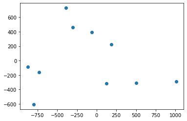
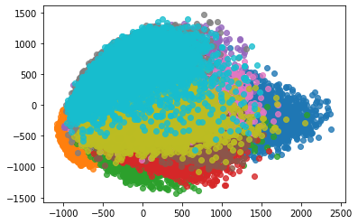
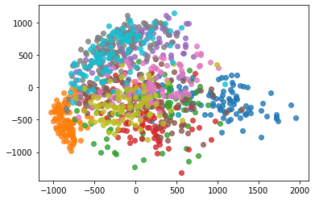

# 7-7 试手 MNIST 数据集


```python
from sklearn.datasets import fetch_openml
import numpy as np
```


```python
import time
```


```python
# start time
time.asctime()
```


    'Mon Jan 25 14:17:35 2021'


```python
# Load data from https://www.openml.org/d/554
# ≈ 15 分钟
mnist = fetch_openml('mnist_784', version=1, data_home='datasets', cache=True)
```


```python
# end time
time.asctime()
```


    'Mon Jan 25 14:17:57 2021'


```python
mnist.DESCR
```


    "**Author**: Yann LeCun, Corinna Cortes, Christopher J.C. Burges  \n**Source**: [MNIST Website](http://yann.lecun.com/exdb/mnist/) - Date unknown  \n**Please cite**:  \n\nThe MNIST database of handwritten digits with 784 features, raw data available at: http://yann.lecun.com/exdb/mnist/. It can be split in a training set of the first 60,000 examples, and a test set of 10,000 examples  \n\nIt is a subset of a larger set available from NIST. The digits have been size-normalized and centered in a fixed-size image. It is a good database for people who want to try learning techniques and pattern recognition methods on real-world data while spending minimal efforts on preprocessing and formatting. The original black and white (bilevel) images from NIST were size normalized to fit in a 20x20 pixel box while preserving their aspect ratio. The resulting images contain grey levels as a result of the anti-aliasing technique used by the normalization algorithm. the images were centered in a 28x28 image by computing the center of mass of the pixels, and translating the image so as to position this point at the center of the 28x28 field.  \n\nWith some classification methods (particularly template-based methods, such as SVM and K-nearest neighbors), the error rate improves when the digits are centered by bounding box rather than center of mass. If you do this kind of pre-processing, you should report it in your publications. The MNIST database was constructed from NIST's NIST originally designated SD-3 as their training set and SD-1 as their test set. However, SD-3 is much cleaner and easier to recognize than SD-1. The reason for this can be found on the fact that SD-3 was collected among Census Bureau employees, while SD-1 was collected among high-school students. Drawing sensible conclusions from learning experiments requires that the result be independent of the choice of training set and test among the complete set of samples. Therefore it was necessary to build a new database by mixing NIST's datasets.  \n\nThe MNIST training set is composed of 30,000 patterns from SD-3 and 30,000 patterns from SD-1. Our test set was composed of 5,000 patterns from SD-3 and 5,000 patterns from SD-1. The 60,000 pattern training set contained examples from approximately 250 writers. We made sure that the sets of writers of the training set and test set were disjoint. SD-1 contains 58,527 digit images written by 500 different writers. In contrast to SD-3, where blocks of data from each writer appeared in sequence, the data in SD-1 is scrambled. Writer identities for SD-1 is available and we used this information to unscramble the writers. We then split SD-1 in two: characters written by the first 250 writers went into our new training set. The remaining 250 writers were placed in our test set. Thus we had two sets with nearly 30,000 examples each. The new training set was completed with enough examples from SD-3, starting at pattern # 0, to make a full set of 60,000 training patterns. Similarly, the new test set was completed with SD-3 examples starting at pattern # 35,000 to make a full set with 60,000 test patterns. Only a subset of 10,000 test images (5,000 from SD-1 and 5,000 from SD-3) is available on this site. The full 60,000 sample training set is available.\n\nDownloaded from openml.org."


```python
mnist.target_names
```


    ['class']


```python
mnist.details
```


    {'id': '554',
     'name': 'mnist_784',
     'version': '1',
     'format': 'ARFF',
     'upload_date': '2014-09-29T03:28:38',
     'licence': 'Public',
     'url': 'https://www.openml.org/data/v1/download/52667/mnist_784.arff',
     'file_id': '52667',
     'default_target_attribute': 'class',
     'tag': ['AzurePilot',
      'OpenML-CC18',
      'OpenML100',
      'study_1',
      'study_123',
      'study_41',
      'study_99',
      'vision'],
     'visibility': 'public',
     'status': 'active',
     'processing_date': '2020-11-20 20:12:09',
     'md5_checksum': '0298d579eb1b86163de7723944c7e495'}


```python
X, y = mnist['data'], mnist['target']
```


```python
X.shape
```


    (70000, 784)


```python
y.shape
```


    (70000,)


```python
X_train = np.array(X[:60000], dtype=float)
y_train = np.array(y[:60000], dtype=float)

X_test = np.array(X[60000:], dtype=float)
y_test = np.array(y[60000:], dtype=float)
```


```python
X_train.shape
```


    (60000, 784)


```python
y_test.shape 
```


    (10000,)


```python
X_test.shape
```


    (10000, 784)


```python
y_test.shape
```


    (10000,)


## 使用 KNN


```python
from sklearn.neighbors import KNeighborsClassifier

knn_clf = KNeighborsClassifier()
%time knn_clf.fit(X_train, y_train)
```

    CPU times: user 19.5 s, sys: 169 ms, total: 19.7 s
    Wall time: 19.8 s


    KNeighborsClassifier()


```python
%time knn_clf.score(X_test[:900], y_test[:900]) # 如果预测 10000 的样本的话，估计需要 7~8 分钟
```

    CPU times: user 1min 2s, sys: 57 ms, total: 1min 2s
    Wall time: 1min 2s


    0.9633333333333334


## 进行 PCA 降维


```python
from sklearn.decomposition import PCA

pca = PCA(0.9)
pca.fit(X_train)
X_train_reduction = pca.transform(X_train)
```


```python
# 从原始的 784 维，降低到了只有 87 维
X_train_reduction.shape
```


    (60000, 87)


```python
knn_clf = KNeighborsClassifier()
%time knn_clf.fit(X_train_reduction, y_train)
```

    CPU times: user 552 ms, sys: 4.46 ms, total: 556 ms
    Wall time: 408 ms


    KNeighborsClassifier()


```python
X_test_reduction = pca.transform(X_test)
```


```python
# PCA 降维后 57.1 s 分类 10000 个样本
%time knn_clf.score(X_test_reduction, y_test)
```

    CPU times: user 57.2 s, sys: 41.7 ms, total: 57.2 s
    Wall time: 57.1 s


    0.9728


PCA 后，虽然丢失了 10% 的信息，但是最后的分类精度反而提升了。这就是 PCA 的另一个作用：降噪！

## 降为 2 维进行可视化


```python
X = mnist['data']

X.shape
```


    (70000, 784)


```python
y = mnist['target']

y.shape
```


    (70000,)


```python
y == 1
```


    array([False, False, False, ..., False, False, False])


```python
pca = PCA(n_components=2)
pca.fit(X)
X_reduction = pca.transform(X)
```


```python
X_reduction.shape
```


    (70000, 2)


```python
plt.scatter(X_reduction[0:10, 0], X_reduction[0:10, 1])
```


    <matplotlib.collections.PathCollection at 0x7fbd1a7050f0>

​    

​    


```python
X_reduction
```


    array([[ 122.25586125, -316.22304828],
           [1010.49434052, -289.96236898],
           [ -58.99572529,  393.70127635],
           ...,
           [-271.50683379,  590.08149957],
           [-310.22531977, -116.73136776],
           [1058.86204802,  -83.39454513]])


```python
y = y.astype(int)
```


```python
for i in range(10):
    plt.scatter(X_reduction[y==i, 0], X_reduction[y==i, 1], alpha=0.8) # matplotlib 自动选择了不同的颜色
plt.show()
```

​    

​    


只绘制 1000 个样本。


```python
X_reduction1 = X_reduction[:1000]
```


```python
y1 = y[:1000]
```


```python
for i in range(10):
    plt.scatter(X_reduction1[y1==i, 0], X_reduction1[y1==i, 1], alpha=0.8) # matplotlib 自动选择了不同的颜色
plt.show()
```

​    

​    


```python

```
