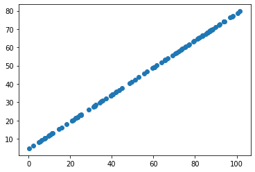
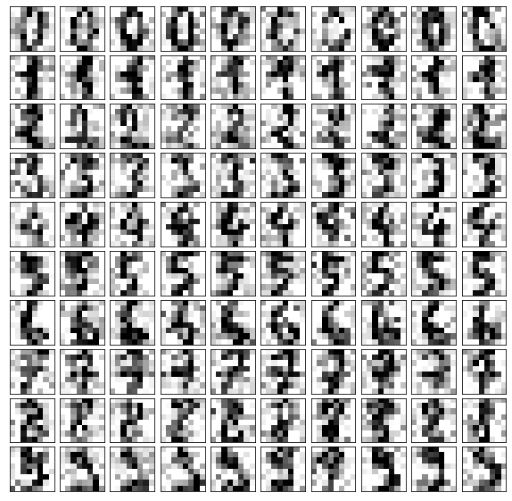
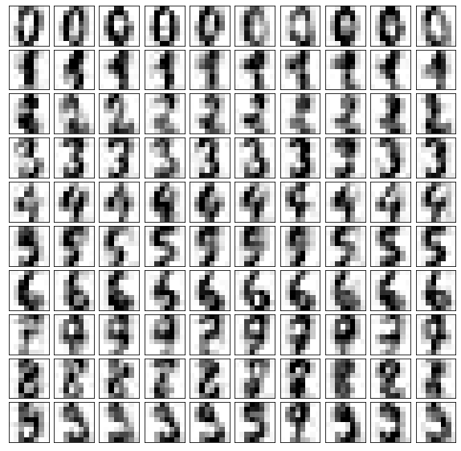

# 7-8 使用 PCA 降噪

回忆之前的例子。


```python
import numpy as np
import matplotlib.pyplot as plt
```


```python
X = np.empty((100, 2))
X[:,0] = np.random.uniform(0., 100, size=100)
X[:,1] = 0.75 * X[:,0] + 3. + np.random.normal(0, 5, size=100)
```


```python
plt.scatter(X[:,0], X[:,1])
plt.show()
```

​    

​    


```python
from sklearn.decomposition import PCA

pca = PCA(n_components=1)
pca.fit(X)

X_reduction = pca.transform(X)
X_restore = pca.inverse_transform(X_reduction)
```


```python
# 丢失的信息，很大可能是噪声
plt.scatter(X_restore[:,0], X_restore[:,1])
plt.show()
```

​    

​    


## 手写识别的例子


```python
from sklearn import datasets

digits = datasets.load_digits()
X = digits.data
y = digits.target
```


```python
noisy_digits = X + np.random.normal(0, 4, size=X.shape)
```


```python
example_digits = noisy_digits[y==0,:][:10]
for num in range(1, 10):
    X_num = noisy_digits[y==num,:][:10]
    example_digits = np.vstack([example_digits, X_num])
```


```python
example_digits.shape
```


    (100, 64)


```python
# 在一幅图中绘制多个子图
def plot_digits(data):
    fig, axes = plt.subplots(10, 10, figsize=(10, 10),
                             subplot_kw={'xticks':[], 'yticks':[]},
    gridspec_kw = dict(hspace=0.1, wspace=0.1))
    for i, ax in enumerate(axes.flat):
        ax.imshow(data[i].reshape(8, 8),
                  cmap='binary', interpolation='nearest',
                  clim=(0, 16))
    plt.show()
```


```python
plot_digits(example_digits)
```

​    

​    


```python
pca = PCA(0.5) # 噪声比较大，只保留 0.5 的信息
pca.fit(noisy_digits)
```


    PCA(n_components=0.5)


```python
pca.n_components_
```


    12


```python
components = pca.transform(example_digits)
filtered_digits = pca.inverse_transform(components)
```


```python
plot_digits(filtered_digits)
```



​    

