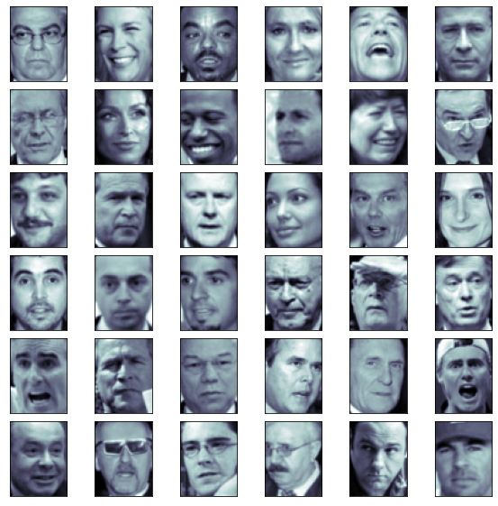
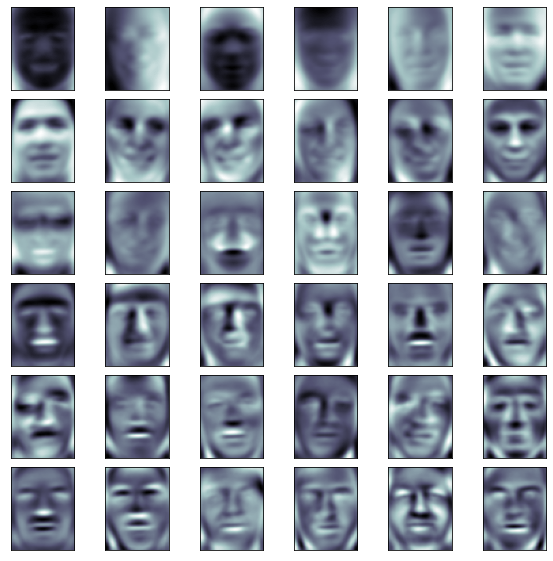

# 7-9 人脸识别与特征脸


```python
import numpy as np
import matplotlib.pyplot as plt
```


```python
from sklearn.datasets import fetch_lfw_people
from PIL import Image
```


```python
import time

time.asctime()
```


    'Mon Jan 25 15:28:01 2021'


```python
faces = fetch_lfw_people()
```


```python
time.asctime()
```


    'Mon Jan 25 15:31:19 2021'


```python
faces.keys()
```


    dict_keys(['data', 'images', 'target', 'target_names', 'DESCR'])


```python
faces.data.shape
```


    (13233, 2914)


```python
faces.images.shape # 62 * 47 = 2914
```


    (13233, 62, 47)


```python
random_indexes = np.random.permutation(len(faces.data))
X = faces.data[random_indexes]
```


```python
example_faces = X[:36,:] # 选择36张
example_faces.shape
```


    (36, 2914)


```python
def plot_faces(data):
    fig, axes = plt.subplots(6, 6, figsize=(10, 10),
                             subplot_kw={'xticks':[], 'yticks':[]},
    gridspec_kw = dict(hspace=0.1, wspace=0.1))
    for i, ax in enumerate(axes.flat):
        ax.imshow(data[i].reshape(62, 47),
                  cmap='bone')
    plt.show()
```


```python
plot_faces(example_faces)
```

​    

​    


```python
faces.target_names
```


    array(['AJ Cook', 'AJ Lamas', 'Aaron Eckhart', ..., 'Zumrati Juma',
           'Zurab Tsereteli', 'Zydrunas Ilgauskas'], dtype='<U35')


```python
len(faces.target_names)
```


    5749


## 特征脸


```python
%%time
from sklearn.decomposition import PCA
pca = PCA(svd_solver='randomized')
pca.fit(X)
```

    CPU times: user 1min 16s, sys: 1.86 s, total: 1min 18s
    Wall time: 34.8 s


    PCA(svd_solver='randomized')


```python
pca.components_.shape
```


    (2914, 2914)


```python
plot_faces(pca.components_[:36,:])
```

​    

​    


```python
# 每个的每张图片不少于 60 张，作为数据集
faces2 = fetch_lfw_people(min_faces_per_person=60)
```


```python
faces2.data.shape
```


    (1348, 2914)


```python
faces2.target_names
```


    array(['Ariel Sharon', 'Colin Powell', 'Donald Rumsfeld', 'George W Bush',
           'Gerhard Schroeder', 'Hugo Chavez', 'Junichiro Koizumi',
           'Tony Blair'], dtype='<U17')


