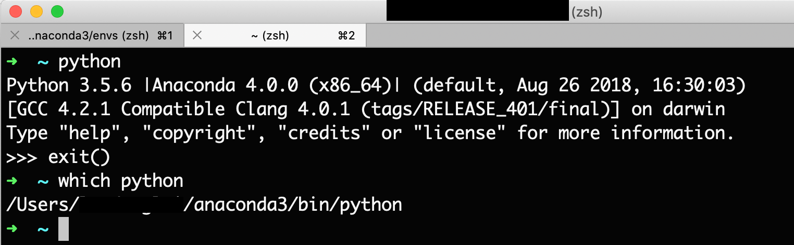
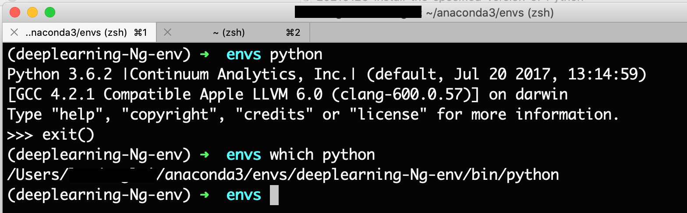
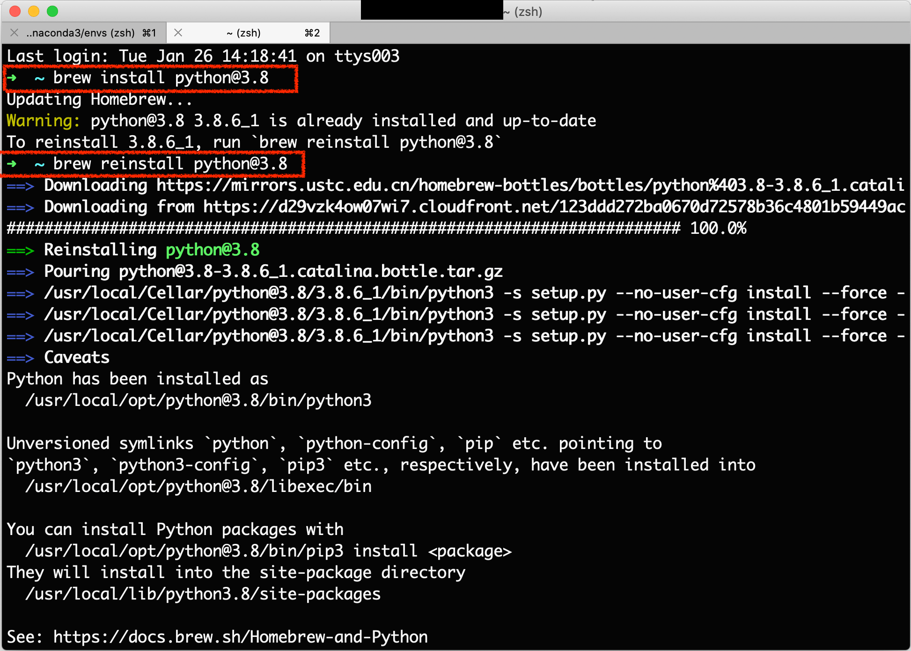
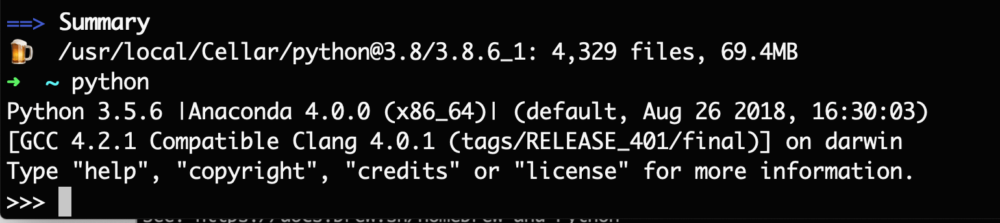
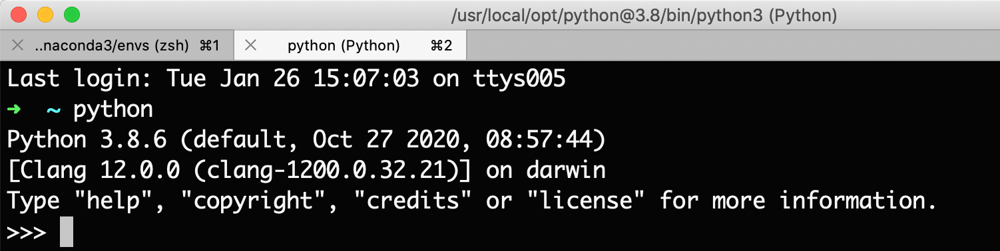
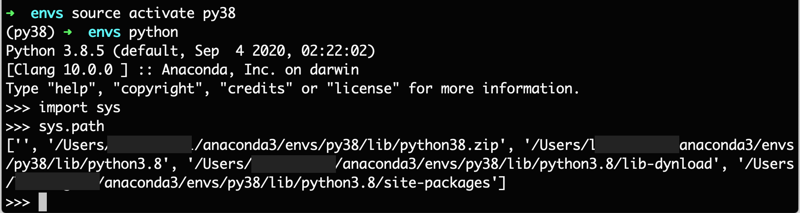
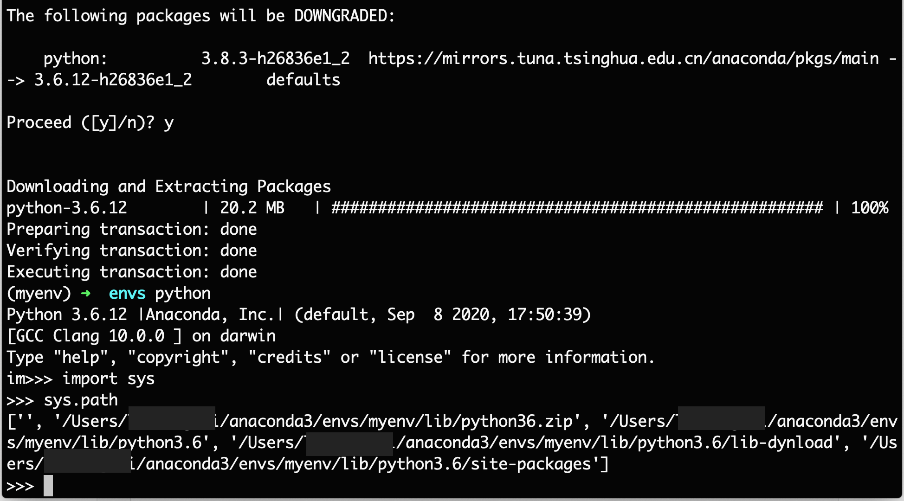

# 安装指定版本的 Python

```powershell
conda create -n your_env_name python=X.X（2.7、3.6等）

conda install -n your_env_name [package]
```


在我的电脑上，系统的 Python 版本为 3.5.6：



虚拟环境中的 Python 各有不同，相互独立：



现在我的需求是，如何安装指定的版本的 Python？

- 系统的 Python 版本
- 虚拟环境中的 Python 版本

## 1. 系统的版本升级为 Python 3.8

使用 Homebrew：

```
brew reinstall python@3.8
```




显示 Python 3.8 安装成功。但是此时 sys 中的 Python 仍然为 3.5.6，



添加了如下三行依旧是不行的：

```shell
export PATH="/usr/local/opt/python@3.8/bin:$PATH"
export LDFLAGS="-L/usr/local/opt/python@3.8/lib"
export PKG_CONFIG_PATH="/usr/local/opt/python@3.8/lib/pkgconfig"
```

如何将系统的 Python 3.5 转换为 Python 3.8 呢？

问题出在了这里：

```shell
➜  ~ which python
/Users/landon/anaconda3/bin/python
```

接下来把 `~/.zshrc` 中的一行代码注释掉：

```shell
# export PATH="/Users/landon/anaconda3/bin:$PATH"
```

Python 3.8 出现了：

```shell
➜  ~ python3
Python 3.8.6 (default, Oct 27 2020, 08:57:44)
[Clang 12.0.0 (clang-1200.0.32.21)] on darwin
Type "help", "copyright", "credits" or "license" for more information.
>>> exit()
➜  ~ python

WARNING: Python 2.7 is not recommended.
This version is included in macOS for compatibility with legacy software.
Future versions of macOS will not include Python 2.7.
Instead, it is recommended that you transition to using 'python3' from within Terminal.

Python 2.7.16 (default, Jun  5 2020, 22:59:21)
[GCC 4.2.1 Compatible Apple LLVM 11.0.3 (clang-1103.0.29.20) (-macos10.15-objc- on darwin
Type "help", "copyright", "credits" or "license" for more information.
>>> exit()
```

接下来把 Python 2.7 消灭掉。

```shell
➜  ~ which python3
/usr/local/opt/python@3.8/bin/python3
➜  ~ which python2
/usr/bin/python2
➜  ~ which python
/usr/bin/python
```

使用 `alias` ：

```
alias python="/usr/local/opt/python@3.8/bin/python3"
```




## 2. 虚拟环境中的 Python

> 这个我非常郁闷，在下载过程中经常会发生 Time out。

平常使用的话，基本上都会使用虚拟环境，很少会使用 sys 中的 Python。

(deeplearning-Ng-env) 环境中安装了 3.6.2 的 Python， 

```shell
➜  envs source activate deeplearning-Ng-env
(deeplearning-Ng-env) ➜  envs python
Python 3.6.2 |Continuum Analytics, Inc.| (default, Jul 20 2017, 13:14:59)
[GCC 4.2.1 Compatible Apple LLVM 6.0 (clang-600.0.57)] on darwin
Type "help", "copyright", "credits" or "license" for more information.
>>>
```

现在，我想要将环境更换为 Python3.8

### 方法一：创建一个指定 Python 版本的新的环境

>An HTTP error occurred when trying to retrieve this URL.
>
>如果遇到错误，就报清华源去掉，使用默认的，并且把自己的 VPN 打开（基本可以解决大部分由网络造成问题）。
>
>```
>  - https://mirrors.tuna.tsinghua.edu.cn/anaconda/pkgs/free/
>  - https://mirrors.tuna.tsinghua.edu.cn/anaconda/pkgs/main/
>```

```shell
➜  envs conda create -n py38 python=3.8
```



```
(py38) ➜  envs which pip
/Users/landon/anaconda3/envs/py38/bin/pip
```

通过查看 sys.path 和 pip 的路径，可以看到，路径已经是虚拟环境的路径了。完成了与系统 Python 的分离。

### 方法二：升级当前虚拟环境的 Python 版本

(myenv) 虚拟环境的 Python 版本为  3.8.3：

```shell
➜  envs source activate myenv
(myenv) ➜  envs python
Python 3.8.3 (default, Jul  2 2020, 11:26:31)
[Clang 10.0.0 ] :: Anaconda, Inc. on darwin
Type "help", "copyright", "credits" or "license" for more information.
```

从 3.8 降为 3.6：conda 命令，pip 一般情况下是失败的。Anaconda 的 conda 是一个更加好的工具。

```shell
# 命令
conda install -n myenv python=3.6
```

```shell
(myenv) ➜  envs conda install -n myenv python=3.6
Solving environment: done

## Package Plan ##

  environment location: /Users/landonglei/anaconda3/envs/myenv

  added / updated specs:
    - python=3.6


The following packages will be downloaded:

    package                    |            build
    ---------------------------|-----------------
    python-3.6.12              |       h26836e1_2        20.2 MB  defaults
    
The following packages will be DOWNGRADED:

    python:          3.8.3-h26836e1_2  https://mirrors.tuna.tsinghua.edu.cn/anaconda/pkgs/main --> 3.6.12-h26836e1_2        defaults

Proceed ([y]/n)? y


Downloading and Extracting Packages
python-3.6.12        | 20.2 MB   | ##################################################### | 100%
Preparing transaction: done
Verifying transaction: done
Executing transaction: done
```

安装 Python3.6 完成：



## 总结

在开始一个工程时，要记得检查 Python 的 sys.path，确保环境符合自己的预期。