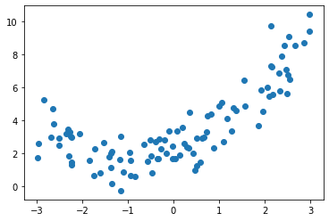
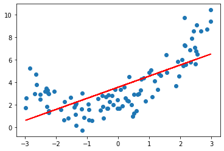
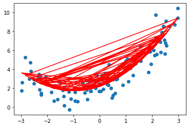
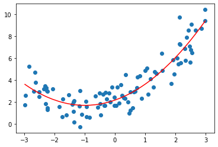

# 8-1 多项式回归

线性回归：$y =ax + b$

多项式回归：$y = ax^2 + bx + c$

- 把 $x^2$ 单独看做是一个特征，则 $y = ax^2 + bx + c$ 依然是一个线性回归的例子。

多项式回归：为样本多添加里一些特征，这些特征是原特征的多项式项。


```python
import numpy as np
import matplotlib.pyplot as plt
```


```python
x = np.random.uniform(-3, 3, size=100)
X = x.reshape(-1, 1)
```


```python
y = 0.5 * x**2 + x + 2 + np.random.normal(0, 1, size=100)
```


```python
plt.scatter(x, y)
plt.show()
```

​    

​    


## 使用线性回归进行拟合


```python
from sklearn.linear_model import LinearRegression

lin_reg = LinearRegression()
lin_reg.fit(X, y)
```


    LinearRegression()


```python
y_predict = lin_reg.predict(X)
```


```python
plt.scatter(x, y)
plt.plot(x, y_predict, color="red")
plt.show()
```

​    

​    


```python
lin_reg.score(X, y)
```


    0.5030154336003514


## 多项式回归


```python
(X**2).shape
```


    (100, 1)


```python
X2 = np.hstack([X, X**2])
```


```python
X2.shape
```


    (100, 2)


```python
lin_reg2 = LinearRegression()
lin_reg2.fit(X2, y)
```


    LinearRegression()


```python
y_predict2 = lin_reg2.predict(X2)
```


```python
plt.scatter(x, y)
plt.plot(x, y_predict2, color="red")
plt.show()
```

​    

​    


```python
plt.scatter(x, y)
plt.plot(np.sort(x), y_predict2[np.argsort(x)], color="red")
plt.show()
```

​    

​    


```python
lin_reg2.score(X2, y)
```


    0.8178161465621729


```python
lin_reg2.coef_
```


    array([0.96468738, 0.48675282])


```python
# y = 0.5 * x**2 + x + 2 + np.random.normal(0, 1, size=100)
```


```python
# 截距
lin_reg2.intercept_
```


    2.152906499856324


