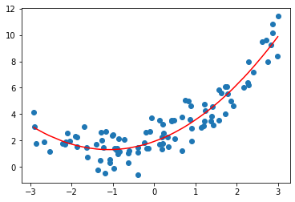
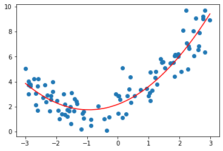

# 8-2 scikit-learn 中的多项式回归与 pipeline 


```python
import numpy as np
import matplotlib.pyplot as plt
```


```python
x = np.random.uniform(-3, 3, size=100)
X = x.reshape(-1, 1)
y = 0.5 * x**2 + x + 2 + np.random.normal(0, 1 , 100)
```


```python
from sklearn.preprocessing import PolynomialFeatures # 多项式回归本质是一种数据预处理
```


```python
poly = PolynomialFeatures(degree=2) # degree 表示为原始数据最多添加几次幂相应的特征
poly.fit(X)
X2 = poly.transform(X)
```


```python
X2.shape
```


    (100, 3)


```python
X2[:5,:] # 1 为 x^0 
```


    array([[ 1.        , -1.35927661,  1.8476329 ],
           [ 1.        ,  1.91700696,  3.67491567],
           [ 1.        ,  1.86338988,  3.47222186],
           [ 1.        ,  1.72220424,  2.96598746],
           [ 1.        , -0.61887781,  0.38300975]])


```python
from sklearn.linear_model import LinearRegression

lin_reg2 = LinearRegression()
lin_reg2.fit(X2, y)
y_predict2 = lin_reg2.predict(X2)
```


```python
lin_reg2.coef_
```


    array([0.        , 1.12126717, 0.50986916])


```python
plt.scatter(x, y)
plt.plot(np.sort(x), y_predict2[np.argsort(x)], color="red")
plt.show()
```

​    

​    


```python
lin_reg2.intercept_
```


    1.925919293313227


## 关于 PolynomialFeatures


```python
X = np.arange(1, 11).reshape(-1, 2)
```


```python
X.shape
```


    (5, 2)


```python
poly = PolynomialFeatures(degree=2)
poly.fit(X)
X2 = poly.transform(X)
```


```python
X2.shape
```


    (5, 6)


```python
X2 # (x1, x2)^2 = x1^2 , x1x2, x2^2
```


    array([[  1.,   1.,   2.,   1.,   2.,   4.],
           [  1.,   3.,   4.,   9.,  12.,  16.],
           [  1.,   5.,   6.,  25.,  30.,  36.],
           [  1.,   7.,   8.,  49.,  56.,  64.],
           [  1.,   9.,  10.,  81.,  90., 100.]])


```python
# 如果 degree=3
```


```python
poly = PolynomialFeatures(degree=3)
poly.fit(X)
X3 = poly.transform(X)
```


```python
X3.shape
```


    (5, 10)


$1, x_1, x_2, x_1^2, x_2^2, x_1x_2, x_1^3, x_2^3, x_1^2x_2, x_1x_2^2$


```python
X3
```


    array([[   1.,    1.,    2.,    1.,    2.,    4.,    1.,    2.,    4.,
               8.],
           [   1.,    3.,    4.,    9.,   12.,   16.,   27.,   36.,   48.,
              64.],
           [   1.,    5.,    6.,   25.,   30.,   36.,  125.,  150.,  180.,
             216.],
           [   1.,    7.,    8.,   49.,   56.,   64.,  343.,  392.,  448.,
             512.],
           [   1.,    9.,   10.,   81.,   90.,  100.,  729.,  810.,  900.,
            1000.]])


## Pipeline

传统的方法需要三步：

(1) 多项式的特征

(2) 数据的归一化

(3) 线性回归

Pipeline 可以将三步合一。


```python
x = np.random.uniform(-3, 3, size=100)
X = x.reshape(-1, 1)
y = 0.5 * x**2 + x + 2 + np.random.normal(0, 1 , 100)
```


```python
from sklearn.pipeline import Pipeline
from sklearn.preprocessing import StandardScaler

poly_reg = Pipeline([
    ("poly", PolynomialFeatures(degree=2)),
    ("std_scaler", StandardScaler()),
    ("lin_reg", LinearRegression())
])
```


```python
poly_reg.fit(X, y)
```


    Pipeline(steps=[('poly', PolynomialFeatures()),
                    ('std_scaler', StandardScaler()),
                    ('lin_reg', LinearRegression())])


```python
y_predict = poly_reg.predict(X)
```


```python
plt.scatter(x, y)
plt.plot(np.sort(x), y_predict[np.argsort(x)], color="red")
plt.show()
```

​    

​    

