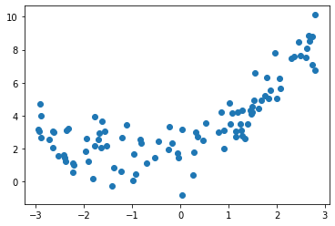
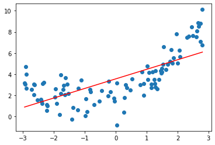
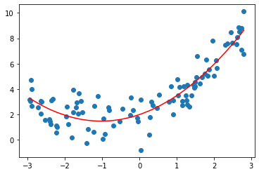
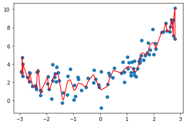

# 8-3 过拟合和欠拟合


```python
import numpy as np
import matplotlib.pyplot as plt
```


```python
x = np.random.uniform(-3, 3, size=100)
X = x.reshape(-1, 1)
y = 0.5 * x**2 + x + 2 + np.random.normal(0, 1 , 100)
```


```python
plt.scatter(x, y)
plt.show()
```

​    

​    


```python
from sklearn.linear_model import LinearRegression

lin_reg = LinearRegression()
lin_reg.fit(X, y)
lin_reg.score(X, y)
```


    0.5048321387397863


```python
y_predict = lin_reg.predict(X)
plt.scatter(x, y)
plt.plot(np.sort(x), y_predict[np.argsort(x)], color='r')
plt.show()
```

​    

​    


使用均方误差指标。


```python
from sklearn.metrics import mean_squared_error

y_predict = lin_reg.predict(X)
mean_squared_error(y, y_predict)
```


    2.576055286285105


## 使用多项式回归


```python
from sklearn.pipeline import Pipeline
from sklearn.preprocessing import StandardScaler
from sklearn.preprocessing import PolynomialFeatures # 多项式回归本质是一种数据预处理

def PolynomialRegression(degree):
    return Pipeline([
        ("poly", PolynomialFeatures(degree)),
        ("std_scaler", StandardScaler()),
        ("lin_reg", LinearRegression())
    ])
```


```python
poly2_reg = PolynomialRegression(2)
poly2_reg.fit(X, y)
```


    Pipeline(steps=[('poly', PolynomialFeatures()),
                    ('std_scaler', StandardScaler()),
                    ('lin_reg', LinearRegression())])


```python
y2_predict = poly2_reg.predict(X)
mean_squared_error(y, y2_predict) # 显然小于线性回归
```


    0.9838063969948245


```python
plt.scatter(x, y)
plt.plot(np.sort(x), y2_predict[np.argsort(x)], color='r')
plt.show()
```

​    

​    


```python
poly10_reg = PolynomialRegression(10)
poly10_reg.fit(X, y)

y10_predict = poly10_reg.predict(X)
mean_squared_error(y, y10_predict) # 显然小于线性回归
```


    0.8973158411490383


```python
plt.scatter(x, y)
plt.plot(np.sort(x), y10_predict[np.argsort(x)], color='r')
plt.show()
```

​    

​    


```python
poly100_reg = PolynomialRegression(100)
poly100_reg.fit(X, y)

y100_predict = poly100_reg.predict(X)
mean_squared_error(y, y100_predict) # 显然小于线性回归
```


    0.46042530862510356


```python
plt.scatter(x, y)
plt.plot(np.sort(x), y100_predict[np.argsort(x)], color='r')
plt.show()
```

​    

​    


```python
X_plot = np.linspace(-3, 3, 100).reshape(100, 1)
y_plot = poly100_reg.predict(X_plot)

plt.scatter(x, y)
plt.plot(X_plot[:,0], y_plot, color='r')
plt.axis([-3, 3, -1, 10])
plt.show()
```

​    

​    

