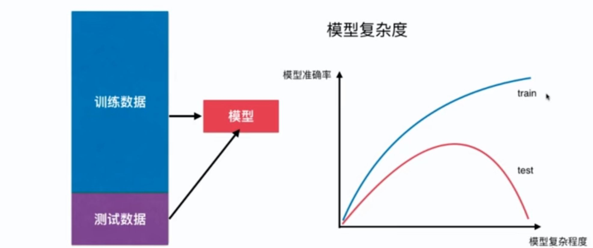

# 8-4 为什么需要训练数据集和测试数据集

模型的泛化能力



- 欠拟合 Underfitting：算法所训练的模型不能完整表达数据关系。
- 过拟合 Overfitting：算法所训练的模型过多的表达了数据间的噪音关系。

寻找泛化能力最好的地方。

## train test split 的意义

```python
import numpy as np
import matplotlib.pyplot as plt

x = np.random.uniform(-3, 3, size=100)
X = x.reshape(-1, 1)
y = 0.5 * x**2 + x + 2 + np.random.normal(0, 1 , 100)
```

```python
from sklearn.model_selection import train_test_split

X_train, X_test, y_train, y_test = train_test_split(X, y, random_state=666)
```

```python
X_train.shape
```


```
(75, 1)
```


```python
X_test.shape
```


```
(25, 1)
```


```python
from sklearn.linear_model import LinearRegression
from sklearn.metrics import mean_squared_error

lin_reg = LinearRegression()
lin_reg.fit(X_train, y_train)
y_predict = lin_reg.predict(X_test)

mean_squared_error(y_test, y_predict)
```


```
3.0352334206458966
```


```python
from sklearn.pipeline import Pipeline
from sklearn.preprocessing import StandardScaler
from sklearn.preprocessing import PolynomialFeatures # 多项式回归本质是一种数据预处理

def PolynomialRegression(degree):
    return Pipeline([
        ("poly", PolynomialFeatures(degree)),
        ("std_scaler", StandardScaler()),
        ("lin_reg", LinearRegression())
    ])
```

```python
poly2_reg = PolynomialRegression(degree=2)
poly2_reg.fit(X_train, y_train)

y2_predict = poly2_reg.predict(X_test)
mean_squared_error(y_test, y2_predict) 
```


```
1.2687249984968663
```


```python
poly10_reg = PolynomialRegression(degree=10)
poly10_reg.fit(X_train, y_train)

y10_predict = poly10_reg.predict(X_test)
mean_squared_error(y_test, y10_predict)
```


```
1.2313079488750964
```


```python
# MSE 增大
poly30_reg = PolynomialRegression(degree=30)
poly30_reg.fit(X_train, y_train)

y30_predict = poly30_reg.predict(X_test)
mean_squared_error(y_test, y30_predict)
```


```
2.326907100635332
```


