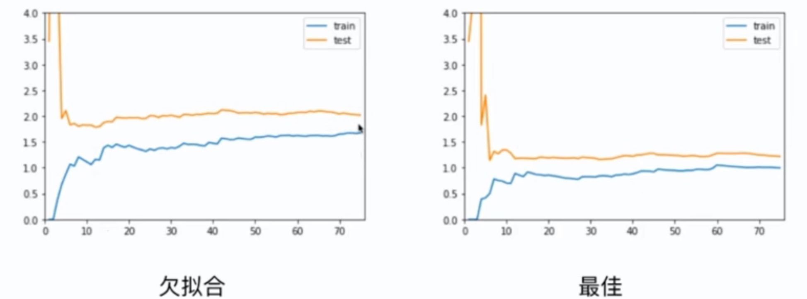
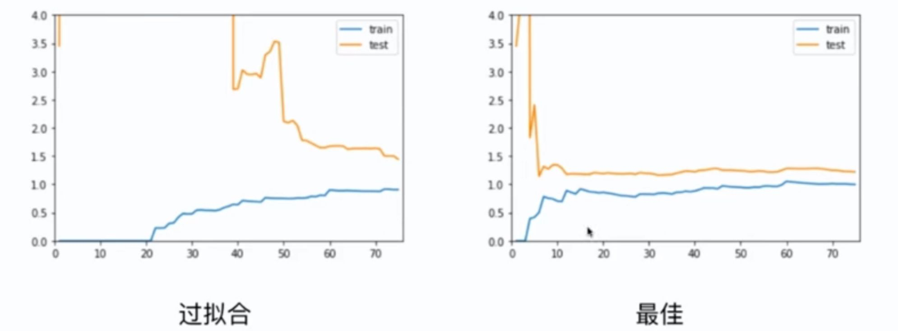
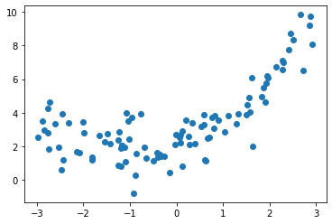
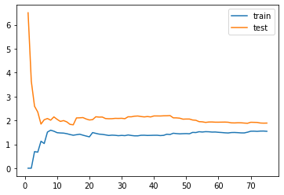
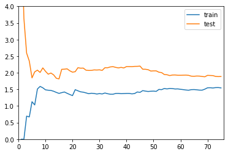
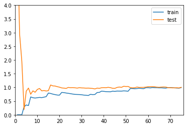

# 8-5 学习曲线

通过学习曲线可以看到模型对数据的欠拟合和过拟合。

随着训练样本的逐渐增多，算法训练出来的模型的表现能力。






## 学习曲线


```python
import numpy as np
import matplotlib.pyplot as plt

np.random.seed(10)
x = np.random.uniform(-3, 3, size=100)
X = x.reshape(-1, 1)
y = 0.5 * x**2 + x + 2 + np.random.normal(0, 1 , 100)
```


```python
plt.scatter(x, y)
plt.show()
```

​    

​    


```python
from sklearn.model_selection import train_test_split

X_train, X_test, y_train, y_test = train_test_split(X, y, random_state=10)
```


```python
X_train.shape
```


    (75, 1)


```python
X_test.shape
```


    (25, 1)


```python
from sklearn.linear_model import LinearRegression
from sklearn.metrics import mean_squared_error

train_score = []
test_score = []

for i in range(1, 76):
    lin_reg = LinearRegression()
    lin_reg.fit(X_train[:i], y_train[:i])
    
    y_train_predict = lin_reg.predict(X_train[:i])
    train_score.append(mean_squared_error(y_train[:i], y_train_predict))
    
    y_test_predict = lin_reg.predict(X_test[:i])
    test_score.append(mean_squared_error(y_test[:i], y_test_predict))
```

    /Users/landonglei/anaconda3/envs/ldl-env/lib/python3.6/site-packages/sklearn/linear_model/_base.py:547: RuntimeWarning: internal gelsd driver lwork query error, required iwork dimension not returned. This is likely the result of LAPACK bug 0038, fixed in LAPACK 3.2.2 (released July 21, 2010). Falling back to 'gelss' driver.
      linalg.lstsq(X, y)


```python
plt.plot([i for i in range(1, 76)], np.sqrt(train_score), label="train")
plt.plot([i for i in range(1, 76)], np.sqrt(test_score), label="test")

plt.legend()
plt.show()
```

​    

​    


```python
def plot_learning_curve(algo, X_train, X_test, y_train, y_test):
    train_score = []
    test_score = []

    for i in range(1, len(X_train)+1):
        algo.fit(X_train[:i], y_train[:i])

        y_train_predict = algo.predict(X_train[:i])
        train_score.append(mean_squared_error(y_train[:i], y_train_predict))

        y_test_predict = algo.predict(X_test[:i])
        test_score.append(mean_squared_error(y_test[:i], y_test_predict))
    
    plt.plot([i for i in range(1, len(X_train)+1)], np.sqrt(train_score), label="train")
    plt.plot([i for i in range(1, len(X_train)+1)], np.sqrt(test_score), label="test")

    plt.legend()
    plt.axis([0, len(X_train)+1, 0, 4])
    plt.show()
```


```python
plot_learning_curve(LinearRegression(), X_train, X_test, y_train, y_test)
```

​    

​    


## 多项式回归的学习曲线


```python
from sklearn.preprocessing import PolynomialFeatures
from sklearn.preprocessing import StandardScaler
from sklearn.pipeline import Pipeline

def PolynomialRegression(degree):
    return Pipeline([
        ("poly", PolynomialFeatures(degree)),
        ("std_scaler", StandardScaler()),
        ("lin_reg", LinearRegression())
    ])
```


```python
poly2_reg = PolynomialRegression(degree=2)
plot_learning_curve(poly2_reg, X_train, X_test, y_train, y_test)
```

​    

​    


```python
poly20_reg = PolynomialRegression(degree=20)
plot_learning_curve(poly20_reg, X_train, X_test, y_train, y_test)
```

​    

​    