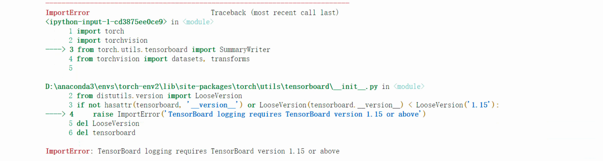
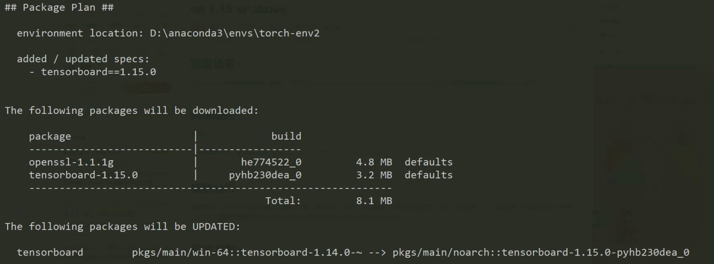
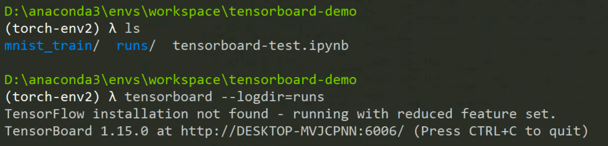
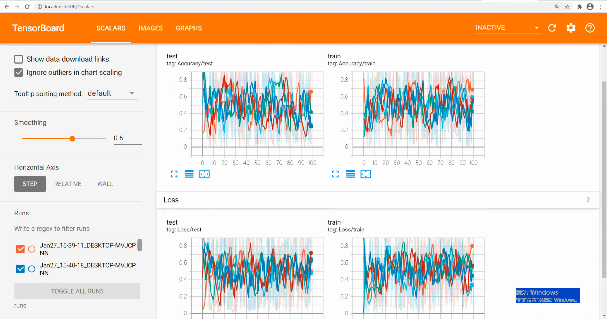
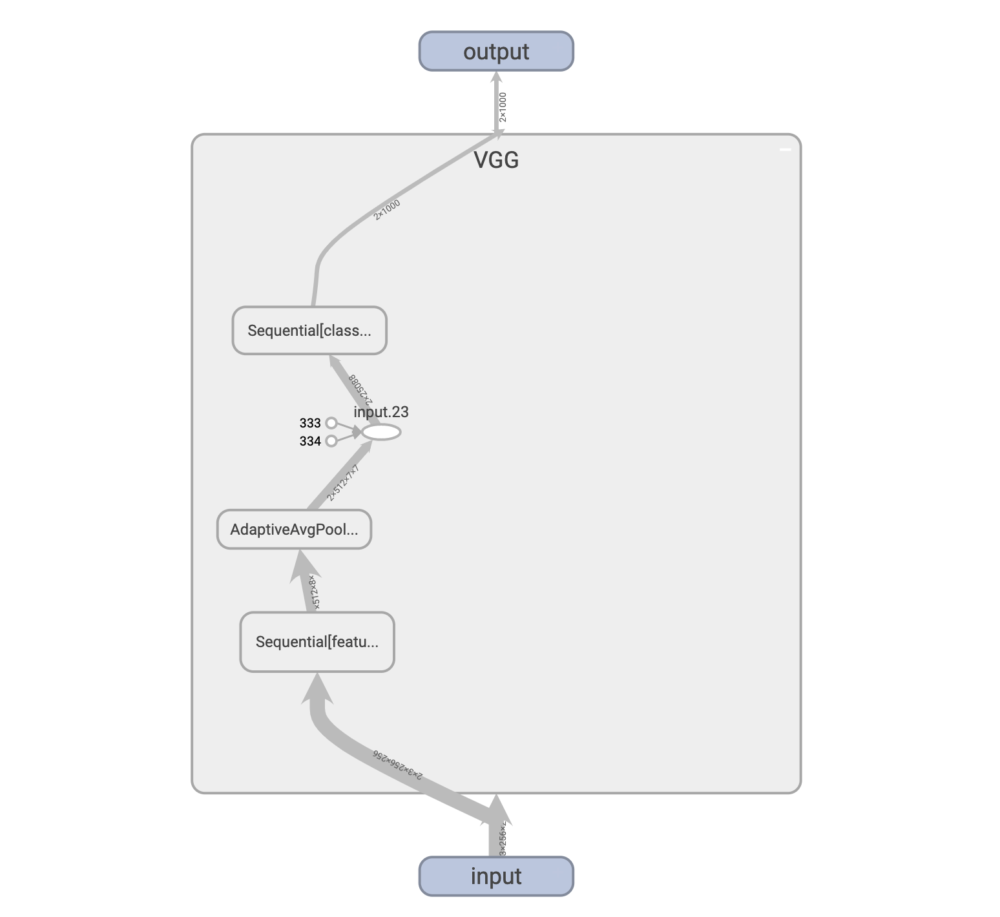
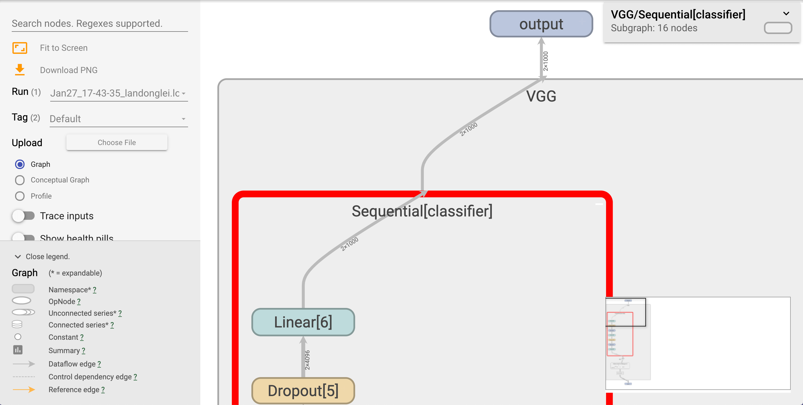

# 使用 TensorBoard 可视化 model

手动保存 checkpoint，再编写脚本读取，最后使用 matplotlib.pyplot 进行绘制。这样效率不高，今天尝试一些 TensorBoard。

## 安装 tensorboard

✅

```shell
conda install -n torch-env tensorboard=1.15.0
```


> ❌ 
>
> ```
> conda install tensorboard
> ```
>
> 查看 tensorboard 版本：
>
> ```shell
> >>> import tensorboard
> >>> tensorboard.version.VERSION
> '1.14.0'
> ```

注意，这个 tensorboard 和 `torch.utils.tensorboard` 不一样。

## 测试

>  

> ❌：TensorBoard 版本问题。

不知道为什么，使用 `pip list` 和 `conda list` 查出 tensorboard 的 版本是 2.3.0。

✅：安装 tensorboard==1.15.0

```shell
conda install -n torch-env tensorboard=1.15.0
```



```
tensorboard --logdir=runs
```



[http://localhost:6006/](http://localhost:6006/)



## 可视化 model graph

```python
import torch
import torchvision
from torch.utils.tensorboard import SummaryWriter
from torchvision import datasets, transforms

writer = SummaryWriter()

model = torchvision.models.vgg11()
dummy_input = torch.rand(2, 3, 256, 256)  # 假设输入2张3*256*256的图片
with SummaryWriter(comment='VGG11') as w:
    w.add_graph(model, (dummy_input,))
```

```
(ldl-env) ➜ tensorboard --logdir=runs
```






## 在 macOS 下安装

🌈🌈🌈 辛苦都是非常值得的！！！

以后就可以在 Mac 上编写模型代码，可视化检查无误后，就可以把代码放到远程的电脑上跑。

```shell
(ldl-env) ➜ conda install -n ldl-env tensorboard==1.15.0
Solving environment: done

# All requested packages already installed.

# 我特么要疯了，能不能不要给我整这些破事！
(ldl-env) ➜ tensoboard
zsh: command not found: tensoboard ❌
```

使用 pip 安装。✅

```shell
(ldl-env) ➜  pip install tensorboard==1.15.0
Collecting tensorboard==1.15.0
  Downloading https://files.pythonhosted.org/packages/1e/e9/d3d747a97f7188f48aa5eda486907f3b345cd409f0a0850468ba867db246/tensorboard-1.15.0-py3-none-any.whl (3.8MB)
    3% |█▏                              | 143kB 14kB/s eta 0:04:06
    
Successfully uninstalled tensorboard-2.4.0
Successfully installed tensorboard-1.15.0
You are using pip version 9.0.1, however version 21.0 is available.
You should consider upgrading via the 'pip install --upgrade pip' command.

(ldl-env) ➜  workspace tensorboard --logdir=runs ✅
TensorFlow installation not found - running with reduced feature set.
TensorBoard 1.15.0 at http://localhost:6006/ (Press CTRL+C to quit)
```

