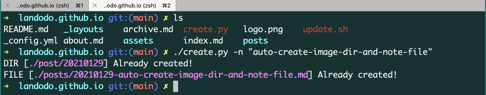

# 使用 Python 编写了一个自动常见文件夹和笔记文件的脚本

每次写笔记，都需要在 ./posts/ 下创建图片文件夹（以当天日期命名，如：20210129）和 Markdown 文件（如：20210129-deep-learning.md）。

今天编写了一个小脚本，帮助完成文件夹和文件的创建，使用方式如下：



只需要提供笔记的**名称字符串**作为参数输入，就可以自动创建好相应的文件夹和文件。

## 脚本

```python
#!/usr/bin/env python
# coding: utf-8

import os
import time
import glob
from datetime import datetime, date
import argparse


root_path = os.getcwd()
work_path = glob.glob(os.path.join(root_path, 'posts'))

# list to string
work_path = ''.join(work_path)

today = date.today()
today_str = "{:02}".format(today.year) + "{:02}".format(today.month) + "{:02}".format(today.day)  # Works only for numbers.

# 创建文件夹 DIR ex:20210128
dir_name = today_str
image_path = os.path.join(work_path, today_str)

if os.path.exists(image_path):
    print("DIR [\033[1;35m./post/%s\033[0m] Already exists!" % dir_name)
else:
    os.mkdir(image_path) # 创建图片文件夹
    print("DIR [\033[1;35m./post/%s\033[0m] Already created!" % dir_name)

# 博客文件名称 ex: 20210123-install-anaconda-notes.md
parser = argparse.ArgumentParser(description='Create notes')
parser.add_argument('-n', default="", type=str, help='notes file name')
args = parser.parse_args()

if args.n:
    filename = "%s-%s.md"%(today_str, args.n)

    file_path = os.path.join(work_path, filename)
    mode = 'a' if os.path.exists(file_path) else 'w'
    with open(file_path, mode) as f:
        f.close()

    print("FILE [\033[1;35m./posts/%s\033[0m] Already created!" % filename)

else:
    print("Please provide file name. ex: [python create.py -n \"notes-for-deep-learning\"]")


```


## 最后

目前博客还有两个地方需要手工操作，

（1）一是指定图片文件夹下的所有图片进行压缩。

（2）将新的笔记添加到主页（Index.md ）。

我可能以后有好的解决思路的话，会把这两个问题给解决的。