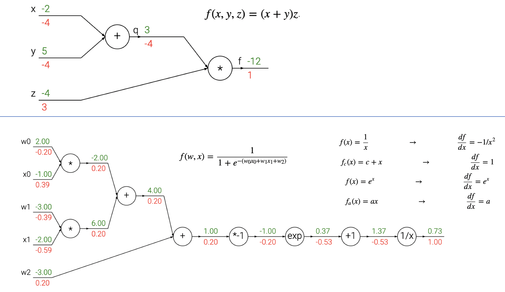

# 计算图和反向传播（Computational Graphs and Backpropagation）

## 学习资料

- （0）《深度学习入门——基于 Python 的理论与实践》

我的读书笔记：[2021.01.28 和看小说一样流畅的深度学习基础图书](https://landodo.github.io/posts/20210128-Deep-Learning-from-Scrach)

- （1）Hacker's guide to Neural Networks: [http://karpathy.github.io/neuralnets/](http://karpathy.github.io/neuralnets/)

- （2）Computational graphs: Backpropagation: [https://kharshit.github.io/blog/2018/03/09/computational-graphs-backpropagation](<https://kharshit.github.io/blog/2018/03/09/computational-graphs-backpropagation>)

- （3）(CS231n) Backpropagation: Intuitionschain rule interpretation, real-valued circuits, patterns in gradient flow: [https://cs231n.github.io/optimization-2/](<https://cs231n.github.io/optimization-2/>)

- （4）Computing Gradient Hung-yi Lee 李宏毅:  [http://speech.ee.ntu.edu.tw/~tlkagk/courses/MLDS_2018/Lecture/Graph.pdf](http://speech.ee.ntu.edu.tw/~tlkagk/courses/MLDS_2018/Lecture/Graph.pdf)

- （5）CS231n: Convolutional Neural Networks for Visual Recognition [https://cs231n.github.io/](./<https://cs231n.github.io/>)

