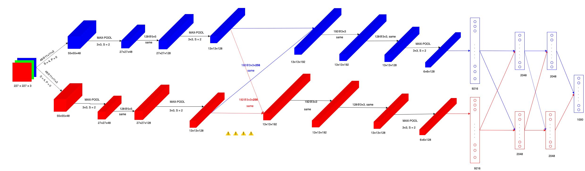

# AlexNet 的一些细节及拓展学习

> 2021.02.04
>
> PS：AlexNet 是我看过第一篇文献，它对我而言意义非凡。

今天又回顾了一下 AlexNet 的论文 ”ImageNet Classification with Deep Convolutional Neural Networks“，把以前的一些不明白的东西搞清楚了。

如下是今天绘制的 AlexNet 网络结构图（两块 GPU）。

一个需要注意的地方是卷积层 CONV3 ⚠️。

在 CONV3 卷积时，卷积核的通道数是 256，而两块 GPU 中 CONV2 输出的特征图的通道为 128。

因此需要将两块 GPU 中的两组 128@13×13 特征图合并（concat）为 256@13×13 后，才能进行卷积。

> 通道分离、合并。

后来的可分离卷积（分组卷积）的思想。

如下是我在网络上收集到单 GPU 中 AlexNet 结构图，图片来源：<https://neurohive.io/en/popular-networks/alexnet-imagenet-classification-with-deep-convolutional-neural-networks/>

## 论文中的 AlexNet 结构

输入图片 227×227，通道数 3。

**卷积层 CONV 1（96@27×27）**

- 卷积：使用两组，每组各 48 个（两组卷积核共 96 个），**3 通道**的大小为 11×11 的卷积核对大小为 227×227的输入进行卷积，步长 S = 4。卷积得到两组 48@55×55（共 96@55×55）的特征图。

  - > [(227 - 11) / 4] + 1 = 55.

- ReLU：使用 ReLU 激活函数。

- Max Pooling：使用 Overlapping Pooling。3×3，步长 S = 2，池化后得到两组 48@27×27（共 96@27×27）的特征图。

- LRN：$k = 2, n = 5,\alpha = 10^{-4}, \beta = 0.75$。

- 参数（仅卷积操作）：单个 GPU 上的权重参数为 11×11×3，偏置参数 1 个，共 48 个卷积核。所有在两块 GPU 上的参数个数为 (11×11×3 + 1)×48×2 = 34944 个。

**卷积层 CONV2（256@13×13）**

- 卷积：使用两组，每组各 128 个（两组卷积核共 256 个），**48 通道**大小为 5×5 的卷积核对输入的 27×27 特征图进行 same 卷积（P=2，S=1）。卷积得到两组 128@27×27（共 256@27×27）的特征图。
- ReLU
- Max Pooling：3×3，S=2。池化后得到两组 128@13×13（共 256@13×13）的特征图。
- LRN
- 参数：(5×5×48 + 1)×128×2 = 307456 个。

**卷积层 CONV3（384@13×13）** ⚠️

- 卷积：使用两组，每组各 192 个（两组卷积核共 384 个），**256 通道**的大小为 3×3 的卷积核对大小为 13×13 的输入进行 same 卷积。**因为每组的特征图通道数为 128，因此先将两个 GPU 上的特征图通道数合并 128+128=256，与卷积核的通道相同，再进行卷积操作。**卷积得到两组 192@13×13 （共 384@13×13）的特征图。
- ReLU
- 参数：(3×3×256 + 1)×192×2 = 885120 个。

**卷积层 CONV4（384@13×13）**

- 卷积：使用两组，每组各 192 个（两组卷积核共 384 个），**192 通道**的大小为 3×3 的卷积核对大小为 13×13 的输入进行 same 卷积。卷积得到两组 192@13×13 （共 384@13×13）的特征图。
- ReLU
- 参数：(3×3×192 + 1)×192×2 = 663936 个。

**卷积层 CONV5（256@6×6）**

- 卷积：使用两组，每组各 128 个（两组共 256 个）卷积核，**192 通道**的大小为 3×3 的卷积核对输入为 13×13 的特征图进行 same 卷积，得到两组 128@13×13 （共 256@13×13）的特征图。
- ReLU
- Max Pooling：3×3，S=2，池化后得到两组 128@6×6（共 256@6×6）的特征图。
- 参数：(3×3×192 + 1)×128×2 = 442624 个。

**全连接层 FC6（4096）**

- 全连接：使用两组 2048 个神经元，与前层输出的两组 128@6×6 进行全连接。
- ReLU
- Dropout
- 参数：前一层的神经元个数为 6×6×256=9216，本层神经元个数为 2048+2048=4096。所以权重参数个数为 6×6×256×4096，偏置个数为 1×4096。得到此全连接层的参数为 (6×6×256 + 1)×4096 = 37752832。

**全连接层 FC7（4096）**

- 全连接：使用两组 2048 个神经元，与前层输出的两组 2048 进行全连接。
- ReLU
- Dropout
- 参数：(4096 + 1)×4096 = 16781312。

**全连接层 FC8（1000）**

- 全连接：使用 1000 个神经元，与前层输出的两组 2048 进行全连接。
- Softmax：通过 Softmax 得到分类结果。
- 参数：(4096 + 1)×1000 = 4097000。

---

## 总结

通道数：

- **3** --CONV1--> **96** -CONV2-> **256** --CONV3--> **384** --CONV4--> **384** --CONV5--> **256**。

参数：

- 使用两块 GPU 总参数：34944 + 307456 + 885120 + 663936 + 442624 + 37752832 + 16781312 + 4097000 = 60965224 个。

  - > 与论文中的描述一致。
    >
    > The neural network, which has **60 million parameters** and 650,000 neurons, consists
    > of five convolutional layers, some of which are followed by max-pooling layers,
    > and three fully-connected layers with a final 1000-way softmax.

- 如果使用单块 GPU，则参数个数为 ≈ 1.38 亿个参数。

---

AlexNet 这篇论文还有不少东西我需要去拓展学习：

- LRN：从 LRN 出发，了解整个神经网络的 Normalization 机制（LN、BN...）。
- 数据增强技术
- 工程上，使用多块 GPU 跑模型，怎么做到的？代码怎么写？

