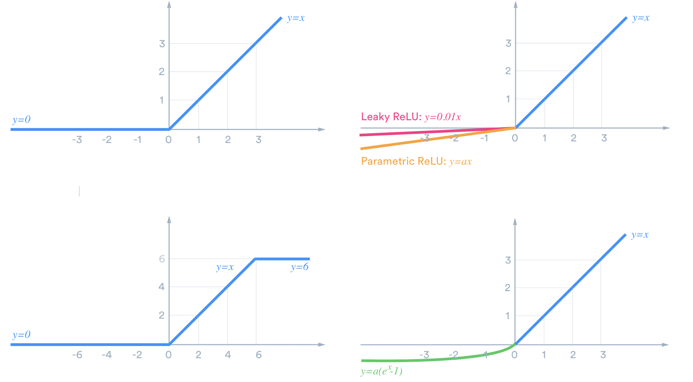
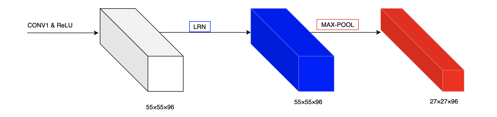
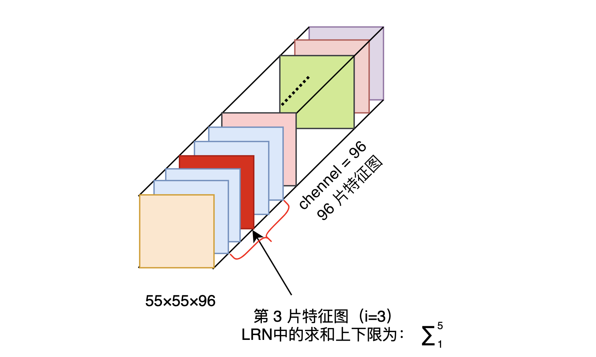

# AlexNet 中的 LRN（Local Response Normalization） 是什么

对我而言，LRN 是 AleNet 论文中的一个难点，今天就来更加细致的理解一下。

- LRN 操作在哪一步？
  - 答：ReLU 之后。

## AlexNet 的 PyTorch 官方实现

（1）PyTorch

<https://github.com/pytorch/vision/blob/master/torchvision/models/alexnet.py>

PyTorch 把 LRN 给移除了。

（2）Paper with Code

下面的一个有 LRN 的版本，来自 Paper with Code。我觉得是写得最清晰的。

<https://github.com/dansuh17/alexnet-pytorch/blob/d0c1b1c52296ffcbecfbf5b17e1d1685b4ca6744/model.py#L40>

```python
class AlexNet(nn.Module):
    """
    Neural network model consisting of layers propsed by AlexNet paper.
    """
    def __init__(self, num_classes=1000):
        """
        Define and allocate layers for this neural net.
        Args:
            num_classes (int): number of classes to predict with this model
        """
        super().__init__()
        # input size should be : (b x 3 x 227 x 227)
        # The image in the original paper states that width and height are 224 pixels, but
        # the dimensions after first convolution layer do not lead to 55 x 55.
        self.net = nn.Sequential(
            nn.Conv2d(in_channels=3, out_channels=96, kernel_size=11, stride=4),  # (b x 96 x 55 x 55)
            nn.ReLU(),
            nn.LocalResponseNorm(size=5, alpha=0.0001, beta=0.75, k=2),  # section 3.3
            nn.MaxPool2d(kernel_size=3, stride=2),  # (b x 96 x 27 x 27)
            nn.Conv2d(96, 256, 5, padding=2),  # (b x 256 x 27 x 27)
            nn.ReLU(),
            nn.LocalResponseNorm(size=5, alpha=0.0001, beta=0.75, k=2),
            nn.MaxPool2d(kernel_size=3, stride=2),  # (b x 256 x 13 x 13)
            nn.Conv2d(256, 384, 3, padding=1),  # (b x 384 x 13 x 13)
            nn.ReLU(),
            nn.Conv2d(384, 384, 3, padding=1),  # (b x 384 x 13 x 13)
            nn.ReLU(),
            nn.Conv2d(384, 256, 3, padding=1),  # (b x 256 x 13 x 13)
            nn.ReLU(),
            nn.MaxPool2d(kernel_size=3, stride=2),  # (b x 256 x 6 x 6)
        )
        # classifier is just a name for linear layers
        self.classifier = nn.Sequential(
            nn.Dropout(p=0.5, inplace=True),
            nn.Linear(in_features=(256 * 6 * 6), out_features=4096),
            nn.ReLU(),
            nn.Dropout(p=0.5, inplace=True),
            nn.Linear(in_features=4096, out_features=4096),
            nn.ReLU(),
            nn.Linear(in_features=4096, out_features=num_classes),
        )
```

需要注意的是，**LRN 发生在 ReLU 激活函数之后。**

接下来看看论文是如何描述 LRN 的。

## Local Response Normalization

ReLU 不需要输入归一化来防止饱和（Saturation），这是 ReLU 的一个理想性质。如果至少有一些训练例子对 ReLU 产生正向输入，学习就会在该神经元中发生。

图片来源：<https://medium.com/@danqing/a-practical-guide-to-relu-b83ca804f1f7>




作者发现以下局部归一化方案有助于泛化。响应归一化 $b_{x,y}^{i}$ 由如下表达式得到。

- $a_{x,y}^{i}$ 表示在位置 $(x,y)$ 处应用核 $i$ 卷积计算后，再运用激活函数 ReLU 后的输出。（即 ReLU 后进行 LRN）


> 如下是 LRN 是整体示意图。

> 

响应归一化实现了一种受真实神经元类型启发的横向抑制形式，在使用不同内核计算的神经元输出中创造了大活动的竞争。常量 k，n，α 和 β 是超参数，其值是使用验证集确定的，使用 k = 2，n = 5，α = 10e-4，β = 0.75。在某些层中应用 ReLU 非线性后应用了这种归一化。

这个方案更正确的说法是”亮度归一化“，因为没有减去平均活性。响应归一化使 top-1 和 top-5 错误率分别降低了 1.4% 和 1.2%。

在 CIFAR-10 数据集上：一个四层 CNN 在没有归一化的情况下实现了 13% 的测试错误率，而在归一化的情况下实现了 11% 的错误率。

## LRN 细节

接下来深入到 LRN 的细节，看看 LRN 究竟实现了什么样的效果。

（1）公式的解释


- a 表示**卷积层（包括卷积操作和激活操作）后的输出结果**。这个输出的结果是一个四维数组 [batch,height,width,channel]。这个输出结构中的一个位置 [a,b,c,d]，可以理解成在某一张特征图中的某一个通道下的某个高度和某个宽度位置的点，即**第 a 张特征图的第 d 个通道下的高度为 b 宽度为 c 的点。**
- $a_{x,y}^{i}$ 表示第 i 片特征图在位置（x,y）运用激活函数 ReLU 后的输出。n 是同一位置上临近的 feature map 的数目，N 是特征图的总数。



- 参数 $k, n, \alpha，\beta$ 都是超参数。k=2，n=5，α=10-4，β=0.75。

举一个例子：

i = 10, N = 96 时，第 i=10 个卷积核在位置（x,y）处的取值为 $a_{x,y}^{i}$，它的局部响应归一化过程如下：用 $a_{x,y}^{i}$ 除以第 8、9、10、11、12 片特征图位置（x,y）处的取值求和。

也就是跨通道的一个 Normalization 操作。

## torch.nn.LocalResponseNorm()

$$b_{c} = a_{c}\left(k + \frac{\alpha}{n}
​    \sum_{c'=\max(0, c-n/2)}^{\min(N-1,c+n/2)}a_{c'}^2\right)^{-\beta}$$

```shell
Init signature:
nn.LocalResponseNorm(
    size:int,
    alpha:float=0.0001,
    beta:float=0.75,
    k:float=1.0,
) -> None

Docstring:     
Applies local response normalization over an input signal composed
of several input planes, where channels occupy the second dimension.
Applies normalization across channels.

Args:
    size: amount of neighbouring channels used for normalization
    alpha: multiplicative factor. Default: 0.0001
    beta: exponent. Default: 0.75
    k: additive factor. Default: 1

Shape:
    - Input: :math:`(N, C, *)`
    - Output: :math:`(N, C, *)` (same shape as input)

Examples::

    >>> lrn = nn.LocalResponseNorm(2)
    >>> signal_2d = torch.randn(32, 5, 24, 24)
    >>> signal_4d = torch.randn(16, 5, 7, 7, 7, 7)
    >>> output_2d = lrn(signal_2d)
    >>> output_4d = lrn(signal_4d)
```

使用：

```python
import torch
import torch.nn as nn

torch.__version__
# '1.7.0'
lrn = nn.LocalResponseNorm(size=5, alpha=0.0001, beta=0.75, k=2)
signal_2d = torch.randn(32, 96, 55, 55) # batch_size=32, feature_map=96×55×55
output_2d = lrn(signal_2d)
```

```python
signal_2d.shape
# torch.Size([32, 96, 55, 55])
output_2d.shape
# torch.Size([32, 96, 55, 55])

```

## 手算检验

```python
import torch
```

```python
torch.__version__
```

```
'1.7.0'
```

```python
import torch.nn as nn
```

```python
lrn = nn.LocalResponseNorm(size=5, alpha=0.0001, beta=0.75, k=2)
```

```python
torch.manual_seed(666)
```

```
<torch._C.Generator at 0x7ffd61652d38>
```

```python
signal_2d = torch.randn(2, 3, 2, 2) # batch_size=2, feature_map=3×2×2
```

```python
output_2d = lrn(signal_2d)
```

```python
output_2d.shape
```

```
torch.Size([2, 3, 2, 2])
```

```python
signal_2d.shape
```

```
torch.Size([2, 3, 2, 2])
```

```python
signal_2d
```

```
tensor([[[[-0.7747,  0.7926],
          [-0.0062, -0.4377]],

         [[ 0.4657, -0.1880],
          [-0.8975,  0.4169]],

         [[-0.3479, -0.4007],
          [ 0.8059, -0.1021]]],
         
        [[[-0.3055, -1.7611],
          [-0.6461,  0.3470]],

         [[ 0.9144,  1.6259],
          [-0.6535, -0.0865]],

         [[ 0.2100,  0.4811],
          [ 0.4506,  0.0600]]]])
```


```python
output_2d
```

```
tensor([[[[-0.4607,  0.4713],
          [-0.0037, -0.2603]],

         [[ 0.2769, -0.1118],
          [-0.5336,  0.2479]],

         [[-0.2069, -0.2383],
          [ 0.4792, -0.0607]]],
         
         
        [[[-0.1816, -1.0471],
          [-0.3842,  0.2063]],

         [[ 0.5437,  0.9667],
          [-0.3886, -0.0514]],

         [[ 0.1249,  0.2860],
          [ 0.2680,  0.0357]]]])
```

分析：

这个 batch 里面的第一张特征图、第一个通道、(0,0) 位置的取值为 -0.7747。接下来分析其 LRN 归一化后的值。

LRN 的超参数：`size=5, alpha=0.0001, beta=0.75, k=2`。

$$b_{c} = a_{c}\left(k + \frac{\alpha}{n}
​    \sum_{c'=\max(0, c-n/2)}^{\min(N-1,c+n/2)}a_{c'}^2\right)^{-\beta}$$

$$\frac{-0.7747}{(2 + \frac{0.0001}{5} (0.7747^2 + 0.4657^2 + 0.3479^2))^{0.75}} = -0.4607$$

- 跨通道求和的下限：max(0, 0 - 5/2) = 0
- 上限：min(2, 0 + 5/2) = 2

---

LRN 归一化公式内部的细节理解就先这样了，至于它更深层的作用，以及它为什么会被舍弃，留到后面。