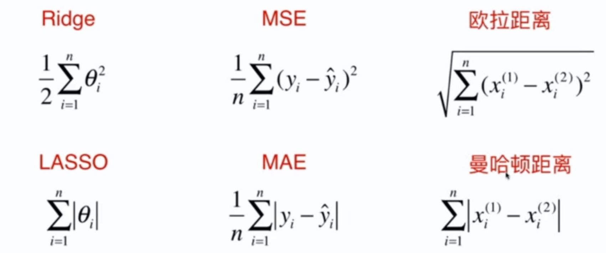
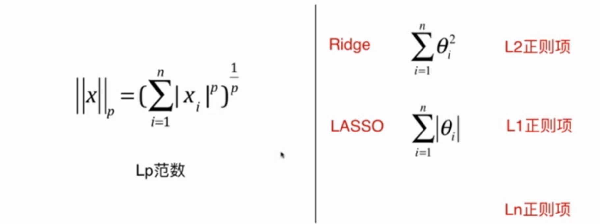

# 8-10 L1，L2 和 弹性网络

## 比较 Ridge 和 LASSO

- MSE 和 MAE
- 欧拉距离和曼哈顿距离（Minkowski Distance）

L1 正则，L2 正则：

因此，对于岭回归，相当于给损失函数添加 L2 正则项；LASSO 回归，相当于添加 L1 正则项。

同样也会存在 L0 正则，它的定义为：

$$J(\theta) = MSE(y, \check{y};\theta) + min\{ number - of - non-zero-\theta\}$$

- L0 正则项的意思是，$\theta$ 越少越好。这一项描述的是非 0 $\theta$ 元素的个数，让 $\theta$ 的数量尽可能的少。
- 实际上很少使用 L0 正则，因为 L0 正则的优化是一个 NP 难问题。

## 弹性网 Elastic Net

结合 L1 和 L2 正则的优点。

- $r$ 为超参数