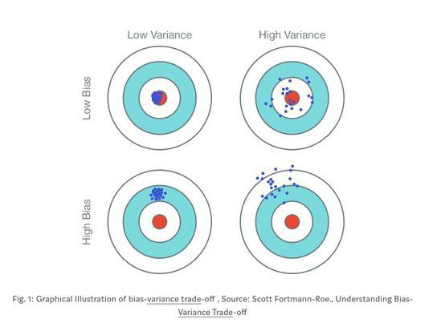

# 8-7 偏差方差权衡

偏差方差权衡 Bias Variance Trade off。

<https://medium.com/@mp32445/understanding-bias-variance-tradeoff-ca59a22e2a83>

模型误差 = 偏差（Bias）+ 方差（Variance）+ 不可避免的误差

导致偏差的主要原因：对模型本身的假设不正确！如：非线性数据使用线性回归。（欠拟合 underfitting）

方差：数据的一点点扰动都会较大的影响模型。通常原因，使用的模型太复杂，如高阶多项式回归。（过拟合 Overfitting）

有一些算法天生是高方差的算法。如 kNN。

通常来讲，非参数学习通常都是高方差算法。因为不能对数据进行任何假设。

有一些算法天生是高偏差算法，如线性回归。

参数学习通常都是高偏差算法，因为数据具有较强的假设。

大多数算法具有相应的参数，可以调整偏差和方差。如 kNN 中的 k，线性回归中使用多项式回归。

偏差和方差通常是矛盾的。降低偏差，会提高方差。降低方差，会提高偏差。

**机器学习的主要挑战，来自于方差！**

解决高方差的通常手段：

- 降低模型复杂度
- 减少数据维度；降噪
- 增加样本数
- 使用验证集
- **模型的正则化！**

