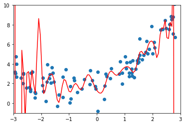
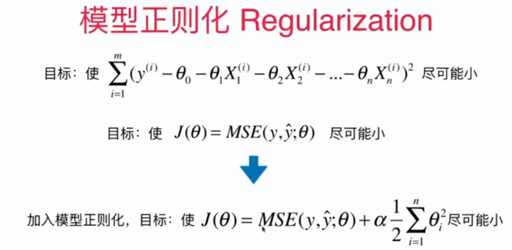
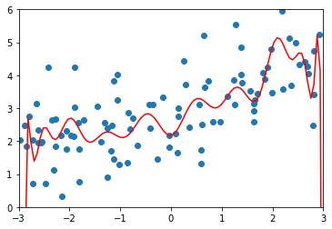
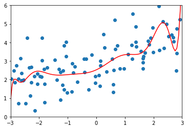
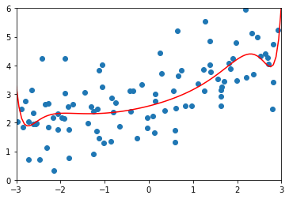
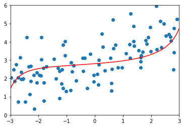
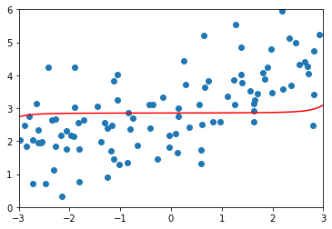

# 8-8 模型泛化与岭回归：正则化

模型正则化（Regularization）：限制参数的大小。

过拟合：



线性回归：



注意：

- 不需要正则化 $\theta_0$
- 1/2 加或不加都可以，只是为了方便计算。
- $\alpha$ ：可以把 1/2 加入 $\alpha$，正则化参数。

## 岭回归 Ridge Regression

目标：使 $J(\theta) = MSE(y, \check{y};\theta) + \alpha \frac{1}{2} \sum^{n}_{i=1} \theta^{2}_i$

## 岭回归


```python
import numpy as np
import matplotlib.pyplot as plt
```


```python
np.random.seed(42)
x = np.random.uniform(-3.0, 3.0, size=100)
X = x.reshape(-1, 1)
y = 0.5 * x + 3 + np.random.normal(0, 1, size=100)
```


```python
plt.scatter(x, y)
plt.show()
```

​    

​    


```python
from sklearn.pipeline import Pipeline
from sklearn.preprocessing import PolynomialFeatures
from sklearn.preprocessing import StandardScaler
from sklearn.linear_model import LinearRegression

def PolynomialRegression(degree):
    return Pipeline([
        ("poly", PolynomialFeatures(degree=degree)),
        ("std_scaler", StandardScaler()),
        ("lin_reg", LinearRegression())
    ])
```


```python
from sklearn.model_selection import train_test_split

np.random.seed(666)
X_train, X_test, y_train, y_test = train_test_split(X, y)
```


```python
from sklearn.metrics import mean_squared_error

poly_reg = PolynomialRegression(degree=20)
poly_reg.fit(X_train, y_train)

y_poly_predict = poly_reg.predict(X_test)
mean_squared_error(y_test, y_poly_predict)
```


    167.9401087504098


```python
X_plot = np.linspace(-3, 3, 100).reshape(100, 1)
y_plot = poly_reg.predict(X_plot)

plt.scatter(x, y)
plt.plot(X_plot[:,0], y_plot, color='r')
plt.axis([-3, 3, 0, 6])
plt.show()
```

​    

​    


```python
# 封装绘图代码
def plot_model(model):
    X_plot = np.linspace(-3, 3, 100).reshape(100, 1)
    y_plot = model.predict(X_plot)

    plt.scatter(x, y)
    plt.plot(X_plot[:,0], y_plot, color='r')
    plt.axis([-3, 3, 0, 6])
    plt.show()
```



​    


### 使用岭回归


```python
from sklearn.linear_model import Ridge

def RidgeRegression(degree, alpha):
    return Pipeline([
        ("poly", PolynomialFeatures(degree=degree)),
        ("std_scaler", StandardScaler()),
        ("ridge_reg", Ridge(alpha=alpha))
    ])

```


```python
ridge1_reg = RidgeRegression(20, 0.0001)
```


```python
ridge1_reg.fit(X_train, y_train)
y1_predict = ridge1_reg.predict(X_test)

# 结果比原来的 167.9401087504098 好多了
mean_squared_error(y_test, y1_predict)
```


    1.3233492754114753


```python
# 绘制曲线
plot_model(ridge1_reg)
```

​    

​    


```python
ridge2_reg = RidgeRegression(20, 1)
ridge2_reg.fit(X_train, y_train)
y2_predict = ridge2_reg.predict(X_test)

# 结果比原来的 167.9401087504098 好多了
mean_squared_error(y_test, y2_predict)
```


    1.1888759304218455


```python
# 增大了正则化参数后，曲线更加平滑了
plot_model(ridge2_reg)
```

​    

​    


```python
ridge3_reg = RidgeRegression(20, 100)
ridge3_reg.fit(X_train, y_train)
y3_predict = ridge3_reg.predict(X_test)

mean_squared_error(y_test, y3_predict)
```


    1.3196456113086197


```python
plot_model(ridge3_reg)
```

​    

​    


```python
ridge4_reg = RidgeRegression(20, 10000)
ridge4_reg.fit(X_train, y_train)
y4_predict = ridge4_reg.predict(X_test)

mean_squared_error(y_test, y4_predict)
plot_model(ridge4_reg)
```

​    

​    


