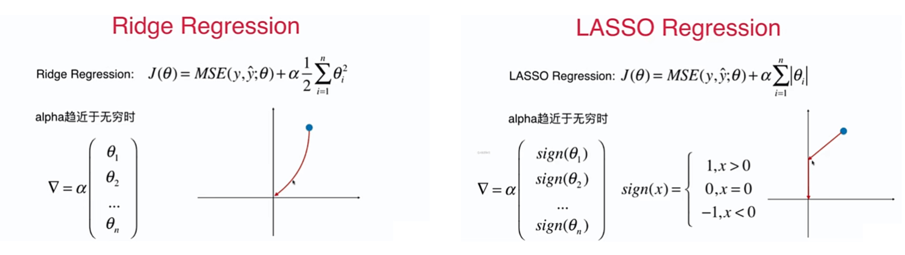
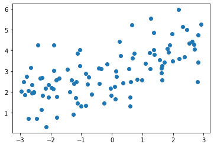
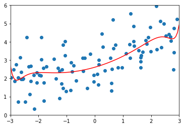
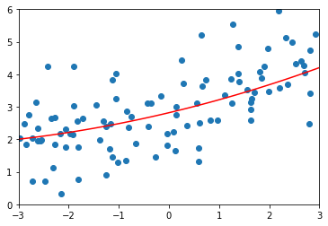
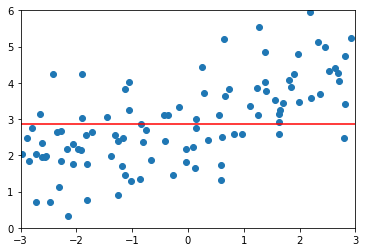

# 8-9 LASSO 回归

LASSO Regression 目标：使 $J(\theta) = MSE(y, \check{y};\theta) + \alpha \sum^{n}_{i=1} \left\vert \theta_i \right\vert$ 尽可能的小。

Least Absolute Shrinkage and Selection Operator Regression

接下来通过编程来看看 LASSO 和岭回归的不同。

- LASSO 趋向于使得一部分 theta 值变为 0。所以可以作为**特征选择**用。
- LASSO 不能和岭回归一样通过曲线的方式达到了 0 点。LASSO 先沿着一个方向，首先走到一个轴为 0 的地方，接下来再周到下一个轴为 0 的方法...



## LASSO


```python
import numpy as np
import matplotlib.pyplot as plt
```


```python
np.random.seed(42)
x = np.random.uniform(-3.0, 3.0, size=100)
X = x.reshape(-1, 1)
y = 0.5 * x + 3 + np.random.normal(0, 1, size=100)
```


```python
plt.scatter(x, y)
plt.show()
```

​    

​    


```python
from sklearn.model_selection import train_test_split

np.random.seed(666)
X_train, X_test, y_train, y_test = train_test_split(X, y)
```


```python
from sklearn.pipeline import Pipeline
from sklearn.preprocessing import PolynomialFeatures
from sklearn.preprocessing import StandardScaler
from sklearn.linear_model import LinearRegression

def PolynomialRegression(degree):
    return Pipeline([
        ("poly", PolynomialFeatures(degree=degree)),
        ("std_scaler", StandardScaler()),
        ("lin_reg", LinearRegression())
    ])
```


```python
from sklearn.metrics import mean_squared_error

poly_reg = PolynomialRegression(degree=20)
poly_reg.fit(X_train, y_train)

y_poly_predict = poly_reg.predict(X_test)
mean_squared_error(y_test, y_poly_predict)
```


    167.9401087504098


```python
# 封装绘图代码
def plot_model(model):
    X_plot = np.linspace(-3, 3, 100).reshape(100, 1)
    y_plot = model.predict(X_plot)

    plt.scatter(x, y)
    plt.plot(X_plot[:,0], y_plot, color='r')
    plt.axis([-3, 3, 0, 6])
    plt.show()
```


```python
plot_model(poly_reg)
```

​    

​    


## LASSO


```python
from sklearn.linear_model import Lasso

def LassoRegression(degree, alpha):
    return Pipeline([
        ("poly", PolynomialFeatures(degree=degree)),
        ("std_scaler", StandardScaler()),
        ("lasso_reg", Lasso(alpha=alpha))
    ])
```


```python
lasso1_reg = LassoRegression(20, 0.01)
lasso1_reg.fit(X_train, y_train)

y_lasso_predict = lasso1_reg.predict(X_test)
mean_squared_error(y_test, y_lasso_predict)
```


    1.1496080843259961


```python
plot_model(lasso1_reg)
```

​    

​    


```python
lasso2_reg = LassoRegression(20, 0.1)
lasso2_reg.fit(X_train, y_train)

y2_lasso_predict = lasso2_reg.predict(X_test)
mean_squared_error(y_test, y2_lasso_predict)
```


    1.1213911351818648


```python
plot_model(lasso2_reg)
```

​    

​    


```python
lasso3_reg = LassoRegression(20, 1)
lasso3_reg.fit(X_train, y_train)

y3_lasso_predict = lasso3_reg.predict(X_test)
mean_squared_error(y_test, y3_lasso_predict)
```


    1.8408939659515595


```python
plot_model(lasso3_reg)
```

​    

​    