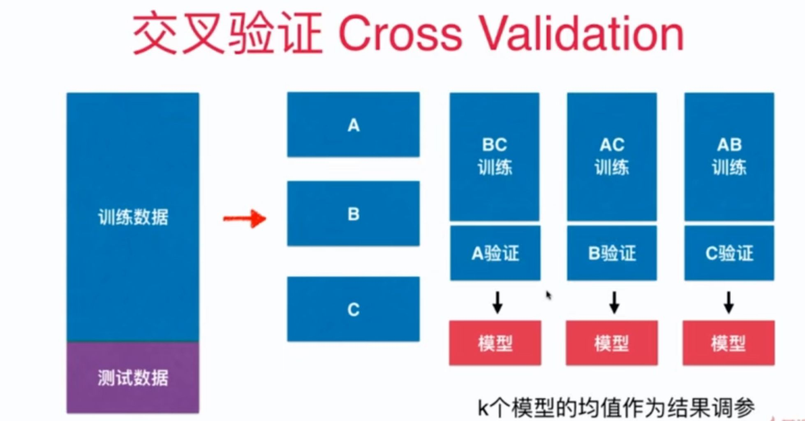

# 8-6 验证数据集与交叉验证

测试数据集的意义：避免发生过拟合而不自知，通过测试集来判断模型的好坏。 

 测试集也存在问题，那就是针对特定测试数据集过拟合。

解决的方法是引入**验证数据集**。测试数据集是不参与模型的创建的，作为衡量最终模型性能的数据集。验证集作为调整超参数使用的数据集。

- train
- validation
- test

仍可能过拟合验证集，解决的方法是使用交叉验证 Cross Validation。



## 交叉验证


```python
import numpy as np
from sklearn import datasets
```


```python
digits = datasets.load_digits()

X = digits.data
y = digits.target
```

## 测试 train_test_split


```python
from sklearn.model_selection import train_test_split

X_train, X_test, y_train, y_test = train_test_split(X, y, test_size=0.4, random_state=666)
```


```python
from sklearn.neighbors import KNeighborsClassifier

best_score , best_p, best_k = 0, 0 ,0
for k in range(2, 10):
    for p in range(1, 5):
        knn_clf = KNeighborsClassifier(weights="distance", n_neighbors=k, p=p)
        knn_clf.fit(X_train, y_train)
        score = knn_clf.score(X_test, y_test)
        if score > best_score:
            best_score , best_p, best_k = score, p, k
        
print("Best K =", best_k)
print("Best P =", best_p)
print("Best score =", best_score)
```

    Best K = 3
    Best P = 4
    Best score = 0.9860917941585535


## 使用交叉验证


```python
from sklearn.model_selection import cross_val_score


knn_clf = KNeighborsClassifier()
cross_val_score(knn_clf, X_train, y_train)
```


    array([0.99537037, 0.98148148, 0.97685185, 0.97674419, 0.97209302])


```python
from sklearn.neighbors import KNeighborsClassifier

best_score , best_p, best_k = 0, 0 ,0
for k in range(2, 10):
    for p in range(1, 5):
        knn_clf = KNeighborsClassifier(weights="distance", n_neighbors=k, p=p)
        scores = cross_val_score(knn_clf, X_train, y_train)
        score = np.mean(scores)
        if score > best_score:
            best_score , best_p, best_k = score, p, k
        
print("Best K =", best_k)
print("Best P =", best_p)
print("Best score =", best_score)
```

    Best K = 2
    Best P = 2
    Best score = 0.9851507321274763


交叉验证得到的结果更加可信。


```python
best_knn_clf = KNeighborsClassifier(weights="distance", n_neighbors=2, p=2)
```


```python
best_knn_clf.fit(X_train, y_train)
best_knn_clf.score(X_test, y_test)
```


    0.980528511821975


## 回顾网格搜索


```python
from sklearn.model_selection import GridSearchCV

param_grid = [
    {
        'weights': ['distance'],
        'n_neighbors': [i for i in range(2, 11)],
        'p': [i for i in range(1, 6)]
    }
]

grid_search = GridSearchCV(knn_clf, param_grid, verbose=1)
grid_search.fit(X_train, y_train)
```

    Fitting 5 folds for each of 45 candidates, totalling 225 fits


    [Parallel(n_jobs=1)]: Using backend SequentialBackend with 1 concurrent workers.
    [Parallel(n_jobs=1)]: Done 225 out of 225 | elapsed:   24.5s finished


    GridSearchCV(estimator=KNeighborsClassifier(n_neighbors=9, p=4,
                                                weights='distance'),
                 param_grid=[{'n_neighbors': [2, 3, 4, 5, 6, 7, 8, 9, 10],
                              'p': [1, 2, 3, 4, 5], 'weights': ['distance']}],
                 verbose=1)


```python
grid_search.best_score_
```


    0.9851507321274763


```python
# 最佳的超参数
grid_search.best_params_
```


    {'n_neighbors': 2, 'p': 2, 'weights': 'distance'}


```python
# 保存最佳的分类器
best_knn_clf = grid_search.best_estimator_
```


```python
best_knn_clf.score(X_test, y_test)
```


    0.980528511821975


```python
# cv=10 分成 10 份
cross_val_score(knn_clf, X_train, y_train, cv=10)
```


    array([0.99074074, 1.        , 0.99074074, 0.9537037 , 0.99074074,
           0.96296296, 0.96296296, 0.98148148, 0.97196262, 0.98130841])


## k-folds 交叉验证

把训练数据集分成 k 份，称为 k-folds cross validation。

留一法 LOO-CV（Leave-One-Out Cross Validation）：把训练数据集分成 m 份，称为留一法。

完全不受随机的影响，最接近模型真正的性能指标。缺点：计算量巨大。


