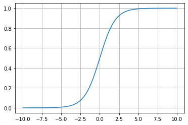

# 9-1 什么是逻辑回归？

逻辑回归（Logistics Regression）：解决分类问题。

回归问题怎么解决分类问题？

- 将样本的**特征**和样本发生的**概率**联系起来，概率是一个数。

回归：$\check{y} = f(x)$

逻辑回归：$\check{p} = f(x)$ ，$\check{p}$ 表示概率。

逻辑回归既可以看做是一个回归算法，也可以看做是分类算法。通常作为分类算法用，只可以解决二分类问题。

Sigmoid 函数：

## Sigmoid


```python
import numpy as np
import matplotlib.pyplot as plt
```


```python
def sigmoid(t):
    return 1 / (1 + np.exp(-t))
```


```python
x = np.linspace(-10, 10, 500)
y = sigmoid(x)

plt.plot(x, y)
plt.grid()
plt.show()
```


​    

Sigmoid 函数值域 (0, 1)。

- t > 0 时，p > 0.5
- t < 0 时，p < 0.5

$$\check{p} = \sigma(\theta^T \cdot x_b) = \frac{1}{1 + e^{-\theta^T \cdot x_b}}$$

问题：对于给定的样本数 X，y，我们如何找到参数 theta，使得用这样的方式，可以最大程度获得样本数据集 X 对应的分类输出 y。