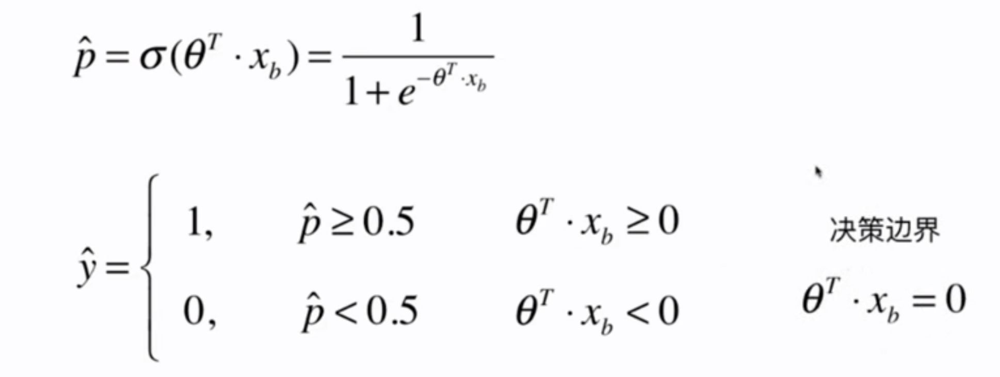
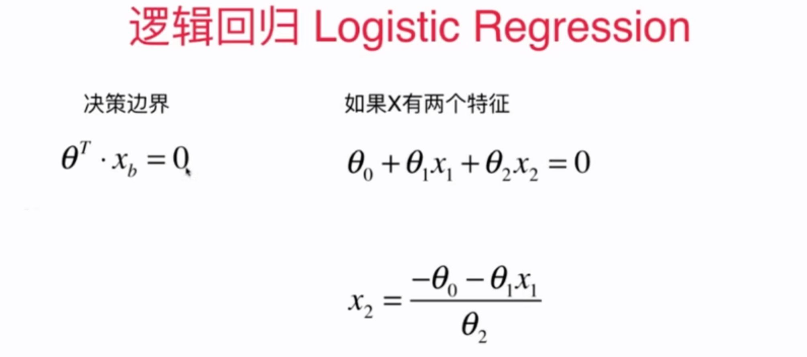
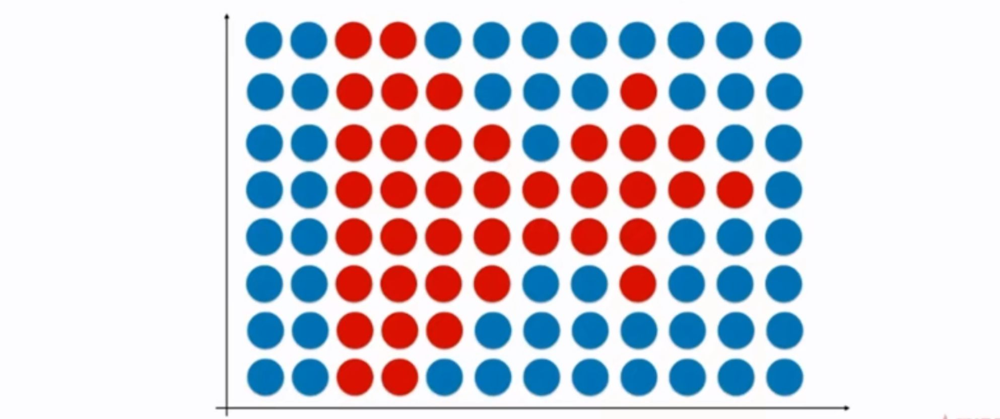
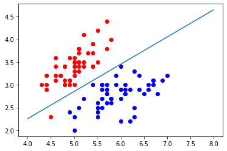
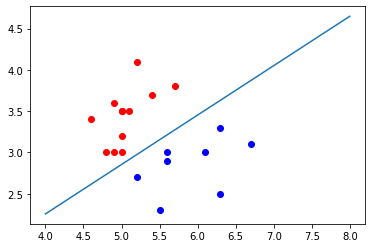
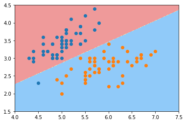
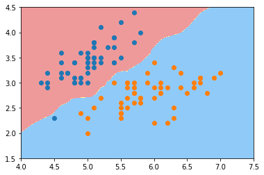
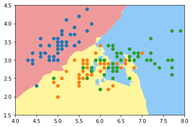
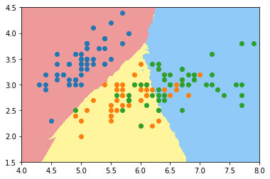

# 9-5 决策边界





## 不规则的决策边界的绘制方法

使用笨一些的方法。




## 实现逻辑回归


```python
import numpy as np
import matplotlib.pyplot as plt
from sklearn import datasets

iris = datasets.load_iris()
```


```python
X = iris.data
y = iris.target
```


```python
X.shape
```


    (150, 4)


```python
# 将 X 调整为只剩下两种分类
X = X[y<2, :2] # 只取前两个特征 
y = y[y<2]
```


```python
X.shape
```


    (100, 2)


```python
y.shape
```


    (100,)


```python
plt.scatter(X[y==0, 0], X[y==0, 1], color='r')
plt.scatter(X[y==1, 0], X[y==1, 1], color='b')
plt.show()
```

​    

​    


## 使用逻辑回归


```python
from playML.model_selection import train_test_split

X_train, X_test, y_train, y_test = train_test_split(X, y, seed=666)
```


```python
from playML.LogisticRegression import LogisticRegression

log_reg = LogisticRegression()
log_reg.fit(X_train, y_train)
```


    LogisticRegression()


```python
log_reg.score(X_test, y_test) # 全都正确分类 1.0
```


    1.0


```python
log_reg.predict_proba(X_test)
```


    array([0.92972035, 0.98664939, 0.14852024, 0.01685947, 0.0369836 ,
           0.0186637 , 0.04936918, 0.99669244, 0.97993941, 0.74524655,
           0.04473194, 0.00339285, 0.26131273, 0.0369836 , 0.84192923,
           0.79892262, 0.82890209, 0.32358166, 0.06535323, 0.20735334])


```python
y_test
```


    array([1, 1, 0, 0, 0, 0, 0, 1, 1, 1, 0, 0, 0, 0, 1, 1, 1, 0, 0, 0])


```python
np.array(log_reg.predict_proba(X_test) > 0.5, dtype='int')
```


    array([1, 1, 0, 0, 0, 0, 0, 1, 1, 1, 0, 0, 0, 0, 1, 1, 1, 0, 0, 0])


```python
log_reg.predict(X_test)
```


    array([1, 1, 0, 0, 0, 0, 0, 1, 1, 1, 0, 0, 0, 0, 1, 1, 1, 0, 0, 0])


```python
def x2(x1):
    return (-log_reg.coef_[0] * x1 - log_reg.intercept_) / log_reg.coef_[1]
```


```python
x1_plot = np.linspace(4, 8, 1000)
x2_plot = x2(x1_plot)
```


```python
# 绘制训练集的决策边界
plt.scatter(X[y==0, 0], X[y==0, 1], color='r')
plt.scatter(X[y==1, 0], X[y==1, 1], color='b')

plt.plot(x1_plot, x2_plot)
plt.show()
```

​    

​    


```python
# 绘制测试集的决策边界
plt.scatter(X_test[y_test==0, 0], X_test[y_test==0, 1], color='r')
plt.scatter(X_test[y_test==1, 0], X_test[y_test==1, 1], color='b')

plt.plot(x1_plot, x2_plot)
plt.show()
```

​    

​    


```python
def plot_decision_boundary(model, axis):

    x0, x1 = np.meshgrid(
        np.linspace(axis[0], axis[1], int((axis[1]-axis[0])*100)).reshape(-1, 1),
        np.linspace(axis[2], axis[3], int((axis[3]-axis[2])*100)).reshape(-1, 1),
    )
    X_new = np.c_[x0.ravel(), x1.ravel()]

    y_predict = model.predict(X_new)
    zz = y_predict.reshape(x0.shape)

    from matplotlib.colors import ListedColormap
    custom_cmap = ListedColormap(['#EF9A9A','#FFF59D','#90CAF9'])
    
    plt.contourf(x0, x1, zz, linewidth=5, cmap=custom_cmap)
```


```python
plot_decision_boundary(log_reg, axis=[4, 7.5, 1.5, 4.5])
plt.scatter(X[y==0,0], X[y==0,1])
plt.scatter(X[y==1,0], X[y==1,1])
plt.show()
```



​    


### kNN 的决策边界


```python
from sklearn.neighbors import KNeighborsClassifier

knn_clf = KNeighborsClassifier()
knn_clf.fit(X_train, y_train)
```


    KNeighborsClassifier()


```python
knn_clf.score(X_test, y_test)
```


    1.0


```python
plot_decision_boundary(knn_clf, axis=[4, 7.5, 1.5, 4.5])
plt.scatter(X[y==0,0], X[y==0,1])
plt.scatter(X[y==1,0], X[y==1,1])
plt.show()
```



​    


```python
knn_clf_all = KNeighborsClassifier()

knn_clf_all.fit(iris.data[:, :2], iris.target)
```


    KNeighborsClassifier()


```python
plot_decision_boundary(knn_clf_all, axis=[4, 8, 1.5, 4.5])
plt.scatter(iris.data[iris.target==0,0], iris.data[iris.target==0,1])
plt.scatter(iris.data[iris.target==1,0], iris.data[iris.target==1,1])
plt.scatter(iris.data[iris.target==2,0], iris.data[iris.target==2,1])
plt.show()
```



​    


```python
knn_clf_all = KNeighborsClassifier(n_neighbors=50)
knn_clf_all.fit(iris.data[:, :2], iris.target)

plot_decision_boundary(knn_clf_all, axis=[4, 8, 1.5, 4.5])
plt.scatter(iris.data[iris.target==0,0], iris.data[iris.target==0,1])
plt.scatter(iris.data[iris.target==1,0], iris.data[iris.target==1,1])
plt.scatter(iris.data[iris.target==2,0], iris.data[iris.target==2,1])
plt.show()
```



​    


