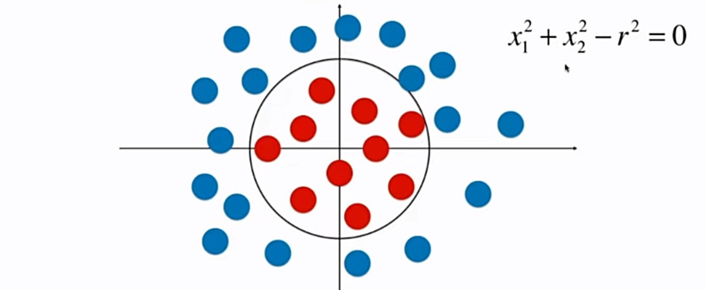
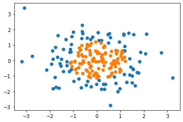
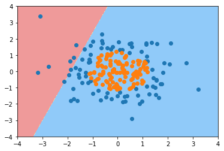
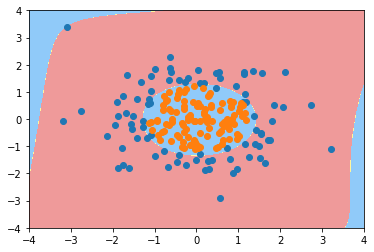

# 9-6 在逻辑回归中使用多项式特征

圆形的决策边界。



从线性回归转换到多项式回归这样的思路，同理为逻辑回归添加**多项式特征**，基于这样的方式，就可以对非线性的数据进行一个比较好的分类，得到的决策边界也就是一个曲线。

## 逻辑回归中添加多项式特征


```python
import numpy as np
import matplotlib.pyplot as plt
```


```python
np.random.seed(666)
X = np.random.normal(0, 1, size=(200, 2))
y = np.array(X[:,0]**2 + X[:,1]**2 < 1.5, dtype='int')
```


```python
plt.scatter(X[y==0,0], X[y==0,1])
plt.scatter(X[y==1,0], X[y==1,1])
plt.show()
```

​    

​    


### 使用逻辑回归


```python
from playML.LogisticRegression import LogisticRegression
```


```python
log_reg = LogisticRegression()
log_reg.fit(X, y)
```


    LogisticRegression()


```python
log_reg.score(X, y)
```


    0.605


```python
def plot_decision_boundary(model, axis):

    x0, x1 = np.meshgrid(
        np.linspace(axis[0], axis[1], int((axis[1]-axis[0])*100)).reshape(-1, 1),
        np.linspace(axis[2], axis[3], int((axis[3]-axis[2])*100)).reshape(-1, 1),
    )
    X_new = np.c_[x0.ravel(), x1.ravel()]

    y_predict = model.predict(X_new)
    zz = y_predict.reshape(x0.shape)

    from matplotlib.colors import ListedColormap
    custom_cmap = ListedColormap(['#EF9A9A','#FFF59D','#90CAF9'])
    
    plt.contourf(x0, x1, zz, linewidth=5, cmap=custom_cmap)
```


```python
plot_decision_boundary(log_reg, axis=[-4, 4, -4, 4])
plt.scatter(X[y==0,0], X[y==0,1])
plt.scatter(X[y==1,0], X[y==1,1])
plt.show()
```



​    


### 添加多项式特征项


```python
from sklearn.pipeline import Pipeline
from sklearn.preprocessing import PolynomialFeatures
from sklearn.preprocessing import StandardScaler

def PolynomialLogisticRegression(degree):
    return Pipeline([
        ('poly', PolynomialFeatures(degree=degree)),
        ('std_scaler', StandardScaler()),
        ('log_reg', LogisticRegression())
    ])
```


```python
poly_log_reg = PolynomialLogisticRegression(degree=2)
poly_log_reg.fit(X, y)
```


    Pipeline(steps=[('poly', PolynomialFeatures()),
                    ('std_scaler', StandardScaler()),
                    ('log_reg', LogisticRegression())])


```python
poly_log_reg.score(X, y)
```


    0.95


```python
plot_decision_boundary(poly_log_reg, axis=[-4, 4, -4, 4])
plt.scatter(X[y==0,0], X[y==0,1])
plt.scatter(X[y==1,0], X[y==1,1])
plt.show()
```


​    


```python
poly_log_reg2 = PolynomialLogisticRegression(degree=20)
poly_log_reg2.fit(X, y)
```


    Pipeline(steps=[('poly', PolynomialFeatures(degree=20)),
                    ('std_scaler', StandardScaler()),
                    ('log_reg', LogisticRegression())])


```python
plot_decision_boundary(poly_log_reg2, axis=[-4, 4, -4, 4])
plt.scatter(X[y==0,0], X[y==0,1])
plt.scatter(X[y==1,0], X[y==1,1])
plt.show()
```



​    

