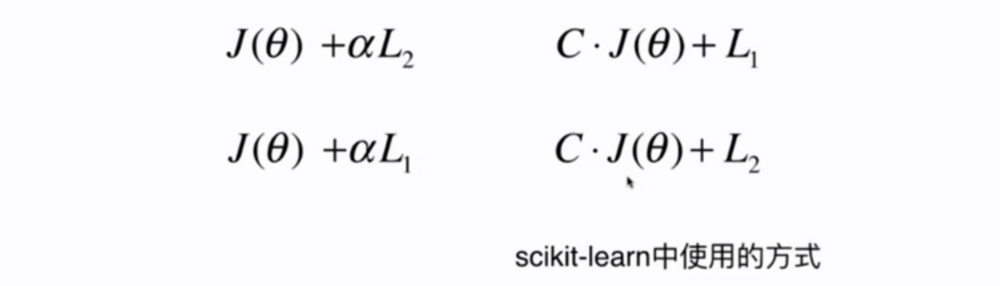
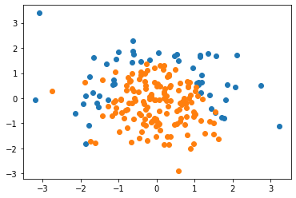
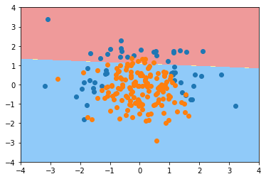
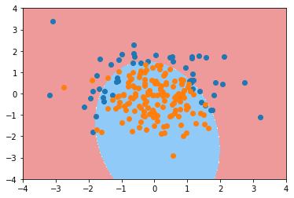
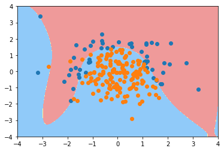
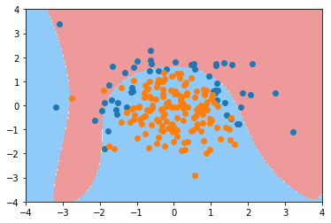
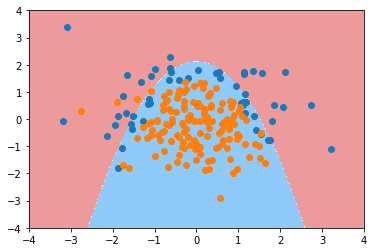

# 9-7 scikit-learn 中的逻辑回归

逻辑回归使用正则化。

9-6 引入了多项式项，会造成过拟合。

把参数 C 放到了 $J(\theta)$。



```python
import numpy as np
import matplotlib.pyplot as plt
```


```python
np.random.seed(666)
X = np.random.normal(0, 1, size=(200, 2))
y = np.array(X[:,0]**2 + X[:,1] < 1.5, dtype='int')
```


```python
# 添加一些噪声
for _ in range(20):
    y[np.random.randint(200)] = 1
```


```python
plt.scatter(X[y==0,0], X[y==0,1])
plt.scatter(X[y==1,0], X[y==1,1])
plt.show()
```

​    

​    


```python
from sklearn.model_selection import train_test_split

X_train, X_test, y_train, y_test = train_test_split(X, y, random_state=666)
```

## 使用 sklearn 中的逻辑回归


```python
from sklearn.linear_model import LogisticRegression

log_reg = LogisticRegression()
log_reg.fit(X_train, y_train)
```


    LogisticRegression()


```python
log_reg.score(X_train, y_train)
```


    0.7933333333333333


```python
log_reg.score(X_test, y_test)
```


    0.86


```python
def plot_decision_boundary(model, axis):

    x0, x1 = np.meshgrid(
        np.linspace(axis[0], axis[1], int((axis[1]-axis[0])*100)).reshape(-1, 1),
        np.linspace(axis[2], axis[3], int((axis[3]-axis[2])*100)).reshape(-1, 1),
    )
    X_new = np.c_[x0.ravel(), x1.ravel()]

    y_predict = model.predict(X_new)
    zz = y_predict.reshape(x0.shape)

    from matplotlib.colors import ListedColormap
    custom_cmap = ListedColormap(['#EF9A9A','#FFF59D','#90CAF9'])
    
    plt.contourf(x0, x1, zz, linewidth=5, cmap=custom_cmap)
```


```python
plot_decision_boundary(log_reg, axis=[-4, 4, -4, 4])
plt.scatter(X[y==0,0], X[y==0,1])
plt.scatter(X[y==1,0], X[y==1,1])
plt.show()
```

    /Users/landonglei/anaconda3/envs/imooc-ml/lib/python3.6/site-packages/ipykernel_launcher.py:15: UserWarning: The following kwargs were not used by contour: 'linewidth'
      from ipykernel import kernelapp as app



​    


```python
from sklearn.pipeline import Pipeline
from sklearn.preprocessing import PolynomialFeatures
from sklearn.preprocessing import StandardScaler

def PolynomialLogisticRegression(degree):
    return Pipeline([
        ('poly', PolynomialFeatures(degree=degree)),
        ('std_scaler', StandardScaler()),
        ('log_reg', LogisticRegression())
    ])
```


```python
poly_log_reg = PolynomialLogisticRegression(degree=2)
poly_log_reg.fit(X_train, y_train)
```


    Pipeline(steps=[('poly', PolynomialFeatures()),
                    ('std_scaler', StandardScaler()),
                    ('log_reg', LogisticRegression())])


```python
poly_log_reg.score(X_train, y_train)
```


    0.9066666666666666


```python
poly_log_reg.score(X_test, y_test)
```


    0.94


```python
plot_decision_boundary(poly_log_reg, axis=[-4, 4, -4, 4])
plt.scatter(X[y==0,0], X[y==0,1])
plt.scatter(X[y==1,0], X[y==1,1])
plt.show()
```

    /Users/landonglei/anaconda3/envs/imooc-ml/lib/python3.6/site-packages/ipykernel_launcher.py:15: UserWarning: The following kwargs were not used by contour: 'linewidth'
      from ipykernel import kernelapp as app



​    


```python
poly_log_reg2 = PolynomialLogisticRegression(degree=20)
poly_log_reg2.fit(X_train, y_train)

plot_decision_boundary(poly_log_reg2, axis=[-4, 4, -4, 4])
plt.scatter(X[y==0,0], X[y==0,1])
plt.scatter(X[y==1,0], X[y==1,1])
plt.show()
```

    /Users/landonglei/anaconda3/envs/imooc-ml/lib/python3.6/site-packages/ipykernel_launcher.py:15: UserWarning: The following kwargs were not used by contour: 'linewidth'
      from ipykernel import kernelapp as app



​    


```python
def PolynomialLogisticRegression(degree, C):
    return Pipeline([
        ('poly', PolynomialFeatures(degree=degree)),
        ('std_scaler', StandardScaler()),
        ('log_reg', LogisticRegression(C=C))
    ])
```


```python
# 默认为 L2 正则化
poly_log_reg3 = PolynomialLogisticRegression(degree=20, C=0.1)
poly_log_reg3.fit(X_train, y_train)
```


    Pipeline(steps=[('poly', PolynomialFeatures(degree=20)),
                    ('std_scaler', StandardScaler()),
                    ('log_reg', LogisticRegression(C=0.1))])


```python
plot_decision_boundary(poly_log_reg3, axis=[-4, 4, -4, 4])
plt.scatter(X[y==0,0], X[y==0,1])
plt.scatter(X[y==1,0], X[y==1,1])
plt.show()
```

    /Users/landonglei/anaconda3/envs/imooc-ml/lib/python3.6/site-packages/ipykernel_launcher.py:15: UserWarning: The following kwargs were not used by contour: 'linewidth'
      from ipykernel import kernelapp as app



​    


```python
def PolynomialLogisticRegression(degree, C, penalty='l2', solver='lbfgs'):
    return Pipeline([
        ('poly', PolynomialFeatures(degree=degree)),
        ('std_scaler', StandardScaler()),
        ('log_reg', LogisticRegression(C=C, penalty=penalty, solver=solver))
    ])
```


```python
# 使用 L1 正则化
poly_log_reg4 = PolynomialLogisticRegression(degree=20, C=0.1, penalty='l1', solver='liblinear')
poly_log_reg4.fit(X_train, y_train)
```


    Pipeline(steps=[('poly', PolynomialFeatures(degree=20)),
                    ('std_scaler', StandardScaler()),
                    ('log_reg',
                     LogisticRegression(C=0.1, penalty='l1', solver='liblinear'))])


```python
plot_decision_boundary(poly_log_reg4, axis=[-4, 4, -4, 4])
plt.scatter(X[y==0,0], X[y==0,1])
plt.scatter(X[y==1,0], X[y==1,1])
plt.show()
```

    /Users/landonglei/anaconda3/envs/imooc-ml/lib/python3.6/site-packages/ipykernel_launcher.py:15: UserWarning: The following kwargs were not used by contour: 'linewidth'
      from ipykernel import kernelapp as app



​    


```python

```