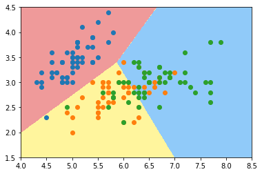

# 9-8 OvR 与 OvO

逻辑回归只可以解决二分类问题。

解决多分类问题：

- OvR（One vs Rest）
- OvO（One vs One）


OvR 的计算复杂度提升了。


## 编程实验

```python
import numpy as np
import matplotlib.pyplot as plt
from sklearn import datasets

iris = datasets.load_iris()
X = iris.data[:, :2]
y = iris.target
```


```python
from sklearn.model_selection import train_test_split

X_train, X_test, y_train, y_test = train_test_split(X, y, random_state=666)
```


```python
from sklearn.linear_model import LogisticRegression

log_reg = LogisticRegression() # 默认支持 OvR
log_reg.fit(X_train, y_train)
```


    LogisticRegression()


```python
log_reg.score(X_test, y_test)
```


    0.7894736842105263


```python
def plot_decision_boundary(model, axis):

    x0, x1 = np.meshgrid(
        np.linspace(axis[0], axis[1], int((axis[1]-axis[0])*100)).reshape(-1, 1),
        np.linspace(axis[2], axis[3], int((axis[3]-axis[2])*100)).reshape(-1, 1),
    )
    X_new = np.c_[x0.ravel(), x1.ravel()]

    y_predict = model.predict(X_new)
    zz = y_predict.reshape(x0.shape)

    from matplotlib.colors import ListedColormap
    custom_cmap = ListedColormap(['#EF9A9A','#FFF59D','#90CAF9'])
    
    plt.contourf(x0, x1, zz, linewidth=5, cmap=custom_cmap)
```


```python
plot_decision_boundary(log_reg, axis=[4, 8.5, 1.5, 4.5])
plt.scatter(X[y==0,0], X[y==0,1])
plt.scatter(X[y==1,0], X[y==1,1])
plt.scatter(X[y==2,0], X[y==2,1])
plt.show()
```

    /Users/landonglei/anaconda3/envs/imooc-ml/lib/python3.6/site-packages/ipykernel_launcher.py:15: UserWarning: The following kwargs were not used by contour: 'linewidth'
      from ipykernel import kernelapp as app



​    


```python
log_reg2 = LogisticRegression(multi_class='multinomial', solver='newton-cg')
```


```python
log_reg2.fit(X_train, y_train)
```


    LogisticRegression(multi_class='multinomial', solver='newton-cg')


```python
log_reg2.score(X_test, y_test)
```


    0.7894736842105263


```python
plot_decision_boundary(log_reg2, axis=[4, 8.5, 1.5, 4.5])
plt.scatter(X[y==0,0], X[y==0,1])
plt.scatter(X[y==1,0], X[y==1,1])
plt.scatter(X[y==2,0], X[y==2,1])
plt.show()
```

    /Users/landonglei/anaconda3/envs/imooc-ml/lib/python3.6/site-packages/ipykernel_launcher.py:15: UserWarning: The following kwargs were not used by contour: 'linewidth'
      from ipykernel import kernelapp as app


​    


## 使用所有的数据


```python
X = iris.data
y = iris.target

X_train, X_test, y_train, y_test = train_test_split(X, y, random_state=666)
```


```python
log_reg = LogisticRegression()
log_reg.fit(X_train, y_train)
log_reg.score(X_test, y_test)
```


    1.0


## OvR and OvO


```python
from sklearn.multiclass import OneVsRestClassifier

ovr = OneVsOneClassifier(log_reg)
ovr.fit(X_train, y_train)
ovr.score(X_test, y_test)

```


    1.0


```python
from sklearn.multiclass import OneVsOneClassifier

ovo = OneVsOneClassifier(log_reg)
ovo.fit(X_train, y_train)
ovo.score(X_test, y_test)
```


    1.0