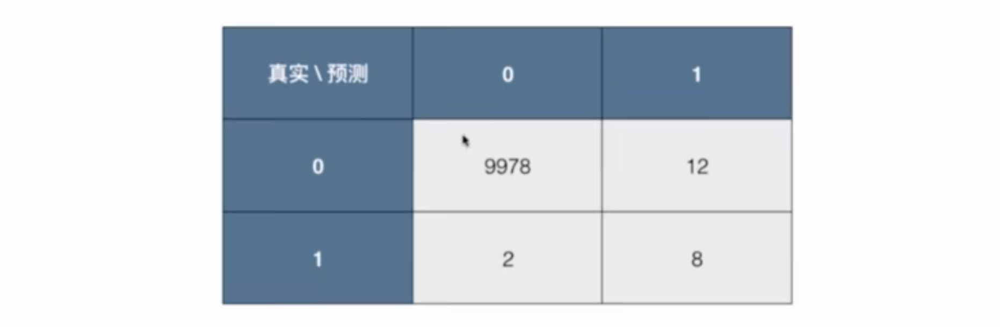

# 10-1 准确度的陷阱和混淆矩阵

分类算法的评价，分类准确度存在的问题。

例子：一个癌症预测系统，输入体检信息，可以判断是否有癌症。如果预测准确度达到了 99.9%，是一个好的系统吗？

如果癌症产生的概率只有 0.1%，我们系统预测所有人都是健康，既可以达到 99.9% 的准确率。

如果癌症产生的概率只有 0.01%，我们的系统预测所有人都是健康，可达到 99.99% 的准确度。这种情况下，99.9% 就是一个非常差的癌症预测系统。

这就是是有分类准确度存在的问题。**对于极度偏斜（Skewed Data）的数据，只使用分类准确度是远远不够的。**

## 混淆矩阵 Confusion Matrix

`[预测正确?][预测值]`

- TN：True Negative
- FP：False Positive，预测值为 Positive，真实值为 True，预测错误 False。
- FN：False Negative
- TP：True Positive，预测值为 Positive，真实值为 Positive，预测正确 True。

以一个真实的例子：有 1000 个人，预测结果如下；

- 算法预测 9978 个人没有患癌症，实际上他们也没有患癌症；
- 算法预测 12 个人患了癌症，实际上这 12 个人是健康的。（误诊）
- 算法预测 2 个人是健康的，而实际上这 2 个人患癌症的。（误诊，耽误治疗）
- ....

