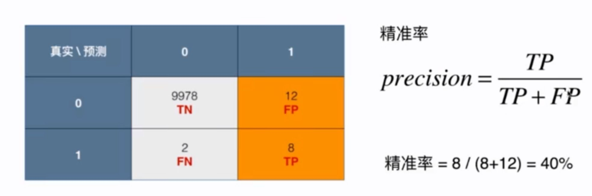
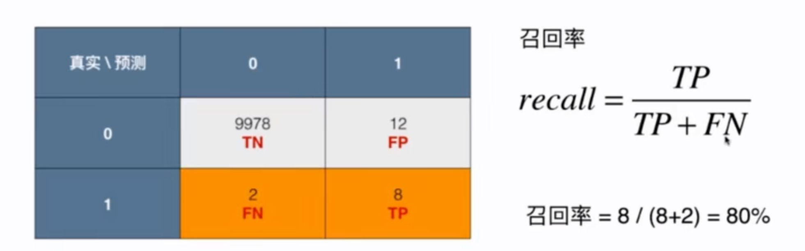
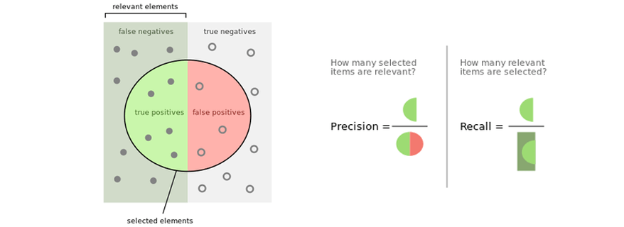
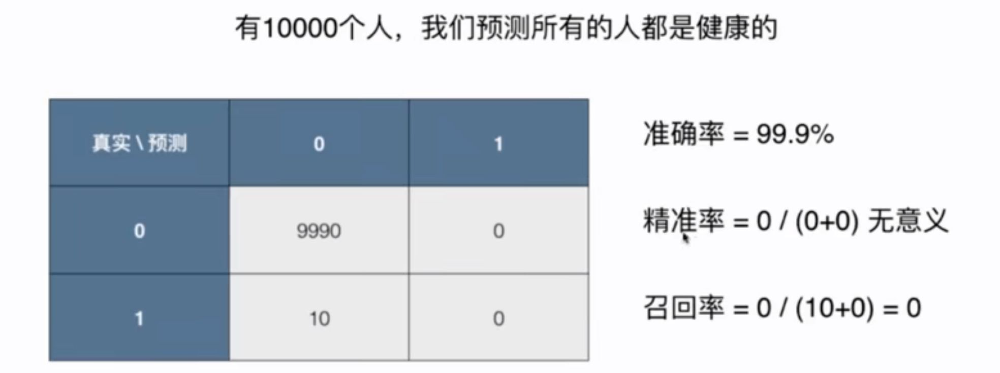

# 10-2 精确率和召回率

这是两个很重要的指标。

1 通常是重点的关注对象。对于这种有偏的数据，通常将 1 作为关注的事件。精准率 Precision 是预测我们关注的事件它相应的有多准。

40% 表示，做了 100 次为 1 的预测，其中有 40% 是正确的。

和精准率对应的指标是召回率。

召回率：这个事件发生了，并且被我们正确预测了。

80% 表示，**如果实际上有 100 个癌症患者，那么算法能够找到其中的 80 个**。

精确率和召回率有一个很好的图：

一个没有意义的预测系统：

