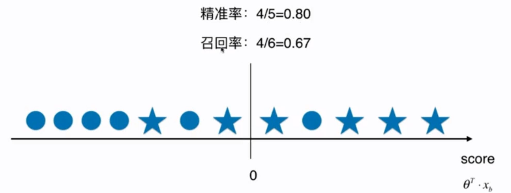
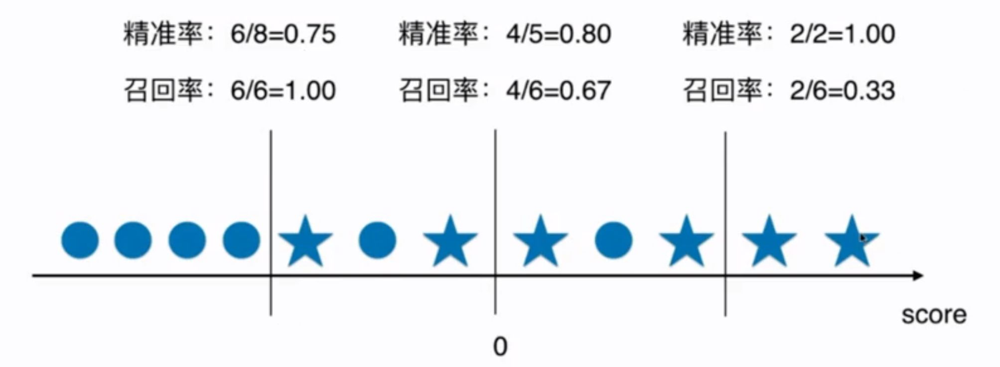

# 10-5 Precision-Recall 的平衡

精准率和召回率是两个矛盾的指标。

决策边界。




调整分类阈值：


调整分类阈值：



```python
import numpy as np
import matplotlib.pyplot as plt
```


```python
digits = datasets.load_digits()
X = digits.data
y = digits.target

# 使得手写数字数据集极度偏斜
y = digits.target.copy()
y[digits.target==9] = 1
y[digits.target!=9] = 0
```


```python
from sklearn.model_selection import train_test_split

X_train, X_test, y_train, y_test = train_test_split(X, y, random_state=666)
```


```python
from sklearn.linear_model import LogisticRegression

log_reg = LogisticRegression()
log_reg.fit(X_train, y_train)
y_predict = log_reg.predict(X_test)
```


```python
from sklearn.metrics import f1_score

f1_score(y_test, y_predict)
```


    0.8674698795180723


```python
from sklearn.metrics import confusion_matrix

confusion_matrix(y_test, y_predict)
```


    array([[403,   2],
           [  9,  36]])


## 调整分类阈值


```python
log_reg.decision_function(X_test)[:10]
```


    array([-21.39741536, -32.89789888, -16.4216551 , -79.82541711,
           -48.0315385 , -24.18126079, -44.61402842, -24.24131623,
            -1.14361072, -19.00577479])


```python
log_reg.predict(X_test)[:10]
```


    array([0, 0, 0, 0, 0, 0, 0, 0, 0, 0])


```python
decision_scores = log_reg.decision_function(X_test)
```


```python
np.min(decision_scores)
```


    -85.73222341152803


```python
np.max(decision_scores)
```


    19.9042350129632


```python
# 阈值为 5
y_predict_2 = np.array(decision_scores >= 5, dtype='int')
```


```python
confusion_matrix(y_test, y_predict_2)
```


    array([[404,   1],
           [ 21,  24]])


```python
precision_score(y_test, y_predict_2)
```


    0.96


```python
recall_score(y_test, y_predict_2)
```


    0.5333333333333333


```python
# 阈值为 -5
y_predict_3 = np.array(decision_scores >= -5, dtype='int')
```


```python
precision_score(y_test, y_predict_3)
```


    0.7272727272727273


```python
recall_score(y_test, y_predict_3)
```


    0.8888888888888888


```python

```


