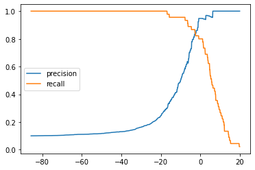
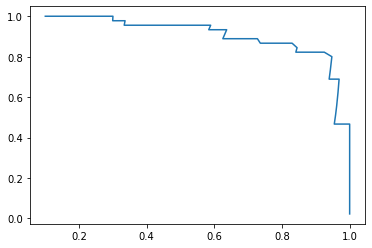
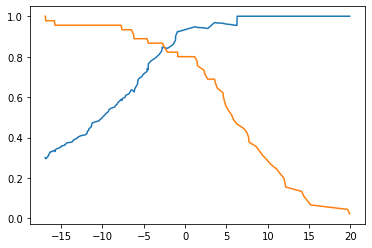

# 10-6 Precision-Recall 曲线

```python
import numpy as np
import matplotlib.pyplot as plt
from sklearn import datasets
```


```python
digits = datasets.load_digits()
X = digits.data
y = digits.target

# 使得手写数字数据集极度偏斜
y = digits.target.copy()
y[digits.target==9] = 1
y[digits.target!=9] = 0
```


```python
from sklearn.model_selection import train_test_split

X_train, X_test, y_train, y_test = train_test_split(X, y, random_state=666)
```


```python
from sklearn.linear_model import LogisticRegression

log_reg = LogisticRegression()
log_reg.fit(X_train, y_train)
decision_scores = log_reg.decision_function(X_test)
```


```python
from sklearn.metrics import precision_score
from sklearn.metrics import recall_score

precisions = []
recalls = []
thresholds = np.arange(np.min(decision_scores), np.max(decision_scores), 0.1)

for threshold in thresholds:
    y_predict = np.array(decision_scores >= threshold, dtype='int')
    precisions.append(precision_score(y_test, y_predict))
    recalls.append(recall_score(y_test, y_predict))
    
```


```python
plt.plot(thresholds, precisions, label='precision')
plt.plot(thresholds, recalls, label='recall')
plt.legend()
plt.show()
```

​    

​    


## Precision-Recall 曲线


```python
plt.plot(precisions, recalls)
plt.show() # 随着 Recall 的增加，则 Precision 减少
```

​    

​    


## sklearn 中的 Precision-Recall 曲线


```python
from sklearn.metrics import precision_recall_curve

precisions, recalls, thresholds = precision_recall_curve(y_test, decision_scores)
```


```python
precisions.shape
```


    (151,)


```python
recalls.shape
```


    (151,)


```python
thresholds.shape # 最后一个precision为1，recall为0，没有阈值 
```


    (150,)


```python
plt.plot(thresholds, precisions[:-1])
plt.plot(thresholds, recalls[:-1])
plt.show()
```

​    

​    


```python

```
