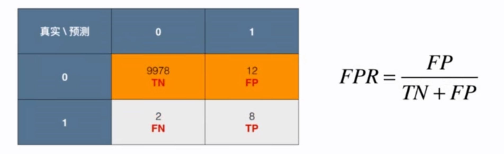
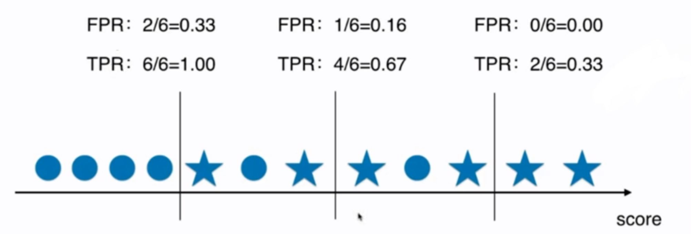

# 10-7 ROC 曲线

Receiver Operation Characteristic Curve：描述的是 TPR 和 FPR 之间的关系。

- TPR：True Positive Rate. 就是召回率 Recall。
- FPR：



## TPR 和 FPR 的关系



ROC 用于比较两个模型。

```python
import numpy as np
import matplotlib.pyplot as plt
from sklearn import datasets
```


```python
digits = datasets.load_digits()
X = digits.data
y = digits.target

# 使得手写数字数据集极度偏斜
y = digits.target.copy()
y[digits.target==9] = 1
y[digits.target!=9] = 0
```


```python
from sklearn.model_selection import train_test_split

X_train, X_test, y_train, y_test = train_test_split(X, y, random_state=666)
```


```python
from sklearn.linear_model import LogisticRegression

log_reg = LogisticRegression()
log_reg.fit(X_train, y_train)
y_predict = log_reg.predict(X_test)
decision_scores = log_reg.decision_function(X_test)
```

    /Users/landonglei/anaconda3/envs/imooc-ml/lib/python3.6/site-packages/sklearn/linear_model/_logistic.py:764: ConvergenceWarning: lbfgs failed to converge (status=1):
    STOP: TOTAL NO. of ITERATIONS REACHED LIMIT.
    
    Increase the number of iterations (max_iter) or scale the data as shown in:
        https://scikit-learn.org/stable/modules/preprocessing.html
    Please also refer to the documentation for alternative solver options:
        https://scikit-learn.org/stable/modules/linear_model.html#logistic-regression
      extra_warning_msg=_LOGISTIC_SOLVER_CONVERGENCE_MSG)


```python
from sklearn.metrics import f1_score

f1_score(y_test, y_predict)
```


    0.8674698795180723


```python
from sklearn.metrics import confusion_matrix

confusion_matrix(y_test, y_predict)
```


    array([[403,   2],
           [  9,  36]])


## sklearn 中的 ROC


```python
from sklearn.metrics import roc_curve

fprs, tprs, thresholds = roc_curve(y_test, decision_scores)
```


```python
plt.plot(fprs, tprs)
plt.show()
```

​    

​    


```python
# 通常关注的是 ROC 曲线的面积
from sklearn.metrics import roc_auc_score

roc_auc_score(y_test, decision_scores)
```


    0.9823868312757201


```python

```


