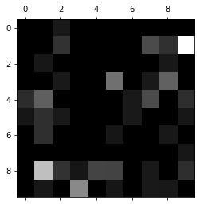

# 10-8 多分类问题中的混淆矩阵

可视化多分类的混淆矩阵（err_matrix），定位错误原因。

```python
import numpy as np
import matplotlib.pyplot as plt
```


```python
from sklearn import datasets

digits = datasets.load_digits()
X = digits.data
y = digits.target
```


```python
from sklearn.model_selection import train_test_split

X_train, X_test, y_train, y_test = train_test_split(X, y, test_size=0.8, random_state=666)
```


```python
from sklearn.linear_model import LogisticRegression

log_reg = LogisticRegression()
log_reg.fit(X_train, y_train)
log_reg.score(X_test, y_test)
```


    0.9408901251738526


```python
y_predict = log_reg.predict(X_test)
```


```python
from sklearn.metrics import precision_score

precision_score(y_test, y_predict, average='micro')
```


    0.9408901251738526


```python
# 混淆矩阵天然支持多分类问题
from sklearn.metrics import confusion_matrix

confusion_matrix(y_test, y_predict)
```


    array([[148,   0,   1,   0,   0,   0,   0,   0,   0,   0],
           [  0, 125,   2,   0,   0,   0,   0,   3,   2,  11],
           [  0,   1, 134,   0,   0,   0,   0,   0,   1,   0],
           [  0,   0,   1, 138,   0,   5,   0,   1,   4,   0],
           [  2,   4,   0,   0, 138,   0,   1,   3,   0,   2],
           [  1,   2,   1,   0,   0, 146,   1,   0,   0,   1],
           [  0,   2,   0,   0,   0,   1, 132,   0,   1,   0],
           [  0,   0,   0,   0,   0,   0,   0, 135,   0,   1],
           [  0,   8,   2,   1,   3,   3,   0,   1, 120,   2],
           [  0,   1,   0,   6,   0,   1,   0,   1,   1, 137]])


```python
cfm = confusion_matrix(y_test, y_predict)

plt.matshow(cfm, cmap=plt.cm.gray)
plt.show()
```

​    

​    


```python
# 关注预测错误的地方
```


```python
# 每一行有多少个样本
row_sums = np.sum(cfm, axis=1)
err_matrix = cfm / row_sums # 错误百分比
np.fill_diagonal(err_matrix, 0) # 对角线填充为 0
err_matrix # 犯错的百分比
```


    array([[0.        , 0.        , 0.00735294, 0.        , 0.        ,
            0.        , 0.        , 0.        , 0.        , 0.        ],
           [0.        , 0.        , 0.01470588, 0.        , 0.        ,
            0.        , 0.        , 0.02205882, 0.01428571, 0.07482993],
           [0.        , 0.00699301, 0.        , 0.        , 0.        ,
            0.        , 0.        , 0.        , 0.00714286, 0.        ],
           [0.        , 0.        , 0.00735294, 0.        , 0.        ,
            0.03289474, 0.        , 0.00735294, 0.02857143, 0.        ],
           [0.01342282, 0.02797203, 0.        , 0.        , 0.        ,
            0.        , 0.00735294, 0.02205882, 0.        , 0.01360544],
           [0.00671141, 0.01398601, 0.00735294, 0.        , 0.        ,
            0.        , 0.00735294, 0.        , 0.        , 0.00680272],
           [0.        , 0.01398601, 0.        , 0.        , 0.        ,
            0.00657895, 0.        , 0.        , 0.00714286, 0.        ],
           [0.        , 0.        , 0.        , 0.        , 0.        ,
            0.        , 0.        , 0.        , 0.        , 0.00680272],
           [0.        , 0.05594406, 0.01470588, 0.00671141, 0.02      ,
            0.01973684, 0.        , 0.00735294, 0.        , 0.01360544],
           [0.        , 0.00699301, 0.        , 0.04026846, 0.        ,
            0.00657895, 0.        , 0.00735294, 0.00714286, 0.        ]])


```python
cfm = confusion_matrix(y_test, y_predict)

plt.matshow(err_matrix, cmap=plt.cm.gray)
plt.show()

# 越亮的地方，错误率越高
```

​    

​    


```python

```

