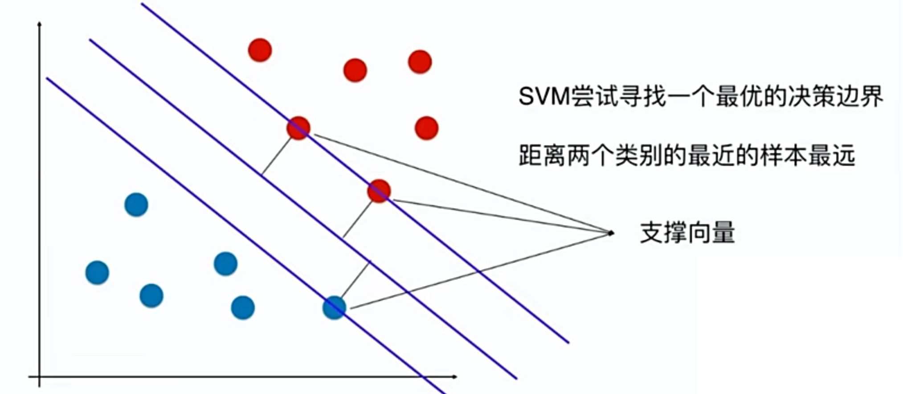
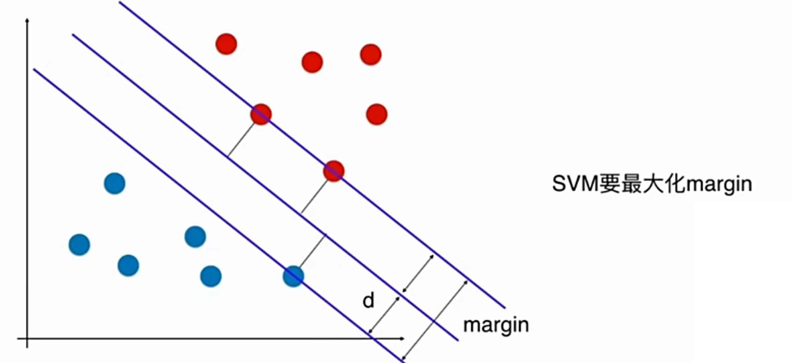

# 11-1 什么是支持向量机 SVM？

支持向量机 Support Vector Machine

既可以解决分类问题，也可以解决回归问题。

**寻找具有好的泛化能力的决策边界。**

离最近的点尽可能的远，决策边界距离分类样本尽可能的远。

SVM 是统计学习中的一种非常重要的方法。

SVM 寻找到的决策边界的特点：

- 距离决策边界最近的点，到决策边界尽可能的远。
- 距离决策边界最近的点定义了两条直线，它和决策边界是平行的。这两天直线之间没有任何数据点（Hard Margin）。

支持向量到直线的距离 d 相等，2d 就是 margin，SVM 要最大化 margin。

Hard Margin SVM 解决的是现行可分问题。Soft Margin SVM 解决的是线性不可分问题。

要用数学的方法将 Margin 表达出来，即 **Margin 的数学形式化表达**，转换为一个最优化问题。

