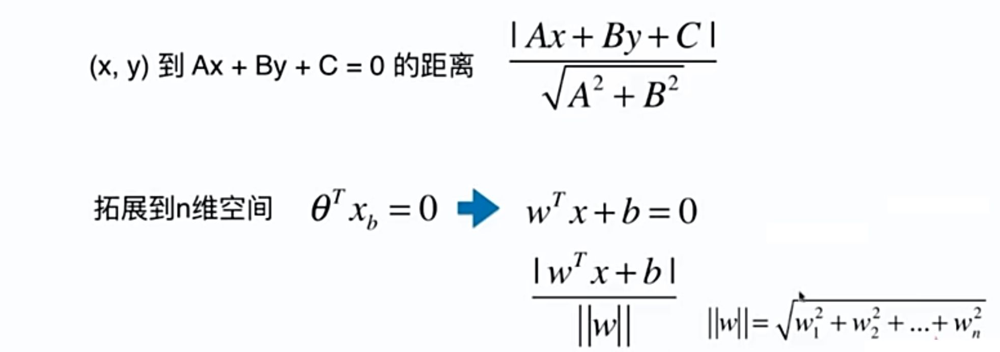
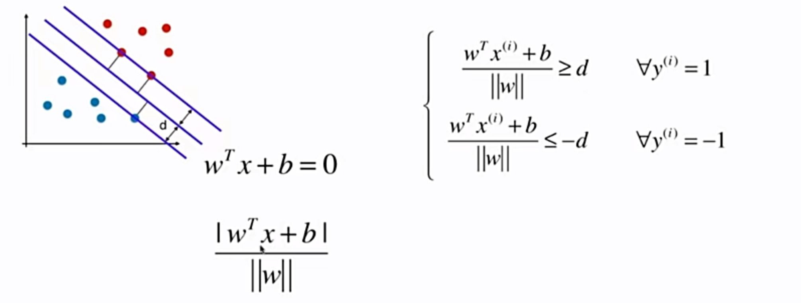
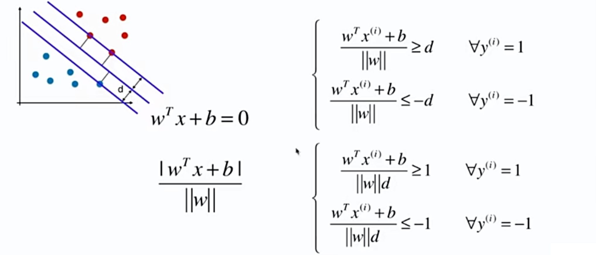
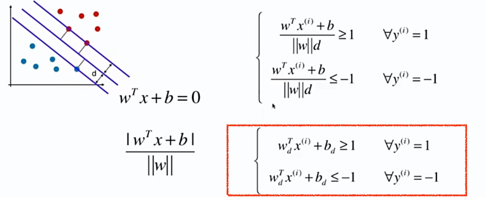
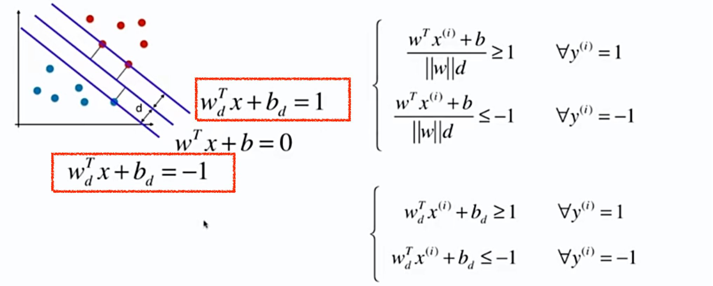
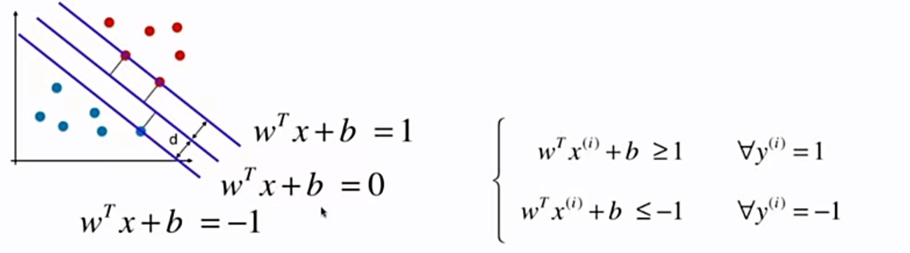
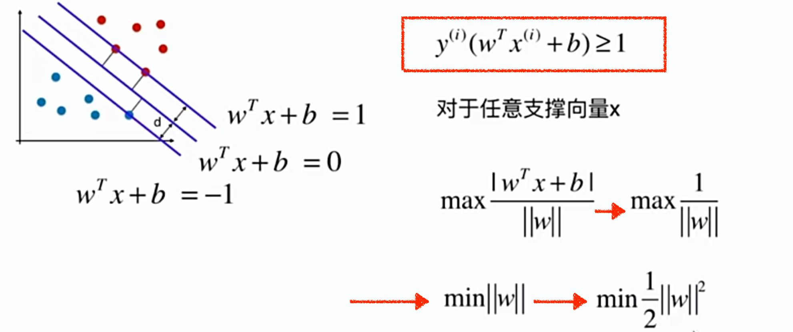

# 11-2 SVM 的数学表达式推导

最大化 Margin，而 Margin = 2d，因此 SVM 最大化 d。

点到直线的距离，从二维拓展到多维：

假设决策边界为 $w^Tx + b = 0$，一类别标签为 1，另一类别为 -1。

两边同时除以 d，得：

分母 $\left \Vert w \right \Vert d$ 是一个数，即 $w^T, b$ 都除以一个数，得到 $w^T_d, b_d$，

 

得到上下两条直线的方程为：

决策边界的参数为 $w^T, b$，上下两条直线的参数为 $w^T_d, b_d$。后者是前者除以 $\left \Vert w \right \Vert d$ 得到的。而决策边界方程的右边等于 0，因此左右同时除以 $\left \Vert w \right \Vert d$ ，得到：

简化符号 $w^T_b, b_d$ 为 $w^T, b$ ，简化后和之前一开始的 $w^T, b$ 在**理论上**已经完全不同了。

将两个式子合并成为一个式子。优化目标推导得到：

最后得到的最优化问题为：

这是一个**有条件的最优化问题**。

