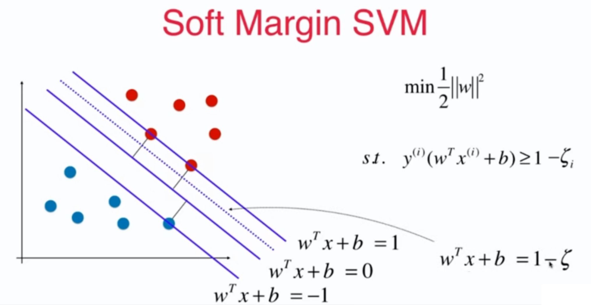
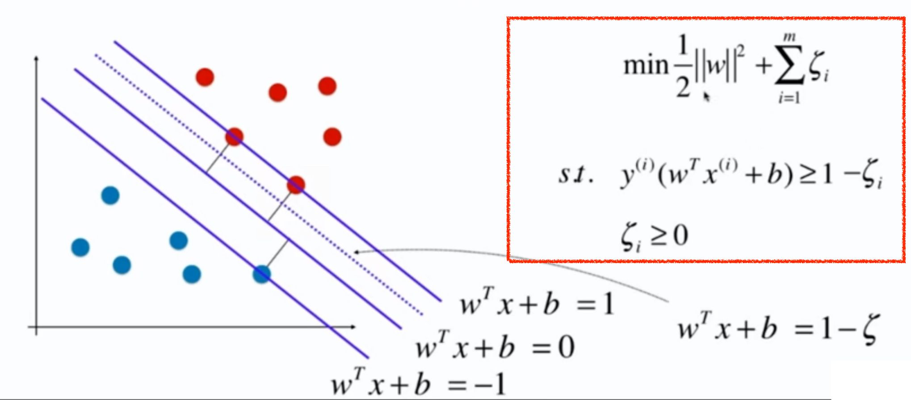
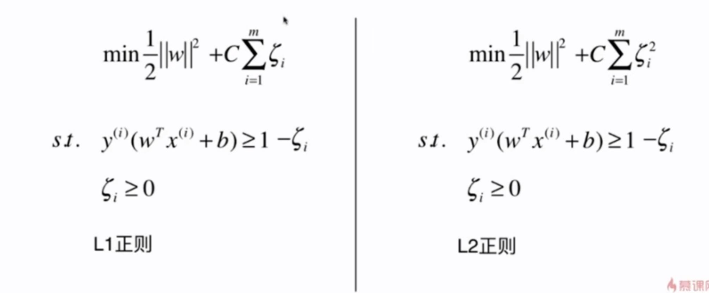

# 11-3 Soft Margin 和 SVM 的正则化

Hard Margin SVM 的泛化能力可能不足。

约束条件中的**大于等于 1** 表示的是：所有的样本点都必须在 $y(wx + b) = 1, y(wx + b) = -1$ 这两条直线的外边。

Soft Margin SVM 就是对约束条件进行一定的宽松。

$\xi \geqslant  0$ ，表示希望有一定的容错的能力。并且这个容错空间又不能太大。

通过参数 C 来平衡两个部分重要程度所占的比例。如果 C 特别大，那么以优化后一项的为主。

