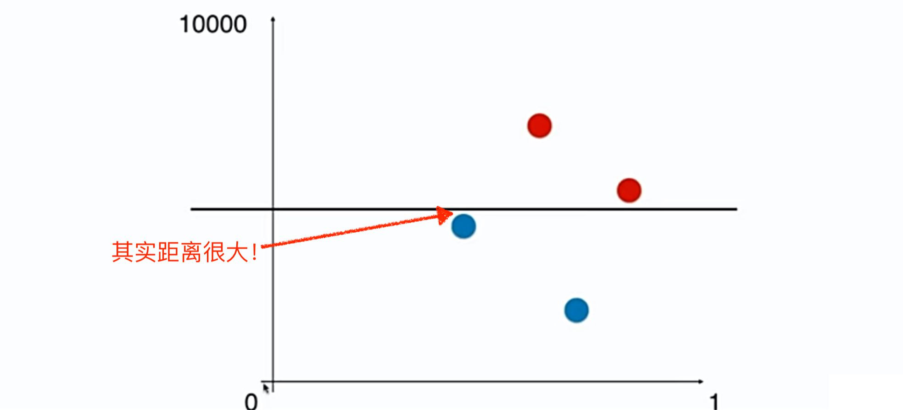
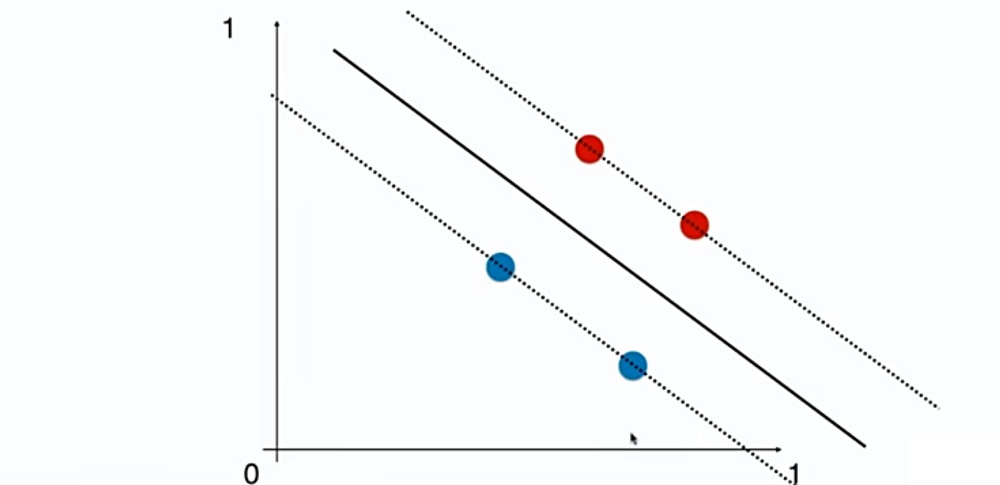
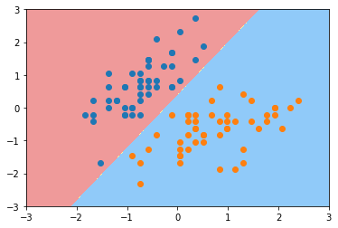
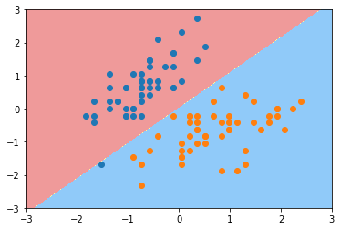
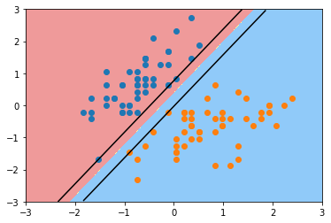
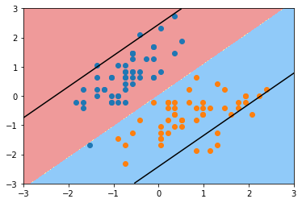

# 11-4 sklearn 中的 SVM 算法

和 kNN 一样，要做数据标准化处理。

涉及距离，需要考虑量纲的影响。



消除量纲的影响之后，就很好。




## 实验

```python
import numpy as np
import matplotlib.pyplot as plt
```


```python
from sklearn import datasets

iris = datasets.load_iris()

X = iris.data
y = iris.target

X = X[y<2,:2]
y = y[y<2]
```


```python
plt.scatter(X[y==0, 0], X[y==0, 1], color='r')
plt.scatter(X[y==1, 0], X[y==1, 1], color='b')
plt.show()
```

​    

​    


```python
from sklearn.preprocessing import StandardScaler

standardScaler = StandardScaler()
standardScaler.fit(X)
X_standard = standardScaler.transform(X)
```


```python
from sklearn.svm import LinearSVC

svc = LinearSVC(C=1e9) # Hard Margin, sklearn 中正则化参数在前面的一部分
svc.fit(X_standard, y)
```


    LinearSVC(C=1000000000.0)


```python
def plot_decision_boundary(model, axis):

    x0, x1 = np.meshgrid(
        np.linspace(axis[0], axis[1], int((axis[1]-axis[0])*100)).reshape(-1, 1),
        np.linspace(axis[2], axis[3], int((axis[3]-axis[2])*100)).reshape(-1, 1),
    )
    X_new = np.c_[x0.ravel(), x1.ravel()]

    y_predict = model.predict(X_new)
    zz = y_predict.reshape(x0.shape)

    from matplotlib.colors import ListedColormap
    custom_cmap = ListedColormap(['#EF9A9A','#FFF59D','#90CAF9'])
    
    plt.contourf(x0, x1, zz, linewidth=5, cmap=custom_cmap)
```


```python
plot_decision_boundary(svc, axis=[-3, 3, -3, 3])
plt.scatter(X_standard[y==0,0], X_standard[y==0,1])
plt.scatter(X_standard[y==1,0], X_standard[y==1,1])
plt.show()
```



​    


```python
svc2 = LinearSVC(C=0.01) # Soft Margin
svc2.fit(X_standard, y)

plot_decision_boundary(svc2, axis=[-3, 3, -3, 3])
plt.scatter(X_standard[y==0,0], X_standard[y==0,1])
plt.scatter(X_standard[y==1,0], X_standard[y==1,1])
plt.show()
```



​    


```python
svc.coef_ # 两个特征 ，二维数组，sklearn 中支持多分类问题
```


    array([[ 4.03243603, -2.50698675]])


```python
svc.intercept_ # 截距
```


    array([0.92734903])


## 绘制 Margin


```python
def plot_svc_decision_boundary(model, axis):

    x0, x1 = np.meshgrid(
        np.linspace(axis[0], axis[1], int((axis[1]-axis[0])*100)).reshape(-1, 1),
        np.linspace(axis[2], axis[3], int((axis[3]-axis[2])*100)).reshape(-1, 1),
    )
    X_new = np.c_[x0.ravel(), x1.ravel()]

    y_predict = model.predict(X_new)
    zz = y_predict.reshape(x0.shape)

    from matplotlib.colors import ListedColormap
    custom_cmap = ListedColormap(['#EF9A9A','#FFF59D','#90CAF9'])
    
    plt.contourf(x0, x1, zz, linewidth=5, cmap=custom_cmap)
    
    w = model.coef_[0]
    b = model.intercept_[0]
    
    # 决策边界：w0 * x0 + w1 * x1 + b = 0 
    # ==> x1 = -w0/w1 * x0 - b/w1
    plot_x = np.linspace(axis[0], axis[1], 200)
    up_y   =  -w[0]/w[1] * plot_x - b/w[1] + 1/w[1] # w0 * x0 + w1 * x1 + b = 1
    down_y =  -w[0]/w[1] * plot_x - b/w[1] - 1/w[1] # w0 * x0 + w1 * x1 + b = -1
    
    up_index = (up_y >= axis[2]) & (up_y <= axis[3]) # 过滤
    down_index = (down_y >= axis[2]) & (down_y <= axis[3])
    plt.plot(plot_x[up_index], up_y[up_index], color='black')
    plt.plot(plot_x[down_index], down_y[down_index], color='black')
```


```python
plot_svc_decision_boundary(svc, axis=[-3, 3, -3, 3])
plt.scatter(X_standard[y==0,0], X_standard[y==0,1])
plt.scatter(X_standard[y==1,0], X_standard[y==1,1])
plt.show()
```



​    


```python
plot_svc_decision_boundary(svc2, axis=[-3, 3, -3, 3]) # svc2 有非常大的容错空间
plt.scatter(X_standard[y==0,0], X_standard[y==0,1])
plt.scatter(X_standard[y==1,0], X_standard[y==1,1])
plt.show()
```



​    


```python

```
