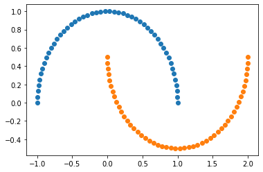
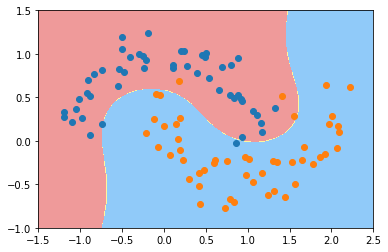
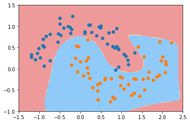
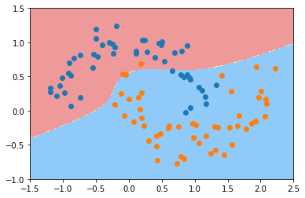
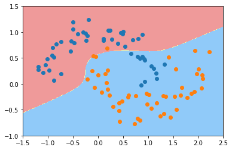

# 11-5 SVM 中使用多项式特征

```python
import numpy as np
import matplotlib.pyplot as plt
```


```python
# 生成非线性数据
from sklearn import datasets

X, y = datasets.make_moons()
```


```python
X.shape
```


    (100, 2)


```python
y.shape
```


    (100,)


```python
plt.scatter(X[y==0,0], X[y==0,1])
plt.scatter(X[y==1,0], X[y==1,1])
plt.show()
```

​    

​    


```python
# 添加一些噪声
X, y = datasets.make_moons(noise=0.15, random_state=666)
plt.scatter(X[y==0,0], X[y==0,1])
plt.scatter(X[y==1,0], X[y==1,1])
plt.show()
```

​    

​    


## 使用多项式特征的 SVM


```python
from sklearn.preprocessing import PolynomialFeatures, StandardScaler
from sklearn.svm import LinearSVC
from sklearn.pipeline import Pipeline

def PolynomialSVC(degree, C=1.0):
    return Pipeline([
        ('poly', PolynomialFeatures(degree=degree)),
        ('std_scaler', StandardScaler()),
        ('linearSVC', LinearSVC(C=C))
    ])
```


```python
poly_svc = PolynomialSVC(degree=3)
```


```python
poly_svc.fit(X, y)
```


    Pipeline(steps=[('poly', PolynomialFeatures(degree=3)),
                    ('std_scaler', StandardScaler()), ('linearSVC', LinearSVC())])


```python
def plot_decision_boundary(model, axis):

    x0, x1 = np.meshgrid(
        np.linspace(axis[0], axis[1], int((axis[1]-axis[0])*100)).reshape(-1, 1),
        np.linspace(axis[2], axis[3], int((axis[3]-axis[2])*100)).reshape(-1, 1),
    )
    X_new = np.c_[x0.ravel(), x1.ravel()]

    y_predict = model.predict(X_new)
    zz = y_predict.reshape(x0.shape)

    from matplotlib.colors import ListedColormap
    custom_cmap = ListedColormap(['#EF9A9A','#FFF59D','#90CAF9'])
    
    plt.contourf(x0, x1, zz, linewidth=5, cmap=custom_cmap)
```


```python
plot_decision_boundary(poly_svc, axis=[-1.5, 2.5, -1.0, 1.5])
plt.scatter(X[y==0,0], X[y==0,1])
plt.scatter(X[y==1,0], X[y==1,1])
plt.show()
```



​    


```python
poly_svc2 = PolynomialSVC(degree=50)
poly_svc2.fit(X, y)

plot_decision_boundary(poly_svc2, axis=[-1.5, 2.5, -1.0, 1.5])
plt.scatter(X[y==0,0], X[y==0,1])
plt.scatter(X[y==1,0], X[y==1,1])
plt.show()
```



​    


## 使用多项式核函数 SVM


```python
from sklearn.svm import SVC

def PolynomialKernelSVC(degree, C=1.0):
    return Pipeline([
        ("std_scaler", StandardScaler()),
        ("kernelSVC", SVC(kernel="poly", degree=degree, C=C))
    ])
```


```python
poly_kernel_svc = PolynomialKernelSVC(degree=3)
poly_kernel_svc.fit(X, y)
```


    Pipeline(steps=[('std_scaler', StandardScaler()),
                    ('kernelSVC', SVC(kernel='poly'))])


```python
plot_decision_boundary(poly_kernel_svc, axis=[-1.5, 2.5, -1.0, 1.5])
plt.scatter(X[y==0,0], X[y==0,1])
plt.scatter(X[y==1,0], X[y==1,1])
plt.show()
```



​    


```python
poly_kernel_svc2 = PolynomialKernelSVC(degree=5)
poly_kernel_svc2.fit(X, y)

plot_decision_boundary(poly_kernel_svc2, axis=[-1.5, 2.5, -1.0, 1.5])
plt.scatter(X[y==0,0], X[y==0,1])
plt.scatter(X[y==1,0], X[y==1,1])
plt.show()
```



​    


```python

```
