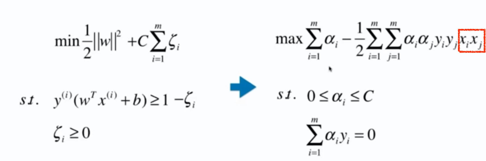
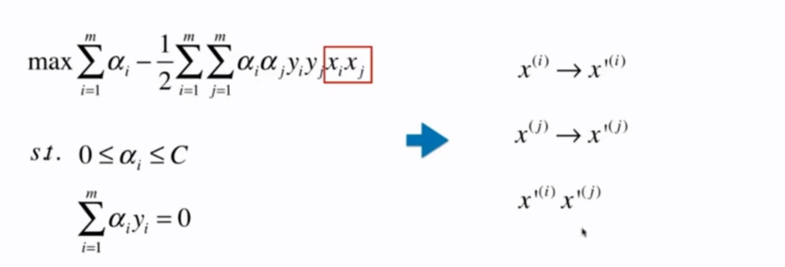
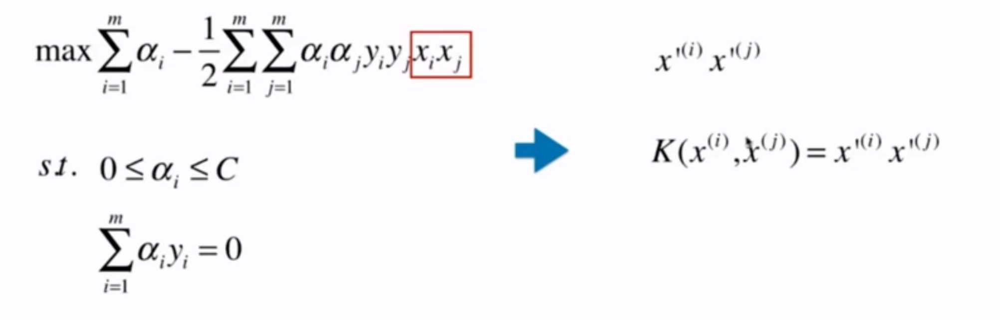
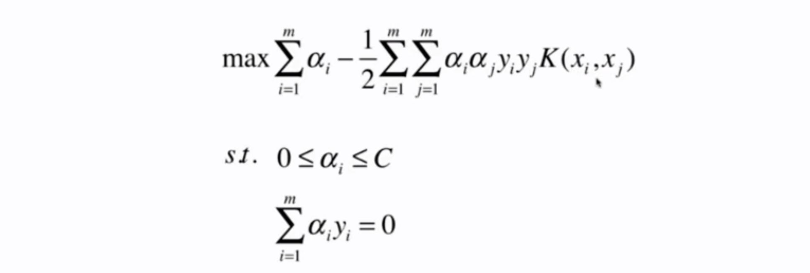
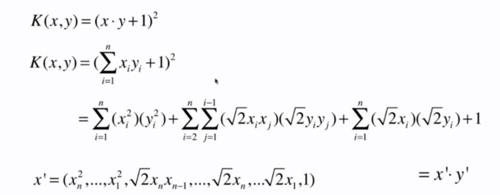
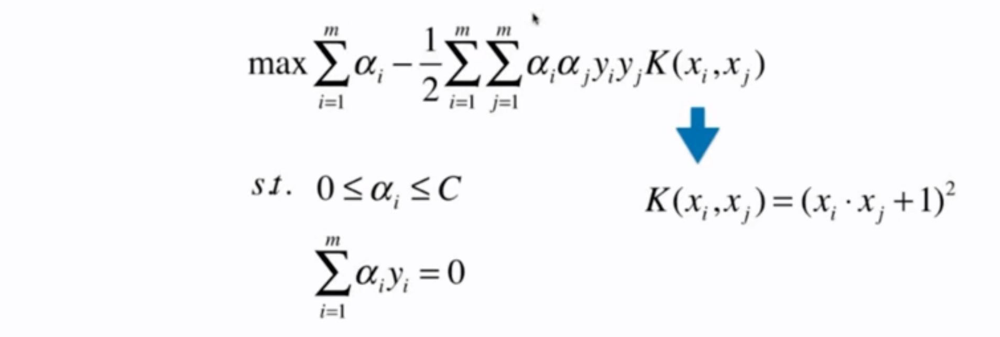

# 11-6 什么是核函数？

SVM 的求解：

添加多项式特征：$x^{(i)} \rightarrow x'^{(j)}$。

核函数是这样的一个思想：传入参数 $x$，得到 $x'$。

所以 $x_ix_j$ 就可以用 $K(x_i, x_j)$ 来表示。

取不同的核函数，就相当于现在原始样本上先进行了一个变化，之后把 $x_i$ 变成了 $x'_i$，$x_j$ 变成了 $x'_j$，之后再对这两个样本进行乘法。K 函数的作用就是想省略掉这一步，不要再进行这种变形了，直接拿原来的样本代入一个函数中，用这个函数直接算出两个样本进行点乘的结果。

使用了核函数后，就不需要关心把原来的样本变化成了什么样子，直接得到点乘结果。

SVM 不是 SVM 特有的技巧，它只是一种思想，只要在数学表示中出现点乘，就可以使用核函数。

## 多项式核函数

核函数大大的降低了计算的复杂度。

得到

- 多项式核函数：$K(x, y) = (x \cdot y + c)^d$
- 线性核函数：$K(x, y) = x \cdot y$

