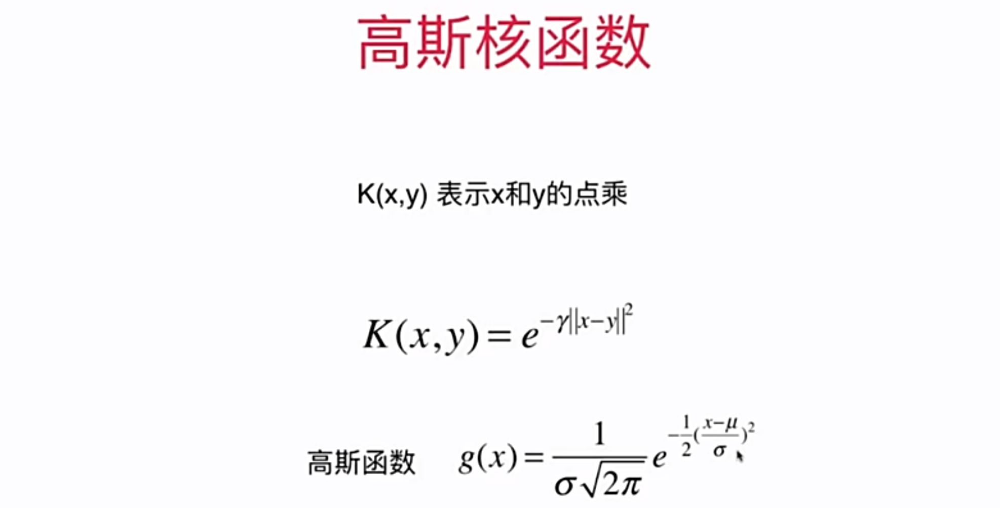
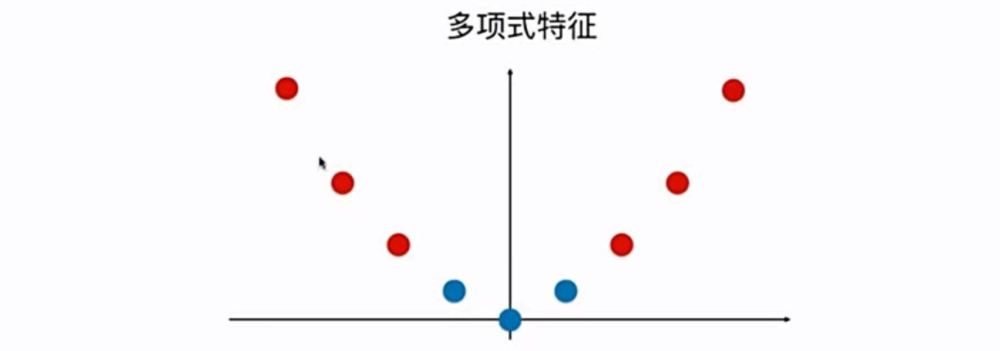
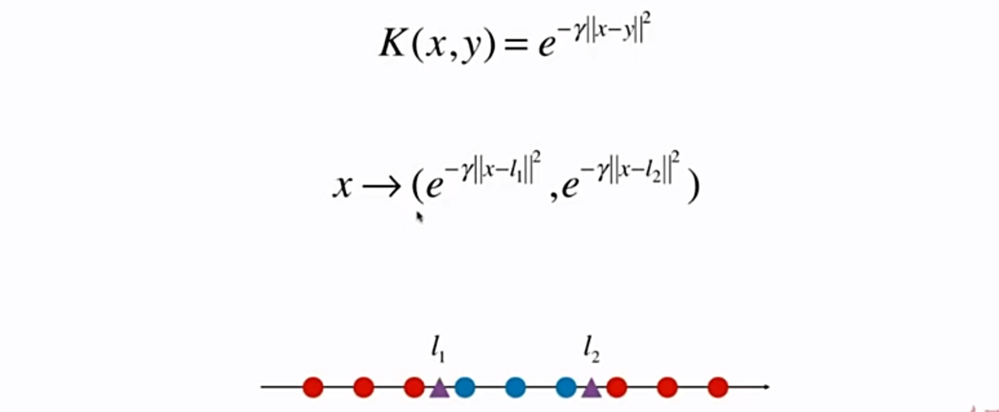
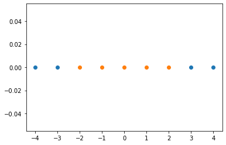
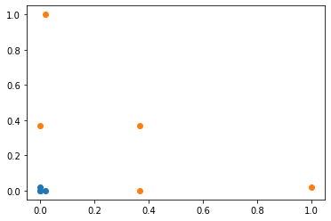
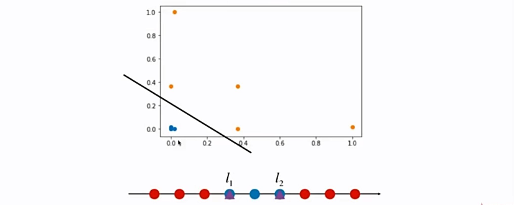

# 11-7 高斯核函数

- K(x, y) 表示重新定义 x 和 y 的点乘。



高斯核也会叫做 RBF 核（Radial Basis Function Kernel）。

**高斯核：将每一个样本点映射到一个无穷维的特征空间。**

这也说明了高斯核函数背后对每一个样本点进行的变形是非常复杂的，但是经过这样的变形再进行点乘，得到的结果却是非常简单的，就是这样的一个简洁的式子 $e^{-\gamma} \left \Vert x-y \right \Vert^{2}$。这就是核函数的威力。

我们不需要知道它是怎么将 x 变换为 x' 的，但是我们我可以知道变化后再进行点乘的结果。

高斯核函数到底在做些什么事情？

举一个多项式特征的例子，多项式特征为什么可以处理非线性的数据问题？它的基本原理是**依靠升维使得原本线性不可分的数据线性可分。**

如下是添加多项式特征（升维）的例子。显然，一维上线性不可分：


接下来添加多项式特征，它的第一维度的特征 x 保持不变，第二维度的特征变为 $x^2$。数据点就变成了线性可分。



高斯核本质上也在做类似的事情。

## 高斯核函数的作用可视化

将高斯核函数中的 y 值固定，取两个固定的点 $l_1, l_2$ 当做 y。


这两个点也叫做 landmark。

高斯核函数所做的事：如果有两个地标，就将它升为二维。



```python
import numpy as np
import matplotlib.pyplot as plt
```


```python
x = np.arange(-4, 5, 1)
```


```python
x
```


    array([-4, -3, -2, -1,  0,  1,  2,  3,  4])


```python
y = np.array((x >= -2) & (x <= 2), dtype='int')
```


```python
y
```


    array([0, 0, 1, 1, 1, 1, 1, 0, 0])


```python
plt.scatter(x[y==0], [0]*len(x[y==0]))
plt.scatter(x[y==1], [0]*len(x[y==1]))
plt.show()
```

​    

​    


```python
def gaussian(x, l):
    gamma = 1.0
    return np.exp(-gamma * (x - l)**2)
```


```python
l1, l2 = -1, 1

X_new = np.empty((len(x), 2))
for i, data in enumerate(x):
    X_new[i, 0] = gaussian(data, l1)
    X_new[i, 1] = gaussian(data, l2)
```


```python
plt.scatter(X_new[y==0, 0], X_new[y==0, 1])
plt.scatter(X_new[y==1, 0], X_new[y==1, 1])
plt.show()
```

​    

​    


得到的结果，显然是线性可分的。



高斯核：对于每一个数据点都是 landmark。

将一个 $m\times n$ 的数据映射成了 $m \times m$ 的数据。

当样本数 m 少，但是特征 n 多，这种情况下 SVM 就非常划算。


