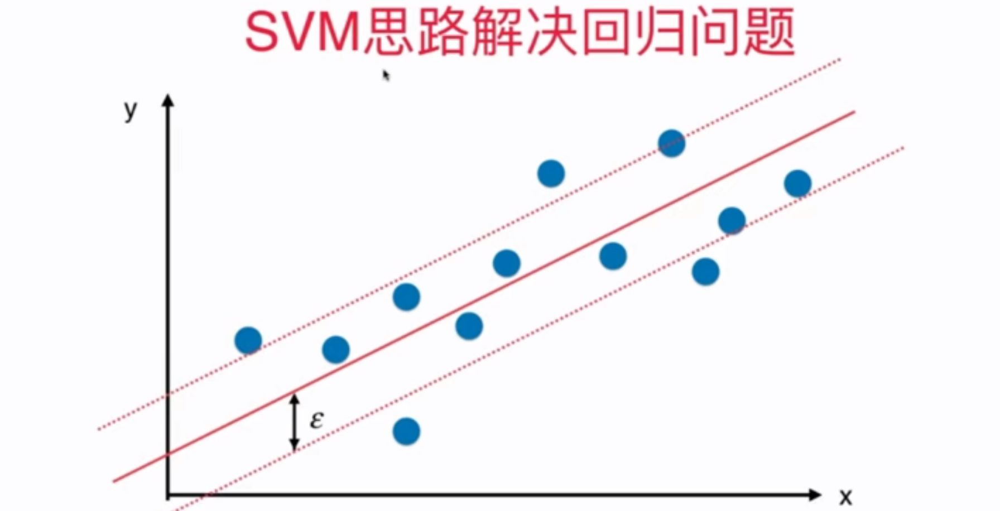

## 11-9 SVM 解决回归问题

回归问题：Margin 内的样本数据点越多越好。

引入 epsilon 参数。




```python
import numpy as np
import matplotlib.pyplot as plt
```


```python
from sklearn import datasets

boston = datasets.load_boston()
X = boston.data
y = boston.target
```


```python
from sklearn.model_selection import train_test_split

X_train, X_test, y_train, y_test = train_test_split(X, y, random_state=666)
```


```python
from sklearn.svm import LinearSVR
from sklearn.svm import SVR # 传入不同的核函数
from sklearn.preprocessing import StandardScaler
from sklearn.pipeline import Pipeline

def StandardLinearSVR(epsilon=0.1):
    return Pipeline([
        ('std_scaler', StandardScaler()),
        ('linearSVR', LinearSVR(epsilon=epsilon))
    ])
```


```python
svr = StandardLinearSVR()
svr.fit(X_train, y_train)
```


    Pipeline(steps=[('std_scaler', StandardScaler()),
                    ('linearSVR', LinearSVR(epsilon=0.1))])


```python
svr.score(X_test, y_test)
```


    0.6355785331041175


```python

```


y