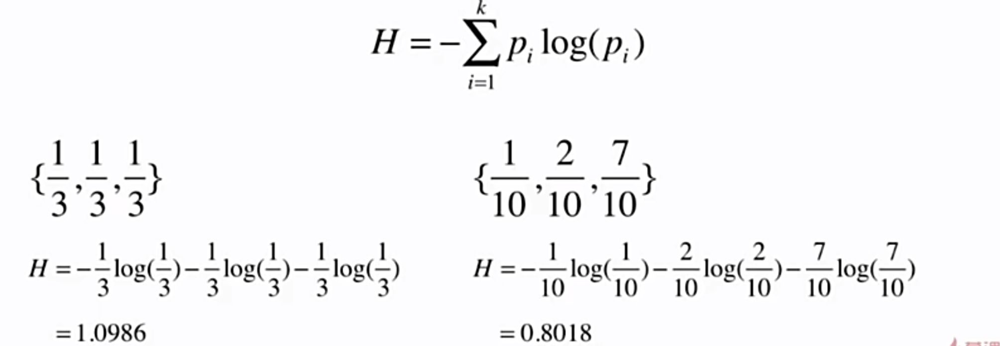
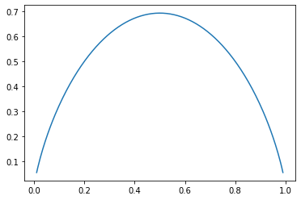

# 12-2 信息熵

熵在信息论中表示随机变量不确定度的度量。

- 熵越大，数据的不确定性越高
- 熵越小，数据的不确定性越低

信息熵计算公式：


- $p_i$：第 i 类所占的比例

例子：




右边 {1/10, 2/10, 7/10} 的信息熵要小于左边 {1/3, 1/3, 1/3}，因此右边的不确定性要低。

对于 {1, 0, 0}，计算得到信息熵为 0。表示数据不确定性是最低的，也就是说数据是非常确定的。

如果只有两类，则信息熵公式可以写成：


```python
import numpy as np
import matplotlib.pyplot as plt
```


```python
def entropy(p):
    return -p * np.log(p) - (1-p) * np.log(1-p)
```


```python
x = np.linspace(0.01, 0.99, 200)
```


```python
plt.plot(x, entropy(x))
plt.show()
```

​    

​    


x = 0.5 时取到了最大值，{1/2, 1/2} 信息熵最大，数据具有强不确定性。


```python

```

## 两个问题

- 每个节点在哪个维度做划分？
- 某个维度在哪个值上做划分？

答：**划分后使得信息熵降低**。


