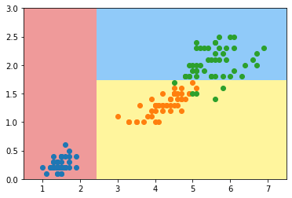

# 12-3 使用信息熵寻找最优划分

```python
import numpy as np
import matplotlib.pyplot as plt
```


```python
from sklearn import datasets

iris = datasets.load_iris()
X = iris.data[:,2:] # 只取后两个维度的特征
y = iris.target
```


```python
from sklearn.tree import DecisionTreeClassifier

dt_clf = DecisionTreeClassifier(max_depth=2, criterion="entropy")
dt_clf.fit(X, y)
```


    DecisionTreeClassifier(criterion='entropy', max_depth=2)


```python
def plot_decision_boundary(model, axis):

    x0, x1 = np.meshgrid(
        np.linspace(axis[0], axis[1], int((axis[1]-axis[0])*100)).reshape(-1, 1),
        np.linspace(axis[2], axis[3], int((axis[3]-axis[2])*100)).reshape(-1, 1),
    )
    X_new = np.c_[x0.ravel(), x1.ravel()]

    y_predict = model.predict(X_new)
    zz = y_predict.reshape(x0.shape)

    from matplotlib.colors import ListedColormap
    custom_cmap = ListedColormap(['#EF9A9A','#FFF59D','#90CAF9'])
    
    plt.contourf(x0, x1, zz, linewidth=5, cmap=custom_cmap)
```


```python
plot_decision_boundary(dt_clf, axis=[0.5, 7.5, 0, 3])
plt.scatter(X[y==0,0], X[y==0,1])
plt.scatter(X[y==1,0], X[y==1,1])
plt.scatter(X[y==2,0], X[y==2,1])
plt.show()
```



​    


## 模拟使用信息熵进行划分


```python
def split(X, y, d, value):
    index_a = (X[:,d] <= value)
    index_b = (X[:,d] > value)
    return X[index_a], X[index_b], y[index_a], y[index_b]
```


```python

from collections import Counter
from math import log

def entropy(y):
    counter = Counter(y)
    res = 0.0
    for num in counter.values():
        p = num / len(y)
        res += -p * log(p)
    return res

def try_split(X, y):
    
    best_entropy = float('inf')
    best_d, best_v = -1, -1
    for d in range(X.shape[1]):
        sorted_index = np.argsort(X[:,d])
        for i in range(1, len(X)):
            if X[sorted_index[i], d] != X[sorted_index[i-1], d]:
                v = (X[sorted_index[i], d] + X[sorted_index[i-1], d])/2
                X_l, X_r, y_l, y_r = split(X, y, d, v)
                p_l, p_r = len(X_l) / len(X), len(X_r) / len(X)
                e = p_l * entropy(y_l) + p_r * entropy(y_r)
                if e < best_entropy:
                    best_entropy, best_d, best_v = e, d, v
                
    return best_entropy, best_d, best_v
```


```python
try_split(X, y)
```


    (0.46209812037329684, 0, 2.45)


```python
best_entropy, best_d, best_v = try_split(X, y)
print("best_entropy =", best_entropy)
print("best_d =", best_d)
print("best_v =", best_v)
```

    best_entropy = 0.46209812037329684
    best_d = 0
    best_v = 2.45


通过上图，第一次划分，在 0 维度， 阈值为 2.45。


```python
X1_l, X1_r, y1_l, y1_r = split(X, y, best_d, best_v)
```


```python
entropy(y1_l) # 这一部分信息熵为0，可以停止划分
```


    0.0


```python
entropy(y1_r) # 信息熵不为0，继续划分
```


    0.6931471805599453


```python
best_entropy2, best_d2, best_v2 = try_split(X1_r, y1_r)
print("best_entropy =", best_entropy2)
print("best_d =", best_d2)
print("best_v =", best_v2)
```

    best_entropy = 0.2147644654371359
    best_d = 1
    best_v = 1.75


第二次划分的阈值为 1.75 左右。


```python
X2_l, X2_r, y2_l, y2_r = split(X1_r, y1_r, best_d2, best_v2)
```


```python
entropy(y2_l) # 信息熵不为零，可以继续划分
```


    0.30849545083110386


```python
entropy(y2_r) # 信息熵不为零，可以继续划分
```


    0.10473243910508653


```python

```
