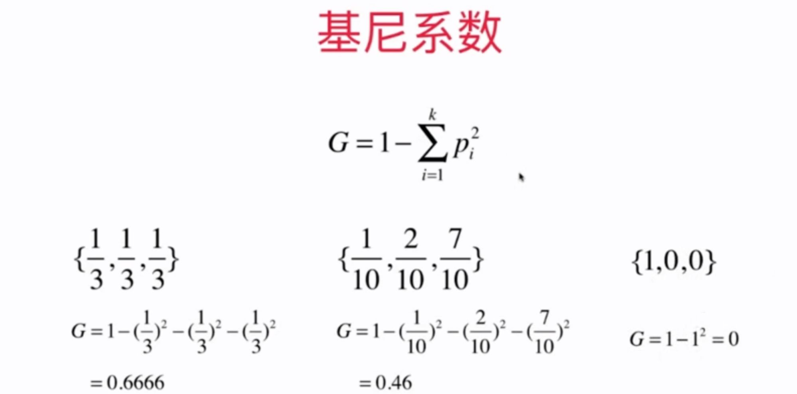

# 12-4 基尼系数

另一个划分指标。基尼系数越高，随机性越强。

$$G =1-\sum^{k}_{i=1} p^{2}_{i}$$



只有两个类别时：

$$G = 1 -x^2 - (1-x)^2 = -2x^2 + 2x$$

- 当 {1/2, 1/2} 时，基尼系数达到了最高值，随机性高。

```python
from sklearn.tree import DecisionTreeClassifier

dt_clf = DecisionTreeClassifier(max_depth=2, criterion="gini")
dt_clf.fit(X, y)
```

熵和基尼系数：

- 熵信息的计算比基尼系数稍慢。
- sklearn 中默认使用基尼系数
- 大多数时候二者没有特别的效果优劣


