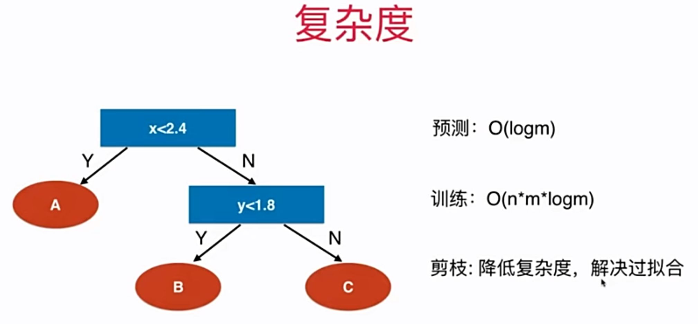
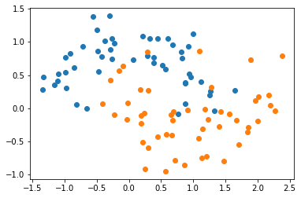
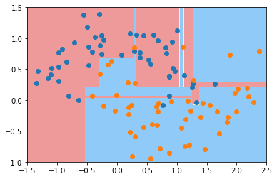
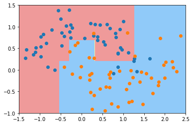
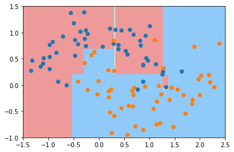
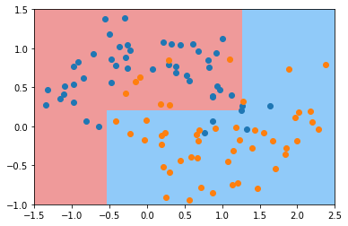

# 12-5 CART 与决策树中的超参数

CART：Classification And Regression Tree。

根据某一维度 d 和某一阈值 v 进行二分。

sklearn 中实现的决策树：CART。

- ID3、C4.5、C5.0

决策树非常容易产生过拟合，需要进行剪枝，降低复杂度，解决过拟合。



```python
import numpy as np
import matplotlib.pyplot as plt
```


```python
from sklearn import datasets

X, y = datasets.make_moons(noise=0.25, random_state=666)
```


```python
plt.scatter(X[y==0,0], X[y==0,1])
plt.scatter(X[y==1,0], X[y==1,1])
plt.show()
```

​    

​    


```python
from sklearn.tree import DecisionTreeClassifier

dt_clf = DecisionTreeClassifier() # 默认：基尼系数、不限定深度
dt_clf.fit(X, y)
```


    DecisionTreeClassifier()


```python
def plot_decision_boundary(model, axis):

    x0, x1 = np.meshgrid(
        np.linspace(axis[0], axis[1], int((axis[1]-axis[0])*100)).reshape(-1, 1),
        np.linspace(axis[2], axis[3], int((axis[3]-axis[2])*100)).reshape(-1, 1),
    )
    X_new = np.c_[x0.ravel(), x1.ravel()]

    y_predict = model.predict(X_new)
    zz = y_predict.reshape(x0.shape)

    from matplotlib.colors import ListedColormap
    custom_cmap = ListedColormap(['#EF9A9A','#FFF59D','#90CAF9'])
    
    plt.contourf(x0, x1, zz, linewidth=5, cmap=custom_cmap)
    
```


```python
plot_decision_boundary(dt_clf, axis=[-1.5, 2.5, -1.0, 1.5])
plt.scatter(X[y==0,0], X[y==0,1])
plt.scatter(X[y==1,0], X[y==1,1])
plt.show()
```



​    


## 缓解过拟合


```python
dt_clf2 = DecisionTreeClassifier(max_depth=2)
dt_clf2.fit(X, y)
plot_decision_boundary(dt_clf2, axis=[-1.5, 2.5, -1.0, 1.5])
plt.scatter(X[y==0,0], X[y==0,1])
plt.scatter(X[y==1,0], X[y==1,1])
plt.show()
```


​    


## 其他超参数


```python
dt_clf3 = DecisionTreeClassifier(min_samples_split=10)
dt_clf3.fit(X, y)
plot_decision_boundary(dt_clf3, axis=[-1.5, 2.5, -1.0, 1.5])
plt.scatter(X[y==0,0], X[y==0,1])
plt.scatter(X[y==1,0], X[y==1,1])
plt.show()
```



​    


```python
dt_clf4 = DecisionTreeClassifier(min_samples_split=6)
dt_clf4.fit(X, y)
plot_decision_boundary(dt_clf4, axis=[-1.5, 2.5, -1.0, 1.5])
plt.scatter(X[y==0,0], X[y==0,1])
plt.scatter(X[y==1,0], X[y==1,1])
plt.show()
```



​    


```python
dt_clf5 = DecisionTreeClassifier(max_leaf_nodes=4)
dt_clf5.fit(X, y)
plot_decision_boundary(dt_clf5, axis=[-1.5, 2.5, -1.0, 1.5])
plt.scatter(X[y==0,0], X[y==0,1])
plt.scatter(X[y==1,0], X[y==1,1])
plt.show()
```



​    


使用网格搜索的方式，来选择更好的参数。


```python

```
