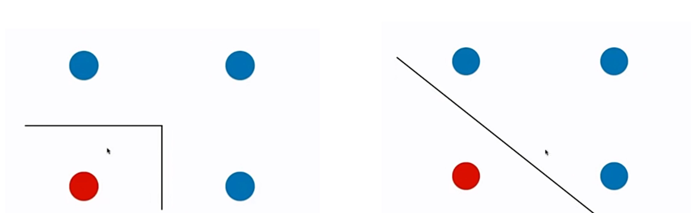
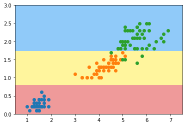

# 12-7 决策树的局限性

决策边界横平竖直。

每次都是在某一个维度上选择某一阈值进行划分。

如下，左边是决策树的决策边界，但是可能右边才是泛化能力更好的决策边界。



输入数据分布相同，但是只是稍微有一些倾斜。决策边界的泛化能力可能不足。


决策树对个别数据比较敏感。

```python
import numpy as np
import matplotlib.pyplot as plt
```


```python
from sklearn import datasets

iris = datasets.load_iris()
X = iris.data[:,2:]
y = iris.target
```


```python
plt.scatter(X[y==0,0], X[y==0,1])
plt.scatter(X[y==1,0], X[y==1,1])
plt.scatter(X[y==2,0], X[y==2,1])
plt.show()
```

​    

​    


```python
from sklearn.tree import DecisionTreeClassifier

dt_clf = DecisionTreeClassifier(max_depth=2, criterion="entropy")
dt_clf.fit(X, y)
```


    DecisionTreeClassifier(criterion='entropy', max_depth=2)


```python
def plot_decision_boundary(model, axis):

    x0, x1 = np.meshgrid(
        np.linspace(axis[0], axis[1], int((axis[1]-axis[0])*100)).reshape(-1, 1),
        np.linspace(axis[2], axis[3], int((axis[3]-axis[2])*100)).reshape(-1, 1),
    )
    X_new = np.c_[x0.ravel(), x1.ravel()]

    y_predict = model.predict(X_new)
    zz = y_predict.reshape(x0.shape)

    from matplotlib.colors import ListedColormap
    custom_cmap = ListedColormap(['#EF9A9A','#FFF59D','#90CAF9'])
    
    plt.contourf(x0, x1, zz, linewidth=5, cmap=custom_cmap)
    
```


```python
plot_decision_boundary(dt_clf, axis=[0.5, 7.5, 0, 3])
plt.scatter(X[y==0,0], X[y==0,1])
plt.scatter(X[y==1,0], X[y==1,1])
plt.scatter(X[y==2,0], X[y==2,1])
plt.show()
```


​    


## 删除一个样本点


```python
X_new = np.delete(X, 128, axis=0) # 索引为 128 删除
y_new = np.delete(y, 128)
```


```python
X_new.shape
```


    (149, 2)


```python
y_new.shape
```


    (149,)


```python
dt_clf2 = DecisionTreeClassifier(max_depth=2, criterion="entropy")
dt_clf2.fit(X_new, y_new)
```


    DecisionTreeClassifier(criterion='entropy', max_depth=2)


```python
plot_decision_boundary(dt_clf2, axis=[0.5, 7.5, 0, 3])
plt.scatter(X[y==0,0], X[y==0,1])
plt.scatter(X[y==1,0], X[y==1,1])
plt.scatter(X[y==2,0], X[y==2,1])
plt.show()
```



​    


```python

```


