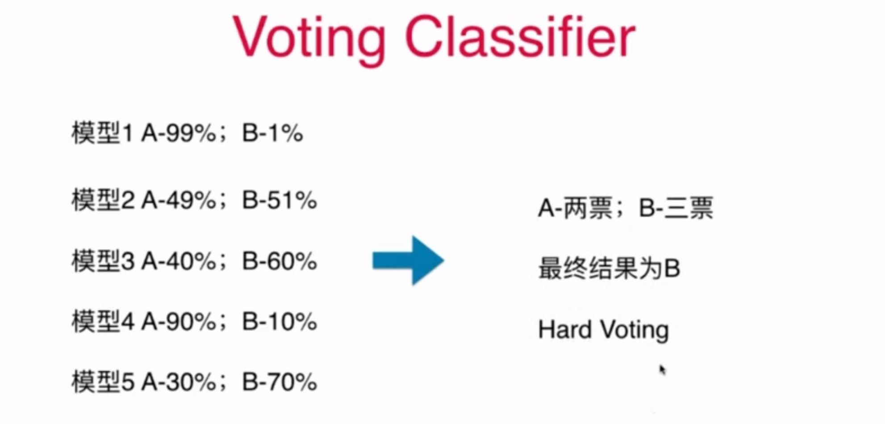
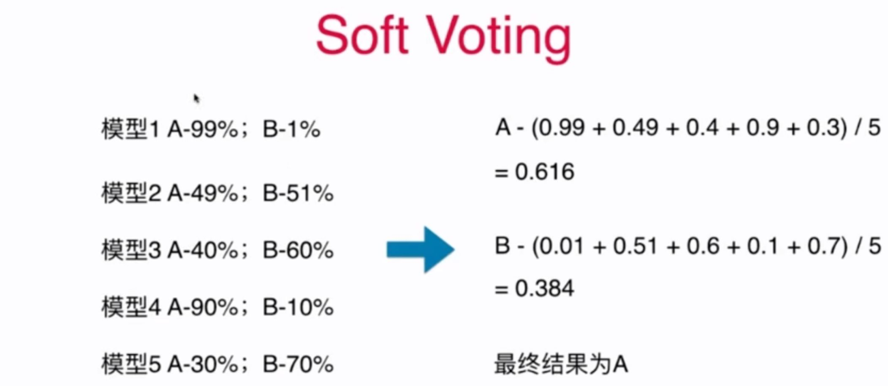

# 12-2 SoftVoting Classifier

“少数服从多数” 并不是合理的。

单纯的少数服从多数对产生**民主暴政**。

更加合理的投票，应该有**权重**。

- 唱歌比赛的投票？专业评审的票的权值应该大于普通观众。



如上的 Hard Voting，按照少数服从多数，应该将样本分类为 B。但是有三个模型分类为 B 的概率并不高（51%、60%、70%），而模型 A 以 99% 的概率确定该样本应为 A。应该给 A 模型更高的权重。



Soft Voting 要求集合的每一个模型都能估计概率（predict_proba）。支持计算概率的方法：

- 逻辑回归：本身就是基于概率的。
- kNN
- 决策树：叶子节点包含不同类的数据，哪个类的数据量大，就分为哪个类。
- SVM：采用其他的方法支持概率。SVC 中的 probability:boolean 参数，会增加计算量。

```python
voting_clf2 = VotingClassifier(estimators=[
    ('log_clf', LogisticRegression()),
    ('svm_clf', SVC(probability=True)),
    ('dt_clf', DecisionTreeClassifier(random_state=666))
], voting='soft')
```


