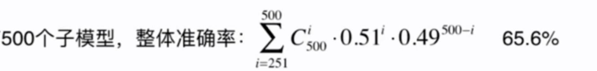
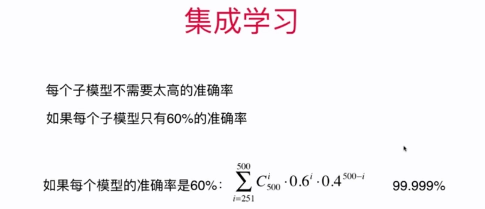
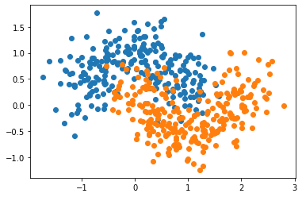

# 12-3 Bagging 和 Pasting

虽然有很多机器学习方法，但是从投票的角度看，仍然不够多。

因此，要创建更多的子模型，集成更多的子模型的意见。子模型之间不能一致，应该存在差异性。

如何创建差异性？

- 每个子模型只看样本数据的一部分。
- 例如：一共有 500 个样本数据，每个子模型只看 100 个样本数据。

每个子模型不需要太高的准确率。

如果每个子模型只有 51% 的准确了。如果我们只有 1 个子模型，整体准确率：51%。

如果有 3 个子模型，整体的准确率： $0.51^3 + C^3_2 0.51^2 \cdot 0.49 =$ 51.5%。

如果有 500 个子模型，整体的准确率：





这就是集成学习的威力！

在一般的机器学习竞赛中，基本上都会应用集成学习。

每个子模型只看样本数据的一部分？取样的方式有放回取样和不放回取样。

- 放回取样：Bagging
- 不返回取样：Pasting

Bagging 更加常用。

在统计学中，放回取样：bootstrap。

```python
import numpy as np
import matplotlib.pyplot as plt
```


```python
from sklearn import datasets

X, y = datasets.make_moons(n_samples=500, noise=0.3, random_state=42)
```


```python
plt.scatter(X[y==0,0], X[y==0,1])
plt.scatter(X[y==1,0], X[y==1,1])
plt.scatter(X[y==2,0], X[y==2,1])
plt.show()
```


​    

​    


```python
from sklearn.model_selection import train_test_split

X_train, X_test, y_train, y_test = train_test_split(X, y, random_state=42)
```

## 使用 Bagging


```python
from sklearn.tree import DecisionTreeClassifier # 决策树的子模型差异性将，这是集成学习喜欢的
from sklearn.ensemble import BaggingClassifier

# bootstrap=True 是放回取样
bagging_clf = BaggingClassifier(DecisionTreeClassifier(),
                               n_estimators=500, max_samples=100,
                               bootstrap=True)
```


```python
bagging_clf.fit(X_train, y_train)
bagging_clf.score(X_test, y_test)
```


    0.912


```python
# 集成 5000 个子模型
bagging_clf2 = BaggingClassifier(DecisionTreeClassifier(),
                               n_estimators=5000, max_samples=100,
                               bootstrap=True)
```


```python
bagging_clf2.fit(X_train, y_train)
bagging_clf2.score(X_test, y_test)
```


    0.92


```python
# 单一的决策树模型
dt_clf = DecisionTreeClassifier()
dt_clf.fit(X_train, y_train)
dt_clf.score(X_test, y_test)
```


    0.824


```python

```


